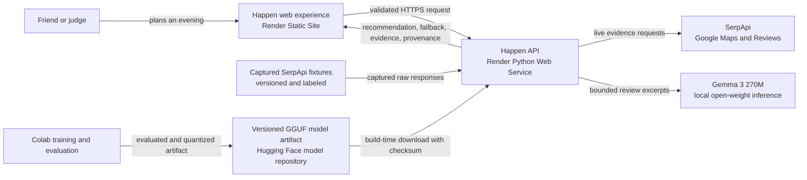
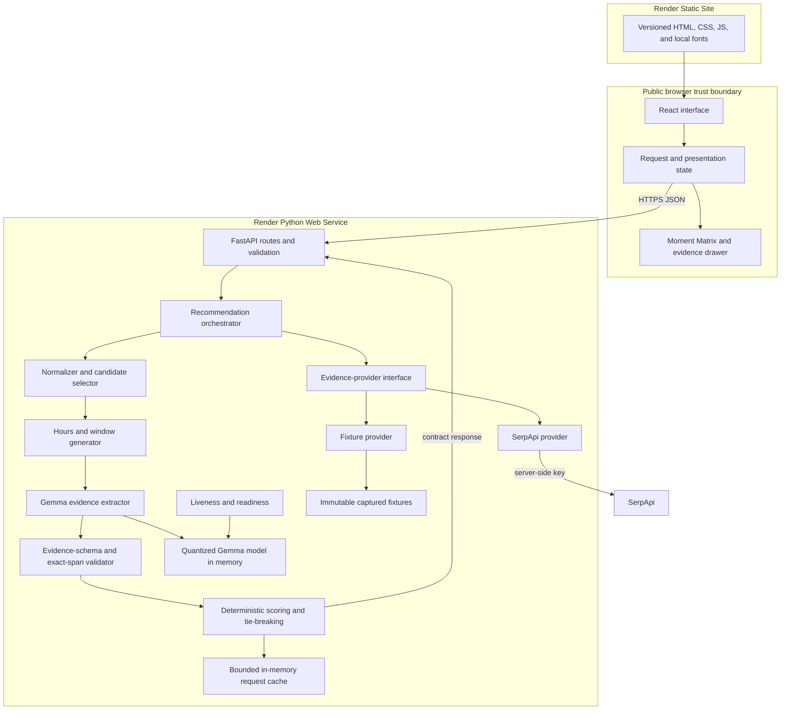
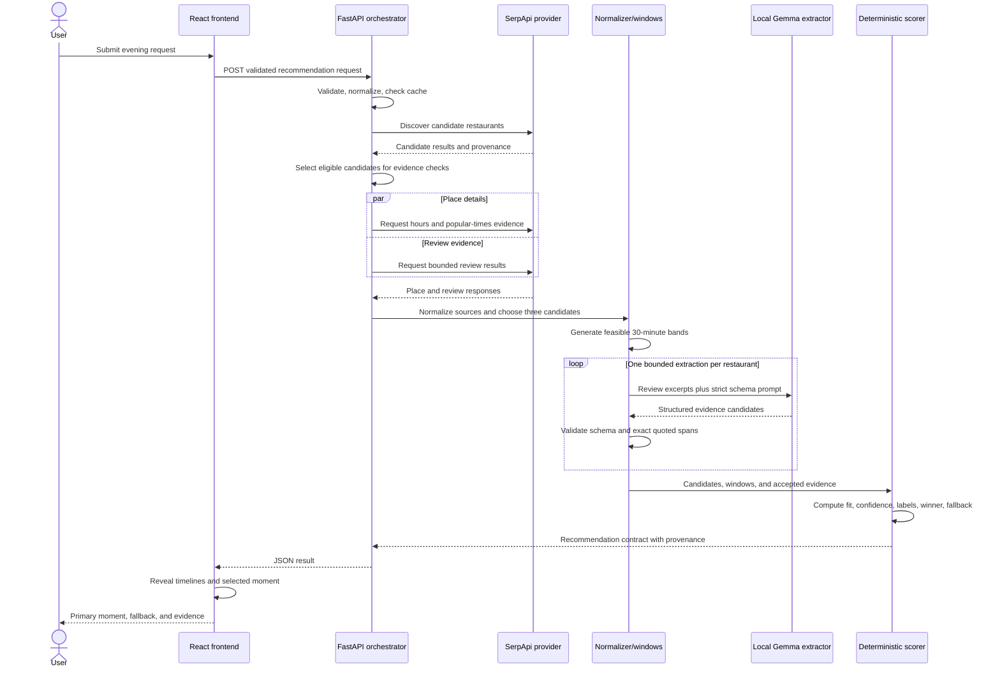
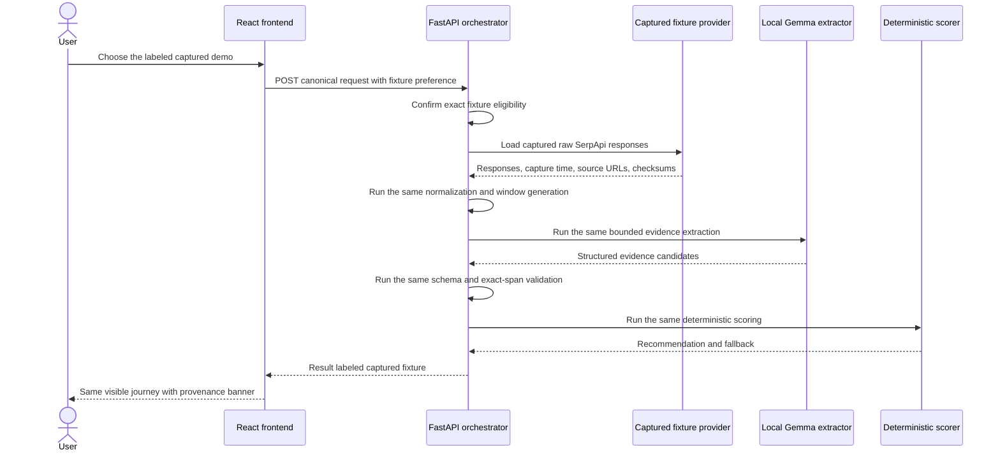

# HANDOFF.md

> Review status: Sections 1–29 remain the historical plan approved on October 3, 2026. Section 30 is the current product contract, approved on October 4, 2026. Where they disagree, section 30 controls. Sections 1–29 were kept as historical context.

## 1. Document Control

- Planning status: `LOCKED`
- Planning date: October 3, 2026
- Source Prompt 0 packet: `PROMPT 0 → PROMPT 1 IDEA PACKET`, received October 3, 2026
- Hackathon: Hacktoberfest Weekend Challenge: Build for a Friend
- Challenge ID: 78
- Deadline: October 5, 2026 at 06:59 UTC / 12:29 PM IST
- Realistic build hours: 24 active hours
- Feature freeze: Build hour 19 of 24, approximately 79%
- Execution autonomy: A1 — files and verification only; the user controls git, pushes, and deployment
- Repository state: Existing and initialized during the challenge window. The baseline commit contains README and MIT license; the working tree now contains the uncommitted planning artifact `docs/HANDOFF.md` created at the user's request.
- Local path: `/home/kernel-kain/Documents/Github/happen`
- Remote URL: `https://github.com/kernelKain/happen`
- Current branch: `main`
- Baseline commit: `a45880a` — Initial commit, October 3, 2026 at 7:25 PM IST
- Live URL: `NOT YET DEPLOYED`

> This document contains the implementation contract. Execution may refine low-level details but may not change product scope, architecture boundaries, or acceptance criteria without following the change policy.

## 2. Source of Truth

Authority order:

1. Official hackathon rules and challenge-specific instructions
2. This locked handoff
3. Current repository evidence
4. Approved change decisions
5. Execution notes

### Official sources consulted

Checked October 3, 2026 unless noted otherwise:

- [Hacktoberfest Weekend Challenge: Build for a Friend](https://dev.to/challenges/hacktoberfest-weekend-2026-10-01) — challenge ID 78, prompt, dates, prizes, partner categories, judging criteria, required tag, and submission requirements
- [DEV Official Challenges and Hackathon Rules](https://dev.to/page/official-hackathon-rules) — eligibility, new-work requirement, team rules, intellectual property, and contest terms
- [DEV AI-assisted article guidelines](https://dev.to/guidelines-for-ai-assisted-articles-on-dev) — disclosure, accuracy, attribution, and human-accountability requirements
- [Hacktoberfest 2026](https://hacktoberfest.com/) — event context and participation program
- [SerpApi Google Maps API](https://serpapi.com/google-maps-api) — discovery behavior, geographic parameters, and result structure
- [SerpApi Google Maps Place Results](https://serpapi.com/maps-place-results) — place details, operating hours, extensions, and optional `popular_times`
- [SerpApi Google Maps Reviews API](https://serpapi.com/google-maps-reviews-api) — review retrieval, filtering, pagination, caching, and request behavior
- [SerpApi Maps Reviews release notes](https://serpapi.com/google-maps-reviews-api/release-notes) and [API metrics](https://serpapi.com/google-maps-reviews-api/api-metrics) — recent reliability history and observed service metrics
- [Gemma 3 270M model card](https://huggingface.co/google/gemma-3-270m-it) — model identity, context limits, intended use, and terms
- [Google Gemma tuning guide](https://ai.google.dev/gemma/docs/tune) — LoRA/PEFT, dataset, evaluation, and deployment guidance
- [Google Gemma inference guide](https://ai.google.dev/gemma/docs/run) — framework and quantization choices
- [Google Gemma 3 270M announcement](https://developers.googleblog.com/en/introducing-gemma-3-270m/) — task-specific tuning and structured-text positioning
- [Render FastAPI deployment](https://render.com/docs/deploy-fastapi), [compute plans](https://render.com/docs/compute-plans), [free-service limitations](https://render.com/docs/free), [Python versions](https://render.com/docs/python-version), and [deployment lifecycle](https://render.com/docs/deploys)
- [Entire CLI](https://github.com/entireio/cli) and [sessions and checkpoints architecture](https://github.com/entireio/cli/blob/main/docs/architecture/sessions-and-checkpoints.md) — agent hooks, `git-refs` checkpoint storage, settings, and push behavior
- [CodeRabbit documentation](https://docs.coderabbit.ai/) — GitHub pull-request review behavior and configuration
- [Forem API](https://developers.forem.com/api/v1) — DEV Agent Session retrieval and publishing-related API surface
- npm and PyPI package registries — current package releases and compatibility inputs

### VERIFIED FACT

- The challenge runs from October 2, 2026 at 02:00 UTC through October 5, 2026 at 06:59 UTC.
- Each submission must be a new project built during the challenge window.
- Open-source or open-weight AI must be central to the project.
- Writing quality is weighted most heavily, followed by theme relevance, creativity, technical execution, and meaningful partner use.
- Submission requires a DEV post using the official template and `#hf26challenge`, plus a demo and source code.
- Happen can qualify simultaneously for the overall prize and meaningful-use categories for Render, Gemma, SerpApi, and Entire when each use is verified, but can win only one prize.
- The repository’s only commit was created inside the challenge window.
- SerpApi exposes structured place results and review results; `popular_times` exists only for some places.
- SerpApi’s default cache can return matching searches for up to one hour without consuming another search credit.
- Gemma 3 270M is an open-weight instruction-tuned model intended for constrained and task-specific use.
- Render’s free web services sleep after 15 minutes of inactivity and can take about one minute to resume.
- Render service filesystems are ephemeral.
- Render provides paid `1c-2g` and `2c-4g` compute options suitable for proof testing CPU inference.

### LOCKED DECISION

- Happen’s approved product identity, target user, problem, mechanism, Hook, sponsor roles, and non-wrapper moat remain unchanged.
- Python is the only backend language.
- SerpApi is the only external data provider.
- Gemma extracts evidence; deterministic Python logic selects the recommendation.
- Out-of-pocket spend is capped at $0.
- Existing credits and genuinely free resources may be used.
- Execution autonomy is A1.
- No authentication, persistent personal data, database, or paid dependency will be added unless an approved change decision establishes a requirement.
- Fixture evidence must be timestamped and visibly labeled.
- Raw reviewer identities will not be retained.

### ASSUMPTION

- The user’s eligibility confirmation is accurate.
- The reported SerpApi allocation contains 250 usable monthly searches.
- The reported Render account contains $50 in usable credits.
- Gemma model terms can be accepted and a free Colab T4 session can be obtained.
- At least two suitable Bengaluru restaurants expose enough comparable temporal and review evidence.
- Short review excerpts may be retained for private/demo fixtures; redistribution remains subject to provider terms.

### VERIFY IN P0

- SerpApi credential validity, remaining quota, response fields, and Bengaluru coverage
- Review-excerpt storage and redistribution terms
- Hugging Face or Kaggle Gemma access and accepted terms
- Free Colab T4 availability
- Base and tuned Gemma schema accuracy on held-out examples
- CPU inference memory and latency on the intended Render plan
- Render credit balance, current plan price, and zero-out-of-pocket cost
- Exact supported Python and Node patch versions
- Current package compatibility and generated lockfiles
- Exact verified restaurant set and evidence snapshot
- Final public URLs and deployment configuration

## 3. Product Contract

- **Name:** Happen
- **Tagline:** Know where. Know when.
- **One-sentence thesis:** Happen helps a friend choose not merely a restaurant, but the best-supported restaurant and arrival window for the experience they want.
- **What:** An evidence-first local discovery tool that compares three restaurants across one evening and recommends one place-and-time “moment,” with a fallback and inspectable evidence.
- **Why:** Existing discovery tools help people choose where to go but leave them manually guessing when to arrive for easier conversation, shorter waits, or better seating.
- **Hook:** Three restaurant timelines resolve across the evening until one interval illuminates as the recommended moment, showing fit, confidence, evidence, and a fallback.
- **Target user:** A real friend in Bengaluru planning dinner for two within a limited evening window and prioritizing easier conversation and shorter waiting.
- **Triggering situation:** The friend has selected a neighbourhood and evening range but cannot confidently choose both a restaurant and an arrival time.
- **User job:** Compare plausible restaurants over time, understand which conclusion has credible support, and leave with one actionable primary choice plus a fallback.
- **Input:** Bengaluru neighbourhood, restaurant category, available arrival range, desired experience, and ranked priorities.
- **Core mechanism:**
  1. Discover candidate restaurants through SerpApi.
  2. Select three candidates using deterministic eligibility rules.
  3. Validate operating hours and generate feasible arrival windows.
  4. Collect available busyness and review evidence.
  5. Use Gemma to convert review excerpts into a constrained evidence schema covering conversation, waiting, seating, temporal hints, polarity, quoted evidence, and confidence.
  6. Score every restaurant-window combination deterministically.
  7. Keep experience fit separate from evidence confidence.
  8. Select one recommendation and one fallback only when at least two candidates have sufficient comparable evidence.
- **Visible output:** A Moment Matrix containing three restaurant timelines and Strong, Possible, Weak, or Unknown intervals; one luminous recommended restaurant and arrival window; a distinct fallback; separate fit and confidence labels; snapshot provenance; and source-linked evidence.
- **SerpApi role:** Supplies current candidate places, operating hours, available popular-times patterns, review excerpts, and source provenance. It is Happen’s only external data provider.
- **Gemma role:** Performs constrained evidence extraction from review text. Its output is validated against a strict schema and never directly determines the winning restaurant.
- **Render role:** Provides the publicly reachable frontend and backend infrastructure used to demonstrate the project.
- **Entire role:** Captures repository-linked agent checkpoints while Happen is built so selected engineering decisions can be reviewed and shared; it is build provenance, not a production runtime dependency.
- **Why open matters:** Gemma’s open weights allow narrow task tuning, local inspection, model replacement, and self-hosted inference without sending review evidence to a closed model API.
- **Non-wrapper moat:** Repeatable place discovery, candidate filtering, time-window generation, hours validation, structured evidence extraction, cross-place temporal comparison, explicit missing-data handling, separate confidence assessment, deterministic recommendation and fallback selection, and preserved source provenance.
- **Current alternative:** The friend opens several place listings, compares popular-times charts manually, searches unrelated reviews for clues, and guesses when to arrive. Missing evidence is easily mistaken for favorable evidence.
- **Must-be-true claim:** “Given a Bengaluru restaurant request with an available time range and ranked experience priorities, Happen produces an evidence-linked restaurant and arrival window, a fallback, and separate fit and confidence labels under the condition that at least two candidate restaurants contain sufficient credible time-dependent evidence for comparison.”

## 4. Success and Acceptance Criteria

| ID | Observable condition | Verification method | Level |
|---|---|---|---|
| **AC-01** | From a fresh page load, the user can submit the verified Bengaluru dinner preset and reach a complete recommendation without authentication or undocumented setup. | Playwright end-to-end test plus one incognito-browser run against production. | Required |
| **AC-02** | When at least two candidates have sufficient evidence, the Moment Matrix displays exactly three restaurant timelines, exactly one highlighted primary moment, and one fallback at a different restaurant. | Automated response/UI assertions using the canonical fixture. | Required |
| **AC-03** | Each interval is labeled Strong, Possible, Weak, or Unknown; the selected moment shows fit and confidence as separate concepts. Unknown evidence never appears as favorable evidence. | Unit tests for label thresholds plus visual inspection. | Required |
| **AC-04** | One verified live run uses SerpApi to discover candidates and retrieve place, hours, busyness, review, and provenance fields where available; the resulting snapshot is saved for fixture replay. | Run the canonical Indiranagar request with request logging that excludes secrets; inspect captured response metadata and source links. | Required |
| **AC-05** | Gemma transforms review excerpts into the locked evidence schema. On at least 24 held-out examples, at least 95% of outputs parse after no more than one constrained retry, and dimension-plus-polarity accuracy is at least 80%. | Versioned evaluation dataset and automated evaluation report. | Required |
| **AC-06** | Every accepted Gemma evidence span is an exact substring of its supplied review excerpt. Unsupported or malformed spans are rejected and cannot affect scoring. | Automated extraction-validation tests including adversarial examples. | Required |
| **AC-07** | The same normalized inputs and evidence produce byte-equivalent recommendation decisions, labels, and tie-breaking results across repeated runs. | Deterministic scoring characterization test run at least five times. | Required |
| **AC-08** | If fewer than two restaurants have sufficient comparable temporal evidence, the system produces no winner and explains how to use the verified demo set; it never manufactures a recommendation. | Unit test and end-to-end insufficient-evidence fixture. | Required |
| **AC-09** | Fixture mode follows the same normalization, extraction-schema validation, scoring, and rendering path as live mode. It differs only at the evidence-source adapter boundary. | Fixture-parity integration test comparing normalized live-capture and replay outputs. | Required |
| **AC-10** | Every result identifies `live` or `captured fixture`, includes a capture timestamp, identifies the Gemma model/adapter version, and preserves clickable source URLs. | API contract test and UI inspection. | Required |
| **AC-11** | On a warm backend, the canonical fixture request completes within 2 seconds and the canonical live request completes within 30 seconds in three consecutive runs. | Timed integration test on the selected Render plan; record median and worst result. | Required |
| **AC-12** | SerpApi timeout, quota exhaustion, missing fields, malformed Gemma output, and model unavailability each produce a visible, specific state with a next action. Any switch to fixture evidence is explicit. | Failure-injection integration tests and UI-state screenshots. | Required |
| **AC-13** | No generated arrival window falls outside user availability or verified operating hours. Missing busyness or review evidence reduces confidence and never increases fit. | Boundary-focused scoring and hours-validation unit tests. | Required |
| **AC-14** | The public frontend is reachable over HTTPS, the backend health endpoint returns HTTP 200, and the canonical fixture journey succeeds from a fresh browser session. | Production smoke test immediately after deployment and on judge day. | Required |
| **AC-15** | Automated accessibility checks report no critical or serious violations on initial, loading, success, and error states. All controls and the evidence drawer work by keyboard with visible focus; normal text contrast is at least 4.5:1. | Playwright plus axe checks, keyboard walkthrough, and contrast audit. | Required |
| **AC-16** | At 1280×720, the entire Hook is visible without horizontal scrolling. At 390×844, the page has no horizontal overflow and the input, recommendation, fallback, and evidence remain usable. | Playwright screenshots and manual responsive inspection. | Required |
| **AC-17** | SerpApi and Hugging Face credentials remain server-side, do not appear in client bundles, logs, fixtures, screenshots, repository history, or HANDOFF.md, and production CORS accepts only the deployed frontend origin. | Secret scan, built-bundle search, log inspection, and CORS request tests. | Required |
| **AC-18** | Inputs are schema-validated and bounded: allowed Bengaluru neighbourhood/category values, valid ranked priorities, an arrival range of 1–4 hours, and request bodies no larger than 16 KB. | API validation tests covering valid, boundary, and rejected requests. | Required |
| **AC-19** | One real-friend walkthrough is completed before submission. The user records consented, paraphrased feedback about comprehension of fit versus confidence, decision usefulness, and fallback usefulness without storing personal information. | Short validation checklist and resulting approved wording in the DEV post. | Required |
| **AC-20** | Submission materials include the public URL, public repository, official DEV template, `#hf26challenge`, architecture diagram, hero screenshot, demo, explanation of why open matters, partner-use explanation, source attribution, accurate AI-use disclosure, and verified Entire/session evidence for any category claim. | Final submission checklist reviewed against challenge ID 78. | Required |
| **AC-21** | Fine-tuning improves held-out extraction accuracy by at least five percentage points over the untuned 270M baseline without increasing invalid outputs. If it does not, the better-performing evaluated model is used and the result is reported honestly. | Baseline-versus-adapter evaluation report. | Stretch |
| **AC-22** | A second verified Bengaluru neighbourhood preset can complete the same journey without new code. | Live capture, fixture generation, and end-to-end replay. | Stretch |

## 5. Scope Lock

### Must Build

- One focused input flow for a documented Bengaluru allowlist, with the canonical Indiranagar dinner preset.
- Inputs for neighbourhood, restaurant category, arrival range, desired experience, and ranked priorities.
- SerpApi integration for candidate discovery, place details, operating hours, available popular-times evidence, reviews, and provenance.
- Deterministic candidate eligibility rules that select three restaurants or return an insufficient-evidence state.
- Feasible 30-minute arrival bands derived from the user’s availability, operating hours, and hourly evidence without claiming real-time queue precision.
- Gemma 3 270M evidence extraction into the locked schema.
- Exact-span validation that prevents unsupported model output from influencing results.
- Deterministic place-and-window scoring with stable tie-breaking.
- Separate fit and evidence-confidence calculations.
- A Moment Matrix with Strong, Possible, Weak, and Unknown states.
- Exactly one primary moment and one distinct fallback when the must-be-true condition is satisfied.
- An evidence explanation with source links, timestamps, model provenance, and live-versus-fixture labeling.
- A captured-fixture adapter that exercises the same downstream pipeline as live evidence.
- Loading, empty, partial, invalid-input, dependency-unavailable, recoverable-error, and success states.
- One automated test proving the central Hook.
- Public HTTPS frontend and backend deployments.
- Production smoke tests, README, architecture diagram, hero screenshot, 60-second demo, DEV submission article, partner explanations, and AI-use disclosure.
- Entire enabled for the execution agent with at least one privacy-reviewed checkpoint published through the user-controlled Git workflow, or the Entire category claim explicitly removed if verification fails.
- One consented friend walkthrough with paraphrased feedback.

### Should Build

Allowed only before the build-hour-19 feature freeze:

- QLoRA adapter training for Gemma 3 270M if the measured result improves the held-out extraction benchmark.
- A controlled progressive reveal that makes the Moment Matrix resolution legible without delaying access to the result.
- Evidence filtering by conversation, wait, and seating dimensions.
- A compact methodology panel explaining deterministic scoring and honest uncertainty.
- A one-click reset to the canonical demo preset.
- Captured build evidence for the DEV article: evaluation results, screenshots, and brief implementation decisions.
- Judge-safe live mode controlled by server configuration, with fixture mode remaining the default recovery path.

### Could Build

Allowed only after every Required acceptance criterion passes:

- One additional verified Bengaluru neighbourhood preset.
- Additional evidence-copy refinement or decorative micro-motion.
- A downloadable non-personal JSON evidence report.
- A second hero screenshot.
- A small model-comparison visualization based only on measured evaluation results.

### Will Not Build

| Excluded feature | Reason |
|---|---|
| Reservations or table booking | Does not support the Hook and introduces another external integration. |
| Navigation or turn-by-turn directions | Does not support the place-plus-time recommendation Hook. |
| Route or travel-time optimization | Adds another data dependency and exceeds the time budget. |
| Maps or geospatial exploration UI | Adds visual and provider complexity without proving the core mechanism. |
| Menus | Does not support the selected experience priorities. |
| Pricing comparison | Data consistency is uncertain and it does not support the Hook. |
| Cuisine recommendation or broad restaurant discovery | Happen assumes the user supplies the category; broad discovery dilutes the place-plus-time thesis. |
| More than three compared restaurants | Weakens the signature visualization and increases SerpApi usage and model latency. |
| Multiple dates or multi-day planning | Multiplies temporal complexity and exceeds the 24-hour budget. |
| Reservations availability or real-time occupancy guarantees | Required evidence is unavailable and the claim would be misleading. |
| Exact wait-time predictions or match percentages | Creates artificial precision unsupported by hourly and review evidence. |
| Medical, allergy, accessibility-safety, or sensory-safety recommendations | Creates unsupported safety and liability claims. |
| User accounts or authentication | Not needed for the demo and adds security scope. |
| Preference history or profiles | Requires persistent personal data and does not prove the Hook. |
| Persistent personal data | Unnecessary and conflicts with the locked privacy posture. |
| Notifications or continuous monitoring | Adds background infrastructure and ongoing API cost. |
| Sharing or collaborative planning | Belongs after the hackathon and does not strengthen the central demo. |
| Crowdsourcing or post-visit feedback | Adds moderation, identity, and data-quality scope. |
| Ratings, testimonials, or social proof created by the project | Risks fake or misleading claims. |
| Additional external data providers | Violates the two-API ceiling and weakens the meaningful SerpApi role. |
| Closed-model fallback | Weakens the open-weight-AI requirement and introduces another API dependency. |
| Model-generated candidate selection or final ranking | Violates the deterministic decision moat. |
| Database or persistent server cache | No requirement justifies it; fixtures and build artifacts are sufficient. |
| Microservices, message queues, or background workers | Unnecessary for the request volume and time budget. |
| Kubernetes | No operational requirement and excessive setup cost. |
| Native mobile applications | Exceeds the time budget; the responsive web experience is sufficient. |
| Arbitrary city support | Unverified evidence coverage would undermine demo reliability. |
| More priority dimensions than conversation, short wait, and seating | Expands training and scoring scope without improving the core demonstration. |
| Unlabeled automatic fallback from live to fixture data | Would obscure provenance and violate the evidence-first thesis. |

## 6. User Journey and Functional Requirements

### Cold-start user journey

| Step | User action | System response | Visible state | Error or fallback behavior | Criteria |
|---|---|---|---|---|---|
| 1 | Opens the public URL. | Loads the focused Happen experience and canonical Indiranagar preset. | Product thesis, input panel, data-mode badge, and an empty Moment Matrix frame. | If the backend health check fails, retain the form and show a service-unavailable message; do not display invented results. | AC-01, AC-14, AC-15, AC-16 |
| 2 | Reviews or changes neighbourhood, category, arrival range, desired experience, and priority order. | Validates fields locally while preserving the canonical preset as a reset option. | Inline constraints, distinct priority ordering, and a clear primary action. | Invalid or unsupported values receive field-level guidance before submission. | AC-18 |
| 3 | Selects **Find the moment**. | Revalidates on the server and starts the recommendation request. | Disabled duplicate-submit action, accessible loading announcement, and “Gathering evidence” state. | A request timeout exposes Retry; the canonical preset may offer an explicitly labeled captured-evidence path. | AC-11, AC-12, AC-18 |
| 4 | Waits for the result. | Retrieves live or captured evidence, validates sources, extracts review signals with Gemma, generates feasible windows, and scores combinations deterministically. | Honest loading state without fabricated progress percentages. | Missing fields reduce confidence. Malformed evidence is rejected. Fewer than two sufficient candidates produces no winner. | AC-04–AC-09, AC-12, AC-13 |
| 5 | Views the resolved matrix. | Returns three restaurant timelines, interval labels, the primary moment, fallback, fit, confidence, and provenance. | Timelines reveal in sequence; unsupported intervals remain visibly Unknown and one supported interval becomes luminous. | If one candidate lacks evidence but two remain sufficient, its row stays visible as partial/Unknown rather than disappearing. | AC-02, AC-03, AC-10, AC-13 |
| 6 | Opens **Why this moment?** | Displays evidence grouped by priority, source, temporal relevance, agreement, and confidence contribution. | Evidence drawer or inline panel with short excerpts, exact spans, timestamps, and source links. | Rejected model output is never shown as accepted evidence; absent evidence is described plainly. | AC-05, AC-06, AC-10 |
| 7 | Reviews the fallback. | Explains why the fallback ranked second and how its evidence differs from the primary choice. | Distinct fallback card with place, arrival window, fit, confidence, and source count. | If a distinct supported fallback does not exist, the system returns the insufficient-evidence state instead of duplicating the winner. | AC-02, AC-08 |
| 8 | Selects **Start over** or restores the demo preset. | Clears the result and restores valid default inputs. | Initial state with no stale recommendation. | No server mutation or persistent history is involved. | AC-01, AC-18 |

### Functional requirements

- **FR-01 — Input contract:** Accept only documented Bengaluru neighbourhood and restaurant-category values, a 1–4-hour arrival range, one desired experience, and a unique ranking of conversation, short wait, and seating priorities.
- **FR-02 — Server-owned data mode:** Select `live` or `fixture` on the server. The browser cannot supply credentials or silently override provenance.
- **FR-03 — SerpApi discovery:** Use SerpApi to discover restaurant candidates and obtain place identifiers, source URLs, ratings metadata, hours, available popular-times data, and reviews.
- **FR-04 — Candidate selection:** Apply deterministic eligibility and tie-breaking rules to choose three candidates. Prefer evidence completeness over raw search rank after minimum quality checks.
- **FR-05 — Window generation:** Create 30-minute arrival bands only inside the user’s range and verified operating hours. Map hourly busyness evidence to overlapping bands without presenting it as exact queue prediction.
- **FR-06 — Gemma extraction:** Send bounded review excerpts to the locked Gemma model and request only the evidence schema defined in Section 12.
- **FR-07 — Evidence validation:** Reject unknown fields, invalid enums, out-of-range confidence, non-substring quoted spans, and malformed temporal hints.
- **FR-08 — Deterministic scoring:** Score every feasible candidate-window pair using locked rules. The model cannot select candidates, assign final fit labels, break ties, or choose the winner.
- **FR-09 — Confidence separation:** Calculate confidence from evidence availability, validity, agreement, recency, and temporal relevance independently of experience fit.
- **FR-10 — Recommendation contract:** Return one primary moment and one fallback at a different restaurant only when at least two candidates meet the minimum evidence threshold.
- **FR-11 — Honest insufficiency:** Return no recommendation when the threshold is not met. Explain which evidence was absent and offer the verified preset when applicable.
- **FR-12 — Fixture parity:** Replay captured SerpApi evidence through the same normalization, validation, extraction-output, scoring, and presentation path used by live mode.
- **FR-13 — Provenance:** Attach mode, capture time, source URL, SerpApi search identifier where safe, model identifier, adapter version, and scoring-policy version to every result.
- **FR-14 — Result states:** Support initial, loading, empty/insufficient, success, partial, recoverable error, dependency unavailable, and invalid-input states.
- **FR-15 — Evidence inspection:** Allow the user to inspect accepted evidence and understand how it affected fit and confidence without exposing reviewer identity.
- **FR-16 — Stable reset:** Restore the canonical preset and remove stale result state without authentication, persistence, or a page reload.
- **FR-17 — Duplicate protection:** Prevent concurrent duplicate submissions from the same browser and reuse an in-process result for identical requests during the configured short cache window.
- **FR-18 — Safe observability:** Log request identifiers, mode, durations, candidate counts, rejection counts, and failure classes—but never keys, raw reviewer identities, or complete review payloads.
- **FR-19 — No authentication:** The complete judge journey must work without an account, login, or test credentials.
- **FR-20 — Truthful presentation:** Never show fabricated progress, exact occupancy claims, predicted wait minutes, match percentages, or unlabeled fixture results.

### Required application states

- **Initial/landing:** Valid canonical preset, short thesis, empty matrix frame, and visible mode/freshness explanation.
- **Loading:** Input summary remains visible; duplicate submission is disabled; status is announced to assistive technology.
- **Empty/insufficient:** No winner, missing-evidence explanation, and action to restore the verified preset.
- **Success:** Three timelines, primary moment, distinct fallback, fit, confidence, provenance, and evidence access.
- **Partial result:** Three rows remain visible, but unsupported intervals or one evidence-poor candidate are Unknown.
- **Recoverable error:** Plain-language cause, Retry, and preservation of the user’s inputs.
- **Dependency unavailable:** Name the unavailable class—place evidence or model extraction—and offer the captured fixture only when it matches the canonical request.
- **Invalid input:** Field-level error plus server rejection; no external API call is made.

## 7. UX and Visual Specification

### Visual direction

- **Visual thesis:** An evening signal observatory—not a map, directory, or generic restaurant-listing interface. The experience should feel calm, precise, evidence-aware, and slightly cinematic.
- **Signature moment:** Three restaurant timelines resolve from muted uncertainty into labeled intervals. Unsupported cells remain subdued while one 30-minute band gains a restrained amber glow and becomes “Tonight’s moment.”
- **Primary viewport:** 1440×900 desktop.
- **Required desktop check:** 1280×720.
- **Minimum supported desktop width:** 1024px.
- **Required mobile check:** 390×844.
- **Mobile behavior:** Stack the planner, recommendation, fallback, and evidence vertically. Replace the wide matrix with compact restaurant timeline cards; never depend on horizontal page scrolling.
- **Theme:** Dark evening theme only for the hackathon release.
- **Typography:** Self-hosted Manrope Variable for interface and editorial text; JetBrains Mono Variable for timestamps, confidence labels, evidence metadata, and technical provenance. System fallbacks must be defined.
- **Typography scale:** Large but compact editorial headline, 16px minimum body text, 14px minimum metadata, and tabular numerals for time.
- **Color direction:**
  - Background: near-black green-charcoal
  - Raised surfaces: layered charcoal with warm borders
  - Primary text: warm off-white
  - Secondary text: cool gray-green
  - Highlighted moment: luminous ochre/amber
  - Strong: teal plus label/icon
  - Possible: amber plus label/icon
  - Weak: coral plus label/icon
  - Unknown: slate plus label/pattern
- **Semantic rule:** Color may reinforce status but never communicate status by itself.
- **Density:** Focused and information-rich, using an 8px spacing system, generous section separation, and compact evidence metadata.
- **Maximum content width:** Approximately 1440px, centered.
- **Motion policy:** Motion explains state change; it is not decoration.
- **Reduced motion:** Respect `prefers-reduced-motion`; reveal all final states immediately and remove glow pulsing, staggered entrance, parallax, and animated scrolling.
- **Runtime assets:** No remote font or image dependency is required for the central experience.

### Screen 1 — Plan the evening

- **Route:** `/`
- **Purpose:** Establish the friend’s problem and collect the smallest valid request.
- **Main content:** Tagline, one-sentence thesis, canonical preset indicator, neighbourhood, category, arrival range, desired experience, ranked priorities, and data-mode explanation.
- **Primary action:** **Find the moment**
- **Secondary action:** **Restore demo preset**
- **Important states:** Initial, invalid input, loading, backend unavailable
- **Data shown:** Current input values, supported choices, fixture/live status, and the meaning of captured evidence
- **Relationship to the Hook:** Frames the task as choosing both place and time before the matrix appears.

### Screen 2 — The Moment Matrix

- **Route:** `/` after a successful request
- **Purpose:** Deliver the visual Hook and the actionable answer.
- **Main content:**
  - “Tonight’s moment” summary
  - Recommended restaurant and 30-minute arrival band
  - Separate fit and confidence labels
  - Three restaurant timelines across the chosen evening
  - Strong, Possible, Weak, and Unknown legend
  - Distinct fallback card
  - Source mode and capture timestamp
- **Primary action:** **Why this moment?**
- **Secondary action:** **Start over**
- **Important states:** Success, partial result, insufficient evidence, stale fixture warning
- **Data shown:** Restaurant names, feasible bands, status labels, selected moment, fallback, confidence, evidence counts, and provenance
- **Relationship to the Hook:** This is the signature reveal: one interval becomes visibly preferable without hiding unsupported evidence.

### Screen 3 — Evidence explanation

- **Presentation:** Desktop side drawer; mobile full-height bottom sheet. It remains part of `/`, not a separate route.
- **Purpose:** Make the recommendation inspectable and prove meaningful SerpApi and Gemma use.
- **Main content:** Accepted evidence grouped by priority, exact quoted spans, source links, temporal hints, polarity, extraction confidence, rejected-evidence count, scoring explanation, model identifier, and scoring-policy version.
- **Primary action:** **Open source**
- **Secondary action:** **Close evidence**
- **Important states:** Complete evidence, missing dimension, conflicting evidence, rejected extraction
- **Data shown:** Only evidence that passed schema and exact-span validation; no reviewer identities
- **Relationship to the Hook:** Demonstrates that the luminous moment is evidence-backed and deterministically selected rather than model-generated.

### Reusable regions and components

- **App header:** Happen wordmark, tagline, mode badge, and snapshot freshness
- **Planner panel:** Bounded fields, priority-order control, validation summary, and primary action
- **Loading frame:** Stable matrix skeleton with accessible status text and no fabricated completion percentage
- **Moment Matrix:** Three rows, six 30-minute bands for the canonical 6–9 PM range, labeled statuses, keyboard-accessible cells, and selected-moment treatment
- **Moment card:** Restaurant, arrival band, fit, confidence, concise explanation, and provenance
- **Fallback card:** Clearly secondary but fully actionable
- **Status legend:** Text, icon, and pattern for all four states
- **Confidence meter:** Discrete label—Insufficient, Low, Medium, or High—rather than an artificial percentage
- **Evidence drawer:** Grouped signals, exact spans, source links, conflict treatment, and methodology
- **Inline state panel:** Empty, dependency unavailable, insufficient evidence, or recoverable error with a next action
- **Footer:** Methodology link target, source attribution, project repository, and “planning evidence—not live occupancy” disclaimer

### Interaction details

- The result reveal begins only after the response is complete.
- Desktop rows may appear in a short stagger, followed by the selected-cell emphasis; total reveal time must remain under 1.8 seconds.
- The selected moment uses border, label, contrast, and a static glow—not glow alone.
- Matrix cells are focusable and expose restaurant, time, fit state, and confidence to assistive technology.
- Opening the evidence drawer moves focus into it; closing it restores focus to the trigger.
- Errors appear inline near their cause and in an accessible summary.
- Loading never causes layout collapse or large cumulative shifts.
- Destructive or irreversible actions do not exist in the interface.

### Quality floor

- No lorem ipsum or placeholder restaurant copy
- No fake metrics, users, ratings, testimonials, or unsupported claims
- No unlabeled synthetic, captured, or fixture data
- No inaccessible color-only status
- Visible keyboard focus
- At least 4.5:1 contrast for normal text
- Complete loading, empty, partial, error, dependency-unavailable, and success states
- Correct layout at 1280×720
- Unbroken layout at 390×844
- Motion is never required to understand the result
- Native inputs, range controls, disclosure elements, and scrollbars are intentionally styled when visible
- Evidence links are visually identifiable and keyboard accessible
- All timestamps include timezone context
- The phrase “planning evidence—not live occupancy” remains visible near the result

## 8. System Architecture

### Architecture summary

Happen uses two deployable services:

1. A React/Vite static frontend on Render.
2. A Python/FastAPI backend on Render that owns SerpApi access, local Gemma inference, evidence validation, deterministic scoring, and fixture replay.

There is no database, queue, background worker, authentication service, or runtime closed-model API.

The production backend loads a quantized Gemma 3 270M GGUF artifact into `llama-cpp-python` once at startup. QLoRA training, evaluation, merging, and quantization happen offline in Google Colab; they are not part of the request path.

### System-context diagram



### Component/container diagram



### Live Hook sequence



### Fixture-fallback sequence



Fixture mode replaces only SerpApi network retrieval. It does not bypass normalization, Gemma extraction, validation, scoring, or rendering.

### Components and responsibilities

| Component | Responsibility | Inputs | Outputs | State owned | Dependencies | Failure behavior | Location |
|---|---|---|---|---|---|---|---|
| React frontend | Collect inputs and render every product state. | User actions and API responses | Validated requests and visible UI | Ephemeral browser state only | React, browser APIs, backend URL | Preserve inputs and show an actionable inline error | Render Static Site |
| FastAPI routes | Enforce request, size, mode, CORS, and response contracts. | HTTPS JSON | Typed response or stable error envelope | Request-local state | FastAPI and Pydantic | Reject before external calls when invalid | Render Web Service |
| Recommendation orchestrator | Execute the pipeline in the required order and attach provenance. | Valid request and configuration | Complete recommendation contract | Request timing and correlation ID | All domain components | Classify failure; never return partial data as success | Render Web Service |
| Evidence-provider interface | Keep live and fixture retrieval interchangeable at one boundary. | Normalized query | Raw provider-shaped evidence bundle | None | Live and fixture implementations | Return typed unavailable, quota, timeout, or fixture errors | Render Web Service |
| SerpApi provider | Discover places and retrieve place/review evidence with bounded concurrency. | Query, location, place IDs | Raw SerpApi responses and metadata | Short-lived HTTP connections | SerpApi and `SERPAPI_API_KEY` | One retry for eligible transient failures, then typed failure | Render Web Service |
| Fixture provider | Replay one immutable verified evidence set. | Exact canonical fixture identifier | Raw captured responses and manifest | Versioned files only | Repository fixtures | Reject unknown, stale, missing, or checksum-invalid fixture | Render Web Service |
| Normalizer and candidate selector | Convert provider variation into stable domain objects and choose three candidates. | Raw evidence bundle | Normalized candidates | None | Domain schemas | Missing fields become Unknown or make a candidate ineligible | Render Web Service |
| Hours/window generator | Produce valid 30-minute arrival bands and map hourly evidence conservatively. | Availability, hours, popular-times buckets | Feasible windows with temporal evidence | None | Timezone-aware standard library | Exclude invalid windows; never infer missing hours | Render Web Service |
| Gemma extractor | Convert bounded review excerpts into evidence candidates. | Prompt version, excerpts, model | Structured extraction output | Loaded model and prompt version | `llama-cpp-python`, GGUF artifact | One constrained retry; then mark extraction unavailable | Render Web Service |
| Evidence validator | Enforce schema, enums, bounds, and exact evidence spans. | Model output and original excerpts | Accepted and rejected signals | None | Pydantic schemas | Reject invalid items individually; fail only if nothing remains | Render Web Service |
| Scoring engine | Calculate fit and confidence, label intervals, and select primary/fallback. | Valid candidates, windows, priorities, signals | Deterministic recommendation result | Scoring-policy version | Pure Python | Return insufficient evidence rather than guess | Render Web Service |
| In-memory cache | Reduce duplicate work and protect API credits during a warm process. | Hash of normalized request, mode, fixture/model/scoring versions | Prior validated result | Small TTL/LRU cache | Process memory | Cache miss after restart; correctness does not depend on cache | Render Web Service |
| Health component | Distinguish process liveness from model and fixture readiness. | Process and dependency state | Health/readiness response | Startup readiness flags | Local model and fixture manifest | Remain not-ready until required local assets validate | Render Web Service |
| Training/evaluation workspace | Create, evaluate, merge, and quantize the optional QLoRA adapter. | Reviewed training/evaluation examples | Adapter, evaluation report, GGUF artifact, checksum | Colab session files and exported artifacts | Free Colab T4, Transformers, PEFT | Preserve baseline model if tuning does not improve evaluation | Google Colab |
| Model artifact store | Hold the versioned quantized model outside git size limits. | User-uploaded artifact and metadata | Build-time model download | Versioned model release | Hugging Face and accepted Gemma terms | Deployment fails closed if artifact or checksum is unavailable | Hugging Face |
| Static fixtures | Preserve reproducible demo evidence without reviewer identity. | Approved SerpApi captures | Fixture bundle and manifest | Git-tracked immutable files | Repository | Checksum failure disables that fixture | Repository |

### Deployment topology

```text
Browser
  ├── HTTPS → Render Static Site: React/Vite assets
  └── HTTPS → Render Web Service: FastAPI + local Gemma + fixtures
                                      │
                                      └── HTTPS → SerpApi in live mode only
```

- Frontend and backend deploy independently from the same repository.
- The submitted public URL is the frontend URL.
- The backend uses a paid Render compute plan funded entirely by existing credits during the demo window.
- Target backend plan: `2c-4g` for predictable CPU inference.
- Permitted lower-cost branch: use `1c-2g` only if Phase 0 proves the live request stays within AC-11 and memory remains below 80% of the plan limit.
- The frontend remains a free static site.
- The backend is suspended or downgraded after submission/judging to prevent out-of-pocket spend.
- No persistent disk is required.

### Trust boundaries

- **TB-01 — Browser to backend:** All input is untrusted. Validate type, allowlist, length, rank uniqueness, request size, and mode eligibility.
- **TB-02 — Backend to SerpApi:** The API key exists only in Render secrets and server memory. Never return provider request URLs containing credentials.
- **TB-03 — Review text to Gemma:** Review excerpts are untrusted content, not instructions. They are delimited as evidence, length-bounded, and processed by a fixed extraction prompt.
- **TB-04 — Model output to scoring:** Gemma output is untrusted until schema and exact-span validation succeed. The scorer accepts only validated signals.
- **TB-05 — Build pipeline to model registry:** `HF_TOKEN` is a build secret used only to fetch the pinned model artifact. Verify its checksum before deployment.
- **TB-06 — Public repository:** Fixtures contain no API keys or reviewer identity and include only the minimum evidence permitted by provider terms.
- **TB-07 — Frontend deployment:** The client receives source URLs and accepted short evidence only, never secrets or full raw provider payloads.
- **TB-08 — Local inference boundary:** Review evidence is not sent to a closed AI service. Gemma inference occurs inside the backend process.

### Why a simpler alternative is insufficient

- A client-only application would expose the SerpApi key, cannot safely enforce credit controls, and cannot reliably run the chosen self-hosted model.
- A fully static prerecorded result would demonstrate presentation but not the repeatable evidence pipeline, meaningful sponsor integration, deterministic computation, or failure behavior.
- Using only popular-times data would not support the conversation and seating dimensions.
- Letting Gemma rank restaurants would weaken reproducibility, inspectability, and the non-wrapper moat.

### Why a more complex alternative is unnecessary

- A database is unnecessary because Happen has no accounts, personal history, mutable shared state, or required persistent cache.
- A queue or worker service is unnecessary for one bounded request and would complicate the 60-second demo.
- Server-sent events or WebSockets are unnecessary because the product reveal begins after one complete response.
- Microservices would add deployment and failure boundaries without isolating meaningful scale.
- SSR is unnecessary because the experience is interactive, search indexing is not a judging requirement, and a static frontend is more reliable.
- Containers are unnecessary if the pinned Python runtime and prebuilt `llama-cpp-python` CPU wheel pass Phase 0. Docker becomes an approved implementation fallback only if the native Render build cannot reproduce the inference runtime.
- Kubernetes, managed databases, Redis, and autoscaling do not serve the expected hackathon load.

## 9. Stack and Toolchain Lock

### 9.1 Application stack

| Layer | Selected technology |
|---|---|
| Frontend | React 19, TypeScript 7, Vite 8 |
| Styling | CSS Modules with locally hosted Manrope and JetBrains Mono fonts |
| Frontend validation | Zod |
| Backend | Python 3.13, FastAPI, Pydantic |
| HTTP client | HTTPX |
| API server | Uvicorn with one worker |
| AI inference | Quantized Gemma 3 270M IT GGUF through `llama-cpp-python` |
| AI training | Free Google Colab T4, Transformers, PEFT, TRL, bitsandbytes, QLoRA |
| External restaurant data | SerpApi only |
| Storage | Versioned JSON fixtures and an in-memory bounded cache |
| Database | None for the hackathon build |
| Frontend hosting | Render Static Site |
| Backend hosting | Render Web Service |
| Model artifacts | Hugging Face model repository |
| Source control | GitHub |
| CI | GitHub Actions |
| Code review | CodeRabbit on GitHub pull requests |
| Agent-session provenance | Entire checkpoints published with repository pushes |
| DEV write-ups | DevRelay Agent Sessions embedded in the final DEV post |

### 9.2 Backend packages

Use compatible versions starting from these verified baselines:

- `fastapi==0.142.2`
- `pydantic==2.13.5`
- `pydantic-settings==2.15.0`
- `httpx==0.28.1`
- `uvicorn==0.54.0`
- `llama-cpp-python==0.3.36`
- `huggingface-hub==2.1.1`
- `cachetools==7.2.0`
- `pytest==9.1.1`
- `pytest-asyncio==1.4.0`
- `respx==0.23.1`
- `ruff==0.16.10`

The deployed backend must exclude the training stack.

### 9.3 Colab training packages

- `transformers==5.18.0`
- `torch==2.14.1`
- `peft==0.21.2`
- `trl==1.14.1`
- `bitsandbytes==0.50.2`
- `datasets==5.0.1`
- `safetensors==0.8.0`

Training produces the LoRA adapter, evaluation report, merged model, and quantized GGUF artifact. Render performs inference only.

### 9.4 Frontend packages

- `react==19.3.0`
- `react-dom==19.3.0`
- `vite==8.3.2`
- `@vitejs/plugin-react==6.1.1`
- `typescript==7.0.2`
- `zod==4.6.5`
- `@fontsource/manrope==5.3.0`
- `@fontsource/jetbrains-mono==5.3.0`
- `vitest==5.0.3`
- `@testing-library/react==16.3.3`
- `@testing-library/jest-dom==7.0.1`
- `@playwright/test==1.63.0`
- `@axe-core/playwright==4.13.0`
- `@biomejs/biome==2.5.15`

### 9.5 Dependency and CI policy

- Use `uv` for Python dependency resolution and npm for the frontend.
- Commit both lockfiles.
- Treat lockfiles as the authoritative installed versions.
- Allow only compatible patch or minor adjustments during P0 setup.
- Record any version changes in the build log.
- Pin GitHub Actions to full commit SHAs after initially resolving their current stable releases.
- Initial action baselines are `checkout` 7.0.1, `setup-python` 7.0.0, `setup-node` 7.0.0, and `setup-uv` 10.2.0.
- Run backend linting and tests, frontend formatting and tests, and a production frontend build in CI.
- Keep all keys in local environment files, GitHub secrets, Render secrets, or Colab secrets. Never commit them.

### 9.6 CodeRabbit code review

CodeRabbit is the project's automated pull-request review layer.

- The user installs the CodeRabbit GitHub App for the public Happen repository.
- CodeRabbit reviews milestone pull requests rather than every experimental commit.
- CI remains the objective merge gate; CodeRabbit provides additional defect, maintainability, and security feedback.
- High-severity findings must be fixed or explicitly documented before merge.
- Suggested changes must be reviewed before application. CodeRabbit does not receive permission to merge or deploy independently.
- Start with CodeRabbit defaults. Add `.coderabbit.yaml` only if the default reviews prove too noisy or insufficiently scoped.
- Under A1 autonomy, the user creates and merges pull requests.

### 9.7 Entire agent-session checkpoints

Entire records the engineering process so important agent decisions can be shared with the project.

During P0, the user runs:

```text
entire enable
```

The user selects the actual coding agent used for execution when prompted, expected to be Codex for Prompt 2. Any additional supported coding agent is added through Entire's agent configuration only when it is genuinely used.

Operating policy:

- Entire creates checkpoints from agent-assisted commit activity.
- When the user pushes the repository, Entire publishes the associated checkpoint data through its Git-backed checkpoint references.
- Commit `.entire/settings.json` when generated because it contains shared repository configuration.
- Keep `.entire/settings.local.json` ignored because it contains local-only settings.
- Verify setup with Entire's status command before the first implementation milestone.
- Do not disable session publishing unless private or sensitive material is detected.
- Never include API keys, tokens, credentials, private user data, or unnecessary machine-specific paths in a publicly shared checkpoint.
- Entire records development provenance only; it is not part of Happen's production runtime.

The project may enter the challenge's Entire category if its submission demonstrates meaningful use of these checkpoints to explain the build.

### 9.8 DevRelay Agent Sessions and DEV publishing

DevRelay is used to turn selected engineering sessions into supporting material for the required DEV write-up.

After important milestones, select sessions that clearly show one of the following:

- an architectural or product decision;
- diagnosis and resolution of a meaningful bug;
- implementation of a significant feature;
- evaluation or correction of Gemma extraction behavior;
- a deployment or performance tradeoff.

Before sharing a session:

1. Remove secrets, tokens, credentials, private data, and unnecessary local paths.
2. Retain enough context for the decision or fix to be understandable.
3. Give the session a clear title and summary.
4. Save the curated transcript as a DEV Agent Session.
5. Embed the relevant session in the final article using its DEV Liquid tag.
6. Keep the DEV article as a draft until the user explicitly approves publication.

DevRelay session sharing complements Entire:

- Entire preserves continuous repository-linked checkpoints while building.
- DevRelay publishes a small, intentionally curated set of sessions for readers and judges.
- The final article should embed only the strongest sessions rather than the complete build history.

### 9.9 Material technology decisions

| Decision | Selected option | Reason |
|---|---|---|
| Backend language | Python | Best-supported path for Gemma inference, data normalization, and deterministic scoring |
| Frontend | React with Vite | Fast implementation and a clear separation from the API |
| AI runtime | Local quantized Gemma | Keeps open-weight AI at the product's core without per-request model API costs |
| Training | Colab QLoRA | Fits the free T4 constraint and produces a small adapter |
| Database | None | The MVP does not require durable accounts or user data |
| Deployment | Render | Existing $50 credit balance and support for separate static and Python services |
| Review | CodeRabbit | Adds automated pull-request review without becoming a runtime dependency |
| Build provenance | Entire | Connects agent-assisted decisions and checkpoints to the repository history |
| Public session sharing | DevRelay | Enables curated agent transcripts to support the DEV narrative |

### 9.10 Rejected alternatives

- Gemma 3 1B is a fallback only if the 270M model fails the held-out extraction evaluation.
- Gemma 4 E2B is rejected for the initial build because its deployment footprint adds unnecessary schedule and memory risk.
- A hosted proprietary LLM API is rejected because the project requires open-weight AI at its core.
- A database, authentication system, worker queue, and analytics platform are rejected as unnecessary MVP complexity.
- Docker is a deployment fallback, not the first choice, because Render's native runtimes should be faster to configure.
- CodeRabbit auto-fixes and autonomous merging are rejected under A1 autonomy.
- Publishing every raw agent conversation is rejected in favor of privacy-reviewed, curated DevRelay sessions.

## 10. Proposed Repository Structure

Happen uses a single Git repository containing the frontend, backend, offline model-development resources, deployment configuration, tests, and submission documentation.

### 10.1 Planned structure

```text
happen/
├── .github/
│   └── workflows/
│       └── ci.yml
├── .entire/
│   └── settings.json
├── backend/
│   ├── src/
│   │   └── happen_api/
│   │       ├── api/
│   │       │   ├── health.py
│   │       │   └── recommendations.py
│   │       ├── ai/
│   │       │   ├── extractor.py
│   │       │   ├── prompt.py
│   │       │   └── validation.py
│   │       ├── domain/
│   │       │   ├── models.py
│   │       │   ├── scoring.py
│   │       │   └── timing.py
│   │       ├── fixtures/
│   │       │   └── loader.py
│   │       ├── providers/
│   │       │   └── serpapi/
│   │       │       ├── client.py
│   │       │       └── normalizer.py
│   │       ├── services/
│   │       │   └── recommendation.py
│   │       ├── config.py
│   │       └── main.py
│   ├── data/
│   │   └── fixtures/
│   │       └── v1/
│   │           ├── manifest.json
│   │           └── scenarios/
│   ├── tests/
│   │   ├── contract/
│   │   ├── integration/
│   │   └── unit/
│   ├── .python-version
│   ├── pyproject.toml
│   └── uv.lock
├── frontend/
│   ├── public/
│   ├── src/
│   │   ├── app/
│   │   ├── components/
│   │   ├── features/
│   │   │   └── recommendation/
│   │   ├── lib/
│   │   │   └── api/
│   │   ├── styles/
│   │   ├── types/
│   │   └── main.tsx
│   ├── tests/
│   │   ├── e2e/
│   │   └── unit/
│   ├── index.html
│   ├── package.json
│   ├── package-lock.json
│   ├── tsconfig.json
│   └── vite.config.ts
├── ml/
│   ├── data/
│   │   ├── evaluation.jsonl
│   │   ├── training.jsonl
│   │   └── README.md
│   ├── evaluations/
│   │   ├── baseline.json
│   │   └── tuned-model.json
│   ├── notebooks/
│   │   └── fine-tune-gemma-3-270m.ipynb
│   ├── schemas/
│   │   └── evidence-extraction.schema.json
│   └── model-manifest.json
├── docs/
│   ├── HANDOFF.md
│   ├── BUILD_LOG.md
│   ├── DEMO_SCRIPT.md
│   ├── SUBMISSION.md
│   ├── ATTRIBUTIONS.md
│   └── AGENT_SESSIONS.md
├── scripts/
│   ├── download-model.py
│   ├── verify-fixtures.py
│   └── smoke-test.py
├── .env.example
├── .gitignore
├── AGENTS.md
├── LICENSE
├── README.md
└── render.yaml
```

Only files required by the implemented design should be created. Empty placeholder directories are unnecessary.

### 10.2 Ownership boundaries

| Area | Responsibility | Must not contain |
|---|---|---|
| `frontend/` | User interface, form state, result presentation, accessibility, and backend API calls | SerpApi access, model inference, ranking logic, or secrets |
| `backend/api/` | HTTP routing, request validation, response codes, and public response schemas | Provider-specific normalization or scoring rules |
| `backend/providers/` | SerpApi requests and conversion of provider responses into internal records | Product ranking or UI logic |
| `backend/ai/` | Gemma prompt construction, inference, parsing, and evidence validation | Final restaurant selection or score weighting |
| `backend/domain/` | Provider-independent models, timing rules, and deterministic scoring | HTTP calls, framework state, or model loading |
| `backend/services/` | Orchestration of retrieval, extraction, validation, scoring, and response assembly | Direct UI rendering |
| `backend/fixtures/` | Fixture-mode loading through the same normalized provider boundary | Separate hard-coded recommendations |
| `ml/` | Offline dataset preparation, tuning, evaluation, and artifact metadata | Code imported by the production API |
| `docs/` | Human-readable execution, demo, submission, attribution, and session records | Credentials or raw private transcripts |
| `scripts/` | Small repeatable development and verification commands | Core business logic required only through scripts |

### 10.3 Runtime import rules

- The frontend communicates with the backend only through the documented HTTP contract.
- API routes call the recommendation service rather than individual providers or the model directly.
- The recommendation service may depend on provider, AI, and domain interfaces.
- Domain modules remain pure and deterministic.
- Provider and AI modules may depend on domain schemas, but domain modules must not depend on them.
- Fixture mode implements the same provider-facing interface as live SerpApi mode.
- Training notebooks and training dependencies must never be imported by the deployed backend.
- Tests may use internal modules, but production code must not import test helpers.

### 10.4 Model artifact policy

Large model files are not committed to the Git repository.

`ml/model-manifest.json` records:

- Hugging Face repository ID;
- exact model revision;
- source Gemma model and license reference;
- quantization format;
- expected filename and size;
- SHA-256 checksum;
- extraction-schema version;
- evaluation result;
- creation date.

`scripts/download-model.py` downloads the pinned artifact during an approved build step and rejects a checksum mismatch.

The following remain ignored:

- `*.gguf`
- `*.safetensors`
- merged checkpoints;
- LoRA training output directories;
- local Hugging Face caches;
- Colab temporary output.

### 10.5 Fixture policy

`backend/data/fixtures/v1/` contains only the minimum sanitized evidence needed to demonstrate the repeatable pipeline.

Each scenario records:

- a stable scenario ID;
- user input;
- capture date;
- source URLs;
- normalized restaurant fields;
- permitted short review excerpts;
- expected structural outcomes;
- fixture schema version.

Fixtures must not contain:

- SerpApi credentials;
- complete raw provider responses unless redistribution is verified as permitted;
- unnecessary reviewer identities;
- invented claims presented as live data;
- final precomputed rankings that bypass Gemma and deterministic scoring.

Fixture and live modes converge immediately after provider normalization.

### 10.6 Documentation ownership

- `HANDOFF.md` is the implementation authority.
- `BUILD_LOG.md` records commands, version deviations, P0 results, fallback activations, and unresolved risks.
- `DEMO_SCRIPT.md` contains the final 60-second demonstration sequence.
- `SUBMISSION.md` contains challenge fields, URLs, category choices, and the final checklist.
- `ATTRIBUTIONS.md` records external libraries, model terms, fonts, source data, and reused assets.
- `AGENT_SESSIONS.md` records selected Entire checkpoint references and sanitized DevRelay session IDs or slugs.
- Root `AGENTS.md` gives implementation agents concise repository rules derived from the approved handoff. It cannot override `HANDOFF.md`.

### 10.7 Generated and ignored content

At minimum, `.gitignore` covers:

- `.env` and environment-specific variants;
- Python virtual environments and caches;
- `node_modules/`;
- frontend build output;
- test and coverage output;
- local Render state;
- model binaries and training checkpoints;
- `.entire/settings.local.json`;
- editor and operating-system files;
- temporary SerpApi responses;
- logs that may contain user input or provider URLs.

`package-lock.json`, `uv.lock`, `.entire/settings.json`, fixture manifests, evaluation summaries, and the model manifest are intentionally committed.

### 10.8 Naming rules

- Python modules and fields use `snake_case`.
- Python classes and Pydantic models use `PascalCase`.
- React components use `PascalCase`.
- TypeScript functions and variables use `camelCase`.
- CSS class names use locally scoped `camelCase`.
- API paths use lowercase plural nouns.
- Public JSON fields use `snake_case` to match backend schemas.
- Fixture IDs use stable lowercase kebab-case.
- Environment variables use uppercase `SNAKE_CASE`.
- Test filenames describe observable behavior rather than implementation details.

## 11. API and Event Contracts

### 11.1 Contract principles

- All public API paths use the `/api/v1` prefix except the lightweight health endpoint.
- JSON field names use `snake_case`.
- Responses include a contract version and request identifier.
- The frontend never receives SerpApi or Hugging Face credentials.
- The backend owns provider selection, model execution, validation, and scoring.
- Live and fixture requests use the same request schema and response schema.
- Fixture use is explicit through a separate endpoint and visible provenance.
- A valid analysis with insufficient evidence is a successful HTTP response, not a server error.
- No WebSocket, server-sent-event, queue, or event-bus contract is required.

### 11.2 Endpoint summary

| ID | Method | Path | Purpose |
|---|---|---|---|
| API-01 | `GET` | `/healthz` | Process health and dependency readiness summary |
| API-02 | `GET` | `/api/v1/meta` | Contract version, supported inputs, canonical preset, and mode availability |
| API-03 | `POST` | `/api/v1/recommendations` | Generate a recommendation from live SerpApi evidence |
| API-04 | `POST` | `/api/v1/demo-recommendations` | Replay the canonical captured fixture through the production pipeline |

### 11.3 Shared recommendation request

API-03 and API-04 accept the same JSON object.

| Field | Conceptual type | Required | Rules |
|---|---|---:|---|
| `neighborhood` | string enum | Yes | Must be returned by API-02 and belong to the Bengaluru allowlist |
| `restaurant_category` | string enum | Yes | Must be returned by API-02 |
| `arrival_start` | local time string | Yes | `HH:MM`, 30-minute boundary |
| `arrival_end` | local time string | Yes | `HH:MM`, later than start, same local day |
| `desired_experience` | string enum | Yes | Must be a supported experience returned by API-02 |
| `priorities` | ordered string array | Yes | Exactly `conversation`, `short_wait`, and `seating`, each appearing once |
| `visit_date` | ISO local date | No | Defaults to the current date in `Asia/Kolkata`; fixtures use their recorded canonical date |

Additional validation:

- Arrival range must be between one and four hours.
- Request body must not exceed 16 KB.
- Unknown fields are rejected.
- Strings are trimmed before enum validation.
- The server performs validation before any SerpApi request or model invocation.
- The frontend sends an `Idempotency-Key` header containing a fresh UUID for each intentional submission.
- API-04 accepts only a request matching an installed fixture's normalized signature.

The request does not contain an API key, model choice, fixture ID, scoring weights, raw place identifiers, or a hidden mode override.

### 11.4 Shared recommendation response

A successful API-03 or API-04 response contains:

| Field | Purpose |
|---|---|
| `request_id` | Server-generated correlation identifier |
| `contract_version` | Public API schema version |
| `outcome` | `recommendation`, `insufficient_evidence`, or `partial_evidence` |
| `input` | Server-normalized request |
| `provenance` | Source mode, timestamps, model, schema, and scoring versions |
| `candidates` | Three normalized restaurant timelines when candidate discovery succeeds |
| `recommendation` | Selected restaurant-window result or `null` |
| `fallback` | Distinct second restaurant-window result or `null` |
| `warnings` | Structured non-fatal limitations and next actions |
| `rejected_evidence_count` | Number of extracted signals excluded by validation |
| `duration_ms` | Total server processing duration |

`provenance` contains:

- `mode`: `live` or `captured_fixture`;
- `captured_at`;
- `generated_at`;
- `timezone`: `Asia/Kolkata`;
- `source_count`;
- safe provider request or search identifiers where available;
- Gemma base-model identifier;
- adapter identifier or `none`;
- extraction-schema version;
- scoring-policy version;
- fixture version when applicable.

Each candidate contains:

- stable request-scoped candidate ID;
- restaurant name;
- primary source URL;
- normalized opening-hours summary;
- evidence-availability summary;
- ordered feasible windows;
- missing dimensions;
- candidate-level warnings.

Each window contains:

- stable request-scoped window ID;
- start and end time;
- feasibility;
- status: `strong`, `possible`, `weak`, or `unknown`;
- fit label;
- confidence label;
- accepted evidence references;
- reason codes.

The recommendation and fallback each contain:

- candidate ID;
- window ID;
- restaurant name;
- arrival range;
- fit label;
- confidence label;
- concise deterministic explanation;
- evidence references.

The public contract does not expose an artificial match percentage, predicted wait duration, raw chain-of-thought, raw model prompt, raw provider payload, or reviewer identity.

### 11.5 Evidence objects

Accepted evidence exposed to the frontend contains:

- evidence ID;
- dimension: `conversation`, `short_wait`, or `seating`;
- polarity;
- validated temporal hint;
- exact quoted span;
- short source excerpt only when permitted;
- source URL;
- source capture timestamp;
- extraction-confidence label;
- validation status;
- affected candidate and applicable windows.

An evidence object is returned only after schema validation and exact-substring validation. Rejected evidence contributes to `rejected_evidence_count` but cannot affect fit, confidence, ranking, or visible supporting claims.

### 11.6 API-01 — Process health

- **Method:** `GET`
- **Path:** `/healthz`
- **Purpose:** Support Render health checks and deployment smoke tests.
- **Request fields:** None.
- **Response fields:** `status`, `service_version`, `contract_version`, `model_status`, `fixture_status`, and `uptime_seconds`.
- **Validation:** None.
- **Success status:** `200`.
- **Error status:** `500` only when the process cannot construct a valid health response.
- **Timeout:** Must respond within one second and perform no SerpApi request.
- **Retry:** Monitoring may retry with bounded backoff.
- **Idempotency:** Fully idempotent.
- **Authentication:** None.
- **Acceptance criteria:** AC-12, AC-14.

`status` may be `ok` or `degraded`. A degraded response remains HTTP 200 when the process is alive but the model or fixture is not ready, preventing a dependency problem from causing a Render restart loop.

### 11.7 API-02 — Runtime metadata

- **Method:** `GET`
- **Path:** `/api/v1/meta`
- **Purpose:** Give the frontend the current contract version, allowlisted inputs, canonical preset, fixture availability, source-mode explanation, and methodology versions.
- **Request fields:** None.
- **Response fields:** `contract_version`, `service_version`, `supported_neighborhoods`, `supported_categories`, `supported_experiences`, `priority_dimensions`, `canonical_preset`, `fixture_available`, `live_available`, `model_status`, `scoring_policy_version`, and `timezone`.
- **Validation:** Response must satisfy its schema before transmission.
- **Success status:** `200`.
- **Error statuses:** `500` for invalid server configuration; `503` when required metadata cannot be loaded.
- **Timeout:** Three seconds.
- **Retry:** Frontend may retry once after one second.
- **Idempotency:** Fully idempotent.
- **Authentication:** None.
- **Acceptance criteria:** AC-01, AC-10, AC-12, AC-18.

The frontend supports the locked contract major version. A major-version mismatch disables submission and displays a refresh or service-update message.

### 11.8 API-03 — Live recommendation

- **Method:** `POST`
- **Path:** `/api/v1/recommendations`
- **Purpose:** Execute the complete Hook using current SerpApi evidence.
- **Request fields:** Shared recommendation request.
- **Response fields:** Shared recommendation response.
- **Validation:** Shared request rules plus the server's current allowlist.
- **Success status:** `200`, including honest insufficient-evidence outcomes.
- **Error statuses:**
  - `409` for reuse of an idempotency key with a different payload;
  - `413` for a body over 16 KB;
  - `422` for invalid input;
  - `429` for Happen request throttling;
  - `502` for malformed dependency output;
  - `503` for unavailable model, SerpApi quota exhaustion, or disabled live mode;
  - `504` when the bounded processing deadline expires;
  - `500` for an unexpected internal failure.
- **Timeout:** Server deadline of 28 seconds; frontend deadline of 30 seconds.
- **Retry:** The frontend never automatically retries this POST. The backend may make one bounded retry for a transient SerpApi connection or 5xx failure only when the first attempt produced no usable response. The user may select Retry.
- **Idempotency:** Required from the frontend. Identical request and key reuse the in-process result when available. A restarted process may recompute.
- **Authentication:** None.
- **Acceptance criteria:** AC-01–AC-08, AC-10–AC-13, AC-17, AC-18.

Live failure never silently changes the response to fixture evidence. When the canonical fixture is eligible, the error envelope may set `fixture_available: true`, allowing the frontend to offer an explicit captured-evidence action.

### 11.9 API-04 — Captured fixture recommendation

- **Method:** `POST`
- **Path:** `/api/v1/demo-recommendations`
- **Purpose:** Exercise the Hook with an installed, versioned SerpApi capture when live evidence is unsuitable or unavailable.
- **Request fields:** Shared recommendation request.
- **Response fields:** Shared recommendation response with `provenance.mode` set to `captured_fixture`.
- **Validation:** Shared rules plus exact match against an installed fixture signature.
- **Success status:** `200`, including insufficient-evidence fixture outcomes.
- **Error statuses:**
  - `409` when no installed fixture matches the normalized request;
  - `413` for an oversized body;
  - `422` for invalid input;
  - `429` for Happen request throttling;
  - `503` when the fixture or Gemma runtime is unavailable;
  - `500` for an unexpected internal failure.
- **Timeout:** Server target of 1.5 seconds and hard deadline of two seconds on a warm instance.
- **Retry:** The frontend may retry once only after a connection failure. Fixture execution performs no provider retry.
- **Idempotency:** Required from the frontend and safe to replay.
- **Authentication:** None.
- **Acceptance criteria:** AC-01–AC-03, AC-05–AC-14, AC-18.

This endpoint does not return a precomputed winner. It loads captured provider evidence and continues through normalization, evidence validation, deterministic scoring, and response assembly.

### 11.10 Error envelope

Every non-2xx API response uses:

- `request_id`;
- `contract_version`;
- `error.code`;
- `error.message`;
- `error.retryable`;
- `error.next_action`;
- `error.fixture_available`;
- optional field-level validation errors;
- optional `retry_after_seconds`.

Error responses never expose stack traces, secret-bearing URLs, raw provider bodies, filesystem paths, prompts, or model internals.

Stable public error codes include:

- `INVALID_INPUT`
- `REQUEST_TOO_LARGE`
- `IDEMPOTENCY_CONFLICT`
- `RATE_LIMITED`
- `LIVE_MODE_DISABLED`
- `SERPAPI_UNAVAILABLE`
- `SERPAPI_QUOTA_EXHAUSTED`
- `SERPAPI_INVALID_RESPONSE`
- `MODEL_LOADING`
- `MODEL_UNAVAILABLE`
- `MODEL_OUTPUT_INVALID`
- `FIXTURE_NOT_AVAILABLE`
- `PROCESSING_TIMEOUT`
- `CONTRACT_VERSION_MISMATCH`
- `INTERNAL_ERROR`

### 11.11 Rate and duplicate controls

- Permit no more than three active recommendation requests per client address.
- Apply a conservative rolling request limit configured through environment variables.
- Reject duplicate concurrent submissions sharing an idempotency key.
- Reuse a completed identical result from the short in-memory cache when safe.
- Do not count `/healthz` against recommendation limits.
- Do not expose the precise global SerpApi credit balance through the public API.

### 11.12 Event decision

Happen has no internal asynchronous event contract for the MVP.

The result is bounded, requested by one user, and required only after the complete pipeline finishes. Adding WebSockets, server-sent events, a queue, or persisted job state would introduce failure and deployment complexity without improving the 60-second demonstration. Loading feedback is local UI state, not fabricated backend progress.

## 12. Data Model and State

### 12.1 Classification legend

- **Public:** Safe to return to the browser and display.
- **Internal:** Used by the backend but not exposed directly.
- **Transient public-source:** Obtained from a public source but retained only briefly and minimized before display.
- **Sensitive secret:** Credentials that must exist only in approved secret stores.
- **User-provided non-sensitive:** Planning preferences that are processed but not persistently stored.

Examples in this section describe data categories and shapes. They do not assert that a particular restaurant has a particular characteristic.

### 12.2 RecommendationRequest

**Purpose:** Represent validated user intent.

| Field | Type | Required | Constraint |
|---|---|---:|---|
| `neighborhood` | enum string | Yes | Bengaluru allowlist |
| `restaurant_category` | enum string | Yes | Supported category allowlist |
| `arrival_start` | local time | Yes | 30-minute boundary |
| `arrival_end` | local time | Yes | One to four hours after start |
| `desired_experience` | enum string | Yes | Supported experience |
| `priorities` | ordered enum list | Yes | Three unique dimensions |
| `visit_date` | local date | Yes after normalization | Explicit value or current Bengaluru date |

- **Owner:** API validation layer.
- **Lifecycle:** Created per request, normalized once, passed by value through the pipeline.
- **Persistence:** Not persisted; may appear only as a redacted structural summary in logs.
- **Classification:** User-provided non-sensitive.
- **Example category:** An evening request for a supported Bengaluru neighbourhood.

### 12.3 SourceSnapshot

**Purpose:** Preserve the normalized SerpApi evidence used for one analysis.

| Field | Type | Required | Constraint |
|---|---|---:|---|
| `snapshot_id` | stable string | Yes | Generated from normalized request, mode, and capture metadata |
| `mode` | enum | Yes | `live` or `captured_fixture` |
| `captured_at` | timezone-aware timestamp | Yes | UTC storage, displayed with timezone |
| `provider` | enum | Yes | `serpapi` |
| `safe_request_ids` | string list | No | Must not contain credentials |
| `places` | normalized-place list | Yes | At most the bounded discovery count |
| `source_urls` | URL list | Yes | HTTP or HTTPS only |
| `fixture_version` | string | Fixture only | Installed manifest version |
| `schema_version` | string | Yes | Snapshot schema version |
| `checksum` | SHA-256 string | Fixture only | Covers normalized fixture content |

- **Owner:** SerpApi adapter or fixture adapter.
- **Lifecycle:** Created after provider normalization and consumed by candidate selection.
- **Persistence:** Live snapshots remain only in bounded memory unless deliberately sanitized into a fixture. Fixtures are committed.
- **Classification:** Transient public-source.
- **Example category:** A captured set of place, hours, popularity, review, and source records.

### 12.4 NormalizedPlace

**Purpose:** Provide a provider-independent restaurant candidate.

| Field | Type | Required | Constraint |
|---|---|---:|---|
| `candidate_id` | request-scoped string | Yes | Stable within the snapshot |
| `provider_place_id` | string | Yes | Internal only |
| `name` | string | Yes | Trimmed, bounded length |
| `category_tags` | string list | Yes | Normalized allowlisted values where possible |
| `source_url` | URL | Yes | Valid HTTP or HTTPS URL |
| `rating` | decimal | No | Range accepted only if provider supplies it |
| `review_count` | non-negative integer | No | Provider value, not invented |
| `opening_intervals` | interval list | No | Validated for the visit date |
| `busyness_observations` | observation list | No | Typical evidence, not real-time occupancy |
| `review_excerpts` | excerpt list | No | Bounded and identity-free |
| `eligibility_reasons` | reason-code list | Yes | Deterministic candidate-filter result |
| `warnings` | warning list | Yes | Missing or conflicting fields |

- **Owner:** Provider normalizer.
- **Lifecycle:** Exists for one snapshot and recommendation calculation.
- **Persistence:** Memory only, except sanitized fixture records.
- **Classification:** Public fields plus transient public-source evidence.
- **Example category:** One restaurant candidate returned for the selected category.

Ratings and review counts may help deterministic candidate eligibility but are not displayed as Happen-generated quality claims.

### 12.5 OpeningInterval

**Purpose:** Define when a candidate is known to be open.

| Field | Type | Required | Constraint |
|---|---|---:|---|
| `date` | local date | Yes | Bengaluru local date |
| `opens_at` | local time | Yes | Valid local time |
| `closes_at` | local time | Yes | Later than `opens_at`, with explicit overnight handling |
| `source_url` | URL | Yes | Provider provenance |
| `confidence` | enum | Yes | `verified` or `uncertain` |

- **Owner:** Provider normalizer.
- **Lifecycle:** Used during window generation.
- **Persistence:** Snapshot lifetime or fixture.
- **Classification:** Public.
- **Example category:** A provider-supplied dinner opening interval.

Unparseable or contradictory hours are marked uncertain and cannot generate a supposedly verified feasible window.

### 12.6 BusynessObservation

**Purpose:** Represent provider-supplied typical popularity evidence without claiming live occupancy.

| Field | Type | Required | Constraint |
|---|---|---:|---|
| `day_of_week` | enum | Yes | Valid weekday |
| `hour_start` | local time | Yes | Hour boundary |
| `relative_popularity` | integer | Yes | Provider-normalized range `0–100` |
| `observation_kind` | enum | Yes | `typical_popularity` only for MVP |
| `source_url` | URL | Yes | Provider provenance |
| `captured_at` | timestamp | Yes | Timezone-aware |

- **Owner:** Provider normalizer.
- **Lifecycle:** Mapped deterministically to overlapping arrival windows.
- **Persistence:** Snapshot lifetime or fixture.
- **Classification:** Public.
- **Example category:** Typical hourly popularity for the matching weekday.

This object never represents guaranteed seating, an exact queue, or live headcount.

### 12.7 ReviewExcerpt

**Purpose:** Supply bounded source text to Gemma.

| Field | Type | Required | Constraint |
|---|---|---:|---|
| `excerpt_id` | stable hash-based string | Yes | Must not encode reviewer identity |
| `candidate_id` | string | Yes | References one normalized place |
| `text` | string | Yes | Bounded, normalized, and prompt-delimited |
| `published_at` | timestamp or date | No | Retained only when supplied and parseable |
| `captured_at` | timestamp | Yes | Timezone-aware |
| `source_url` | URL | Yes | Clickable provenance |
| `language` | string | Yes | Supported language for MVP |
| `truncated` | boolean | Yes | Indicates bounded source text |

- **Owner:** Provider normalizer.
- **Lifecycle:** Passed to Gemma, then discarded after request completion unless part of a sanitized fixture.
- **Persistence:** Memory only or minimized fixture.
- **Classification:** Transient public-source.
- **Example category:** A short excerpt discussing noise, waiting, or seating.

Reviewer name, avatar, profile URL, and other identity fields are discarded before model inference.

### 12.8 EvidenceExtraction

**Purpose:** Represent Gemma's complete constrained response for one review excerpt.

| Field | Type | Required | Constraint |
|---|---|---:|---|
| `schema_version` | string | Yes | Exact supported extraction-schema version |
| `excerpt_id` | string | Yes | Must match the supplied excerpt |
| `signals` | evidence-signal list | Yes | Zero to six items |
| `unknown_dimensions` | dimension list | Yes | Explicit unsupported dimensions |
| `parse_attempt` | integer | Internal | `1` or `2` |
| `validation_status` | enum | Internal | `accepted`, `partially_accepted`, or `rejected` |

The union of signaled and unknown dimensions must account for conversation, short wait, and seating. A dimension may have multiple distinct supported signals but cannot be both signaled and unknown.

- **Owner:** Gemma extraction layer.
- **Lifecycle:** Parsed and validated immediately.
- **Persistence:** Accepted minimized output may be present in fixtures and evaluation records; raw generations are not logged in production.
- **Classification:** Internal until validated.
- **Example category:** Structured evidence extracted from a bounded review excerpt.

### 12.9 EvidenceSignal

**Purpose:** Describe one review-supported claim relevant to a priority dimension.

| Field | Type | Required | Constraint |
|---|---|---:|---|
| `dimension` | enum | Yes | `conversation`, `short_wait`, or `seating` |
| `polarity` | enum | Yes | `positive`, `negative`, or `mixed` |
| `temporal_hint` | enum | Yes | Locked temporal vocabulary |
| `temporal_span` | string or null | Conditional | Exact substring when a specific source phrase exists |
| `quoted_span` | string | Yes | Non-empty exact substring of `ReviewExcerpt.text` |
| `confidence` | enum | Yes | `low`, `medium`, or `high` |

Locked temporal vocabulary:

- `specific_time`
- `early_evening`
- `mid_evening`
- `late_evening`
- `weekday`
- `weekend`
- `general`
- `unknown`

Validation rules:

- Unknown fields are rejected.
- `quoted_span` must match the supplied excerpt exactly after only Unicode normalization.
- `temporal_span`, when present, must also be an exact substring.
- `specific_time` requires a parseable `temporal_span`.
- No signal may be accepted for content absent from the excerpt.
- `unknown` temporal scope may contribute only as non-temporal general evidence with reduced confidence.
- Invalid individual signals are removed; a malformed overall response receives at most one constrained retry.

- **Owner:** Gemma extraction layer, then evidence validator.
- **Lifecycle:** Only accepted signals reach scoring.
- **Persistence:** Memory, versioned evaluation data, or sanitized fixture.
- **Classification:** Internal before validation; public after minimization.
- **Example category:** A review-supported indication that conversation was easier earlier in the evening.

### 12.10 ArrivalWindow

**Purpose:** Define one candidate's feasible 30-minute arrival band.

| Field | Type | Required | Constraint |
|---|---|---:|---|
| `window_id` | request-scoped string | Yes | Deterministically generated |
| `candidate_id` | string | Yes | Existing normalized candidate |
| `starts_at` | timezone-aware datetime | Yes | Within user availability |
| `ends_at` | timezone-aware datetime | Yes | Exactly 30 minutes later |
| `open_status` | enum | Yes | `verified_open` or `uncertain` |
| `busyness_refs` | observation-ID list | Yes | May be empty |
| `evidence_refs` | evidence-ID list | Yes | May be empty |

- **Owner:** Domain timing module.
- **Lifecycle:** Generated after hours validation.
- **Persistence:** Recommendation lifetime only.
- **Classification:** Public.
- **Example category:** One half-hour band inside a selected dinner range.

A window outside the request range or verified opening interval is never considered eligible.

### 12.11 WindowAssessment

**Purpose:** Store deterministic scoring inputs and results for one candidate-window pair.

| Field | Type | Required | Constraint |
|---|---|---:|---|
| `window_id` | string | Yes | Existing arrival window |
| `dimension_scores` | dimension-to-decimal map | Yes | Each value from `-1` to `1` |
| `fit_score` | decimal | Internal | Range `-1` to `1` |
| `confidence_score` | decimal | Internal | Range `0` to `1` |
| `fit_label` | enum | Yes | `strong`, `possible`, `weak`, or `unknown` |
| `confidence_label` | enum | Yes | `high`, `medium`, `low`, or `insufficient` |
| `eligible` | boolean | Yes | Derived only from locked thresholds |
| `reason_codes` | string list | Yes | Stable deterministic explanation |
| `evidence_refs` | string list | Yes | Accepted evidence only |
| `policy_version` | string | Yes | Exact scoring-policy version |

- **Owner:** Domain scoring module.
- **Lifecycle:** Created for each feasible window, then used for decision selection.
- **Persistence:** Response lifetime or expected-output test fixture.
- **Classification:** Fit and confidence labels are public; raw scores remain internal.
- **Example category:** A possible-fit window with medium evidence confidence.

### 12.12 Locked scoring policy v1

Priority weights are fixed by user rank:

- first priority: `3`;
- second priority: `2`;
- third priority: `1`.

Review polarity values are:

- positive: `+1`;
- mixed: `0`;
- negative: `-1`;
- unknown or absent: no positive contribution.

Temporal relevance multipliers are:

- exact applicable time or matching early, mid, or late evening band: `1.0`;
- matching weekday or weekend: `0.75`;
- general evidence: `0.50`;
- unknown temporal scope: `0.35`;
- non-matching temporal evidence: `0`.

Extraction-confidence multipliers are:

- high: `1.0`;
- medium: `0.75`;
- low: `0.50`.

Recency multipliers are:

- published within 180 days: `1.0`;
- 181–730 days: `0.75`;
- older or unknown date: `0.50`.

Each review signal's contribution is:

```text
polarity × temporal relevance × extraction confidence × recency
```

Signals within one dimension are averaged after validation. Contradictory signals remain in the average and reduce agreement confidence.

Typical popularity contributes only to `short_wait`:

```text
busyness_fit = 1 - 2 × (relative_popularity / 100)
```

When both popularity and review wait evidence exist:

- typical popularity weight: `0.60`;
- validated wait-review evidence weight: `0.40`.

When only one exists, its normal weight is retained and the missing source reduces confidence. Missing data never causes the remaining evidence to be rescaled above its ordinary contribution.

Overall fit uses the fixed denominator of six priority-weight points:

```text
fit_score =
  Σ(priority_weight × dimension_score) / 6
```

A missing dimension contributes zero to fit and lowers confidence. It cannot increase fit by shrinking the denominator.

Confidence is calculated independently:

```text
confidence_score =
  0.35 × weighted_dimension_coverage
+ 0.25 × temporal_specificity
+ 0.20 × evidence_quality
+ 0.10 × evidence_agreement
+ 0.10 × freshness
```

All components are deterministically bounded from zero to one.

Labels are:

| Condition | Fit label |
|---|---|
| Confidence below `0.25` or no accepted evidence | `unknown` |
| Fit at least `0.55` and confidence at least `0.65` | `strong` |
| Fit at least `0.20` and confidence at least `0.40` | `possible` |
| Any other window with accepted evidence | `weak` |

| Confidence score | Confidence label |
|---|---|
| At least `0.75` | `high` |
| `0.50–0.7499` | `medium` |
| `0.25–0.4999` | `low` |
| Below `0.25` | `insufficient` |

A candidate is sufficiently supported when it has at least one feasible window with:

- fit of at least `0.20`;
- confidence of at least `0.40`;
- at least one temporally relevant busyness observation or validated review signal.

A recommendation is produced only when at least two distinct candidates are sufficiently supported. Selection order is:

1. highest fit score;
2. highest confidence score;
3. higher first-priority dimension score;
4. earlier arrival time;
5. normalized restaurant name in ascending order.

The fallback is the highest-ranked eligible window belonging to a different candidate. Raw scores are retained for tests and deterministic comparisons but are not presented as consumer-facing percentages.

### 12.13 RecommendationDecision

**Purpose:** Represent the final deterministic outcome.

| Field | Type | Required | Constraint |
|---|---|---:|---|
| `outcome` | enum | Yes | `recommendation`, `partial_evidence`, or `insufficient_evidence` |
| `candidate_assessments` | assessment list | Yes | Stable sort order |
| `primary_window_id` | string or null | Conditional | Required for a recommendation |
| `fallback_window_id` | string or null | Conditional | Different candidate from primary |
| `reason_codes` | string list | Yes | Stable decision explanation |
| `missing_dimensions` | dimension list | Yes | May be empty |
| `policy_version` | string | Yes | Scoring-policy version |

- **Owner:** Domain scoring module.
- **Lifecycle:** Created once after all assessments.
- **Persistence:** Response lifetime and deterministic test expectations.
- **Classification:** Public after response shaping.
- **Example category:** A primary evening window, a distinct fallback, or an honest no-winner result.

### 12.14 ProvenanceRecord

**Purpose:** Make source and processing history inspectable.

Required fields are:

- mode;
- capture and generation timestamps;
- timezone;
- source URLs;
- safe provider request identifiers;
- fixture version when applicable;
- Gemma base-model ID;
- adapter ID or `none`;
- extraction-schema version;
- scoring-policy version;
- API contract version;
- stale-evidence flag.

- **Owner:** Recommendation service.
- **Lifecycle:** Assembled with the response.
- **Persistence:** Response, sanitized fixture metadata, and selected build evidence.
- **Classification:** Public after secret checks.
- **Example category:** A label stating that evidence was captured at a specified time and processed with a specified model version.

Fixture evidence older than seven days is marked stale. It may still demonstrate the pipeline but must not be described as current restaurant conditions.

### 12.15 FixtureBundle

**Purpose:** Reproduce a verified scenario without calling SerpApi.

A fixture bundle contains:

- fixture ID and schema version;
- normalized request signature;
- capture timestamp and timezone;
- sanitized normalized source snapshot;
- source URLs;
- safe provider identifiers;
- expected structural outcome;
- checksums;
- attribution notes;
- explicit `captured_fixture` mode.

It does not contain:

- API credentials;
- reviewer identities;
- a precomputed winner used in production execution;
- unverified invented restaurant claims;
- a raw provider payload unless redistribution is verified.

- **Owner:** Fixture tooling and repository maintainers.
- **Lifecycle:** Created from a verified live run, reviewed, versioned, and committed.
- **Persistence:** Git repository.
- **Classification:** Public after sanitization.
- **Example category:** The canonical Indiranagar demonstration scenario.

Expected outcomes exist for tests only. Runtime fixture execution must still calculate its own result.

### 12.16 Frontend state

The client uses a discriminated state model:

- `initial`
- `validating`
- `loading`
- `success`
- `partial_evidence`
- `insufficient_evidence`
- `recoverable_error`
- `dependency_unavailable`
- `contract_mismatch`

Each state owns only the data needed to render it. A new submission clears stale results before loading. The evidence drawer has separate `closed` or `open` state and stores the triggering element for focus restoration.

- **Owner:** Frontend recommendation feature.
- **Lifecycle:** Browser-tab lifetime.
- **Persistence:** None; no local storage, cookies, or user history.
- **Classification:** User-provided non-sensitive plus public response data.
- **Example category:** Loading, result, or explicit captured-evidence state.

### 12.17 Cache behavior

Use bounded in-process `TTLCache` instances only.

| Cache | Key | Maximum | TTL | Stores |
|---|---|---:|---:|---|
| Provider snapshot | Normalized live request | 32 | 15 minutes | Sanitized normalized SerpApi evidence |
| Recommendation result | Mode, normalized request, model version, policy version | 64 | 10 minutes | Completed response object |
| Idempotency | Client key plus payload hash | 128 | 10 minutes | In-progress marker or completed result |
| Fixture result | Fixture checksum plus model and policy versions | 16 | 60 minutes | Completed fixture response |

Rules:

- Errors are not cached as successful results.
- A key reused with a different payload produces an idempotency conflict.
- Cache eviction may cause safe recomputation.
- Cache loss on deploy or restart is expected.
- No cache contains credentials or reviewer identities.
- Cache hits retain the original source capture timestamp and receive a new response-generation timestamp.

Cleanup occurs through TTL eviction on cache access. No worker, persistent cache, or scheduled cleanup service is required.

### 12.18 Retention

- User requests and results remain in memory only until completion or cache eviction.
- Raw provider responses are discarded after normalization unless deliberately captured for fixture preparation.
- Production logs retain only safe operational metadata under the hosting provider's configured retention.
- Review text and model raw output are not logged.
- Sanitized fixtures remain in Git until explicitly replaced.
- Training and evaluation examples remain versioned because they are synthetic, paraphrased, or otherwise approved for inclusion.
- Entire checkpoints follow Entire's Git-backed lifecycle.
- DevRelay sessions are shared only after sanitization and user approval.
- The consented friend walkthrough stores paraphrased feedback only, with no name or contact information.

### 12.19 Schema and version strategy

Independently version:

- API contract;
- source-snapshot schema;
- fixture schema;
- extraction schema;
- scoring policy;
- model artifact;
- training dataset.

Rules:

- Unknown fields are rejected at trust boundaries.
- Breaking changes increment a major version.
- Additive optional fields increment a minor version.
- Evaluation reports record every relevant version.
- Fixture manifests include content checksums.
- The frontend blocks unsupported API major versions.
- Cached results include model, schema, fixture, and scoring versions in their keys.
- A model or scoring change invalidates prior recommendation caches.

### 12.20 Live-versus-fixture labeling

Every response and visible result includes:

- `Live evidence` or `Captured fixture`;
- source capture timestamp;
- timezone;
- stale-evidence status;
- model and scoring-policy versions;
- source links.

Fixture mode must never use language such as “currently quiet,” “live wait,” or “available now.” The required nearby disclaimer is:

> Planning evidence—not live occupancy.

## 13. External Integrations

### 13.1 Integration boundary

Happen has one runtime external data provider: SerpApi.

Other external systems serve narrower roles:

| Integration | Role | Production request dependency |
|---|---|---:|
| SerpApi | Restaurant discovery and source evidence | Yes, in live mode |
| Local Gemma | Review-evidence extraction | Yes, in both modes |
| Hugging Face | Model artifact access | Build or setup only |
| Google Colab | Offline model tuning | No |
| Render | Public hosting | Yes |
| GitHub | Source, CI, and deployment trigger | No |
| Entire | Agent-session checkpoints | No |
| CodeRabbit | Pull-request review | No |
| DevRelay and DEV | Agent-session sharing and submission article | No |

No additional restaurant, mapping, review, occupancy, or AI API may be added without an approved change decision.

---

### 13.2 SerpApi

**Purpose**

SerpApi supplies restaurant discovery, place identifiers, source URLs, ratings metadata, operating hours, typical popular-times evidence where available, and review excerpts.

It is essential because Happen's value depends on comparing real place-and-time evidence rather than a handcrafted directory.

**Official sources**

- [Google Maps API](https://serpapi.com/google-maps-api)
- [Google Maps Local Results](https://serpapi.com/maps-local-results)
- [Google Maps Place Results](https://serpapi.com/maps-place-results)
- [Google Maps Reviews API](https://serpapi.com/google-maps-reviews-api)

**Authentication**

- Private API key passed to SerpApi as `api_key`.
- Required environment variable: `SERPAPI_API_KEY`.
- Store locally in an ignored `.env` file and in Render's secret environment.
- Never send it to the frontend or include a complete authenticated request URL in logs.

**API approach**

Use HTTPX against SerpApi's JSON endpoint instead of adding a provider SDK.

Live flow:

1. Perform one `google_maps` search request with `type=search`.
2. Normalize and deterministically shortlist plausible candidates.
3. Request place results for the bounded shortlist using `type=place`.
4. Select three candidates using the locked eligibility rules.
5. Make at most one `google_maps_reviews` request for each selected candidate when place results do not already contain sufficient excerpts.
6. Stop when the evidence cap is reached.

Expected parameters include:

- `engine=google_maps`;
- `type=search` or `type=place`;
- bounded restaurant query;
- Bengaluru location context;
- `hl=en`;
- `gl=in`;
- `place_id` or `data_id` for detail requests;
- `engine=google_maps_reviews` for dedicated review retrieval;
- `output=json`.

Do not set `no_cache=true`. SerpApi documentation states that matching cached searches may be served without consuming another monthly search, but Happen budgets every request as though it might consume credit.

**Expected response**

The adapter accepts only successful JSON responses with a successful `search_metadata.status`. It extracts a minimal allowlist of:

- safe search metadata;
- place and data IDs;
- names and category information;
- source links;
- rating metadata;
- opening hours;
- popular-times graph values;
- bounded review text and dates;
- review source links.

Phone numbers, reviewer profiles, photos, menus, ordering links, booking links, and unrelated extensions are discarded.

**Credit budget**

The user reports 250 monthly SerpApi credits. P0 must verify the remaining balance before making build assumptions.

Maximum uncached cost for one live recommendation:

- one discovery request;
- up to three place-detail requests after deterministic shortlisting;
- up to three review requests;
- maximum total: seven searches.

Working allocation:

| Use | Maximum planned searches |
|---|---:|
| P0 response-shape probes | 15 |
| Canonical live run and fixture capture | 14 |
| Integration development and verification | 42 |
| Demo recording and judge-day checks | 35 |
| Untouched reserve | 144 |
| Total | 250 |

The application does not automatically repeat live requests for UI animation, polling, or background refresh.

**Timeout**

- Per SerpApi attempt: eight seconds.
- Total SerpApi portion of one request: fourteen seconds.
- Overall recommendation deadline remains 28 seconds.

**Retry**

Retry once only for:

- connection failure before a usable response;
- timeout before a usable response;
- provider 5xx response.

Do not retry:

- invalid parameters;
- authentication failure;
- quota exhaustion;
- provider 4xx responses;
- valid empty results.

A retry still counts against the project's conservative credit budget.

**Failure classification**

- Authentication failure: configuration error.
- Quota exhaustion: dependency unavailable until credits reset or increase.
- Provider 5xx or network failure: transient dependency error.
- Valid empty results: evidence insufficiency.
- Missing popular times, hours, or reviews: partial evidence.
- Malformed JSON or unexpected schema: invalid dependency response.

**Live-demo path**

The canonical Bengaluru preset executes the complete live flow, records safe timing and search metadata, and produces a sanitized fixture candidate after review.

**Fixture fallback**

The captured fixture replaces only SerpApi retrieval. It retains source URLs, capture timestamp, normalized fields, and explicit `captured_fixture` provenance. Gemma extraction, validation, timing, scoring, and rendering still execute.

**May not be mocked**

- A claimed live run must make real SerpApi requests.
- Fabricated restaurant evidence must not be presented as provider data.
- A fixture must originate from a verified live capture and remain visibly labeled.
- Missing popular-times or review data must not be invented.

**Verify in P0**

- Key validity and remaining credit balance.
- Bengaluru Maps search response shape.
- Place-detail availability for hours and popular times.
- Review endpoint response shape and excerpt availability.
- Search cost for the bounded request plan.
- Provider cache behavior.
- Safe source URLs and request IDs.
- Fixture redistribution and minimization policy.
- Completion within the live latency budget.

---

### 13.3 Gemma runtime

**Purpose**

Gemma converts bounded review excerpts into the extraction schema from Section 12. It is central to the product, but it does not choose candidates, assign final labels, or rank results.

**Official sources**

- [Gemma 3 270M instruction-tuned model card](https://huggingface.co/google/gemma-3-270m-it)
- [Google Gemma tuning guidance](https://ai.google.dev/gemma/docs/tune)
- [Gemma terms](https://ai.google.dev/gemma/terms)

**Authentication**

Runtime inference is local and requires no model API credential.

Artifact acquisition may require:

- `HF_TOKEN` with read access for gated model downloads;
- a separate write-capable token only during an intentional Colab upload.

The token is stored in Colab secrets, local ignored environment state, or Render's secret environment. It is never committed or logged.

**Runtime behavior**

- Base model: `google/gemma-3-270m-it`.
- Deployment artifact: merged, quantized GGUF.
- Runtime: `llama-cpp-python`.
- Concurrency: one model generation at a time.
- Input cap: three bounded excerpts per candidate and no more than nine excerpts per recommendation.
- Excerpt cap: set during P0 based on measured tokens, initially no more than approximately 600 characters each.
- Output cap: only enough tokens for the extraction schema.
- Sampling: deterministic or near-deterministic settings locked in the evaluation report.
- Maximum one constrained retry after malformed output.
- Review excerpts are delimited as untrusted evidence rather than instructions.

**Expected response**

Gemma returns only:

- schema version;
- excerpt ID;
- evidence signals;
- explicit unknown dimensions.

The backend rejects prose outside the schema, unknown keys, invalid enum values, unsupported spans, and malformed temporal hints.

**Rate and capacity limit**

There is no remote runtime rate limit. Happen imposes:

- one concurrent generation;
- a bounded input size;
- a bounded output size;
- one retry maximum;
- a global request deadline.

**Timeout**

- Target per candidate extraction: under three seconds on the chosen Render plan.
- Hard model-processing budget for one recommendation: twelve seconds.
- Model loading occurs at process startup, not during the first recommendation when avoidable.

**Retry**

One schema-correction retry is allowed only when the first output is malformed. A valid `unknown` result is not retried.

**Failure classification**

- Model artifact missing or checksum mismatch: deployment configuration failure.
- Model load failure: dependency unavailable.
- Inference timeout: model timeout.
- Invalid output after retry: evidence rejected.
- Valid unknown output: evidence insufficiency.
- Evaluation below threshold: model-quality gate failure.

**Live-demo and fixture paths**

Both paths invoke the same local Gemma artifact. Fixture mode must not substitute precomputed model output for runtime extraction.

**Fallback**

1. Use the better-performing evaluated 270M artifact, tuned or untuned.
2. If 270M fails AC-05 during P0 and schedule permits, evaluate Gemma 3 1B.
3. If no Gemma artifact passes the minimum parse and accuracy gate, return a model-unavailable state rather than claim AI-supported evidence.

**May not be mocked**

- Heuristics alone cannot be described as Gemma inference.
- A closed-model API cannot silently replace Gemma.
- Prewritten evidence labels cannot power the submitted Hook.
- Model output cannot bypass exact-span validation or deterministic scoring.

**Verify in P0**

- Gemma terms accepted.
- Model and artifact download access.
- GGUF compatibility with `llama-cpp-python`.
- Artifact checksum.
- Render memory use.
- Cold and warm model-load time.
- Extraction latency.
- Schema parse rate.
- Held-out dimension-plus-polarity accuracy.
- Exact-span validation.
- Tuned-versus-untuned result.

---

### 13.4 Hugging Face and Google Colab

**Purpose**

Hugging Face stores the pinned model artifact and optional LoRA adapter. Colab provides free T4 compute for offline QLoRA training and evaluation.

Neither is called during a recommendation request.

**Authentication**

- Hugging Face account with accepted Gemma terms.
- `HF_TOKEN` in Colab secrets.
- Read scope for downloading.
- Write scope only when intentionally uploading the project artifact.
- No Google Drive mount unless the user explicitly chooses it.

**Expected behavior**

Colab:

1. Loads the pinned Gemma base revision.
2. Loads versioned training and evaluation JSONL.
3. Trains the QLoRA adapter.
4. Runs the held-out evaluation.
5. Saves the adapter.
6. Merges only if required for deployment.
7. Produces a quantized GGUF artifact.
8. Records metrics and checksums.

Hugging Face:

- stores the selected artifact;
- exposes an exact revision;
- preserves model-card and Gemma-term attribution;
- permits a reproducible build download.

**Limits**

- Colab availability and T4 allocation are not guaranteed.
- Training must fit one free T4 session.
- Artifact downloads should occur once per build and use caching where supported.
- The repository must not contain the large model binary.

**Timeout and retry**

- Artifact downloads use bounded build-time retries.
- A checksum mismatch is never retried as though successful.
- Colab disconnection resumes from saved adapter checkpoints only when available.
- Training is abandoned if it threatens the build-hour-19 freeze.

**Fallback**

- Use the evaluated untuned 270M artifact if tuning fails or produces no improvement.
- Download the pinned artifact locally and deploy it through Render if Hugging Face build access becomes unreliable.
- Do not introduce a hosted inference API.

**Verify in P0**

- Account access and accepted terms.
- Token scopes.
- Base-model download.
- T4 availability.
- One short training dry run.
- Adapter save and reload.
- GGUF conversion path.
- Artifact upload/download.
- License and model-card requirements.

---

### 13.5 Render

**Purpose**

Render provides the public frontend and backend required for judging.

**Official sources**

- [Deploying FastAPI on Render](https://render.com/docs/deploy-fastapi)
- [Render environment variables and secrets](https://render.com/docs/configure-environment-variables)
- [Render health checks](https://render.com/docs/health-checks)
- [Render Python versions](https://render.com/docs/python-version)

**Authentication and permissions**

- User-controlled Render account.
- GitHub repository connection restricted to the Happen repository where possible.
- The coding agent does not create, upgrade, suspend, or delete services under A1.
- No Render API key is required by the application.

**Topology**

- Render Static Site for `frontend/`.
- Render Python Web Service for `backend/`.
- Initial target backend compute: `2c-4g`, funded by existing credits.
- One backend instance and one Uvicorn worker.
- No disk, database, queue, cron job, or private service.

**Required environment names**

Secret:

- `SERPAPI_API_KEY`
- `HF_TOKEN` only if the build artifact remains gated

Non-secret:

- `APP_ENV`
- `PYTHON_VERSION`
- `UV_VERSION`
- `CORS_ALLOWED_ORIGINS`
- `HF_MODEL_REPO`
- `HF_MODEL_REVISION`
- `MODEL_FILENAME`
- `MODEL_SHA256`
- `HAPPEN_LIVE_ENABLED`
- `LOG_LEVEL`
- request-rate configuration values

Render supplies `PORT`; the application binds to `0.0.0.0:$PORT`.

**Expected behavior**

- GitHub push triggers the configured build.
- Static frontend receives its backend base URL at build time.
- Backend downloads or restores the pinned model artifact during build or startup according to the successful P0 path.
- `/healthz` responds within Render's five-second health-check limit.
- Failed deployments retain the previous healthy version where Render supports it.

**Timeout and retry**

- Application request timeout is controlled by Happen's 28-second server deadline.
- Deployment failures receive one diagnosis-led retry after configuration correction.
- Do not repeatedly redeploy an unchanged failure.

**Failure classification**

- Build dependency failure.
- Model download or checksum failure.
- Model memory or startup failure.
- Health-check failure.
- CORS misconfiguration.
- credit or account limitation.
- regional platform incident.

**Fallback**

- Native Python runtime first.
- Docker only if native `llama-cpp-python` reproduction fails in P0.
- Try `1c-2g` only if measured memory and latency pass the locked gate.
- Preserve the existing healthy deployment during failed updates.
- Use the fixture endpoint during a SerpApi or demo-network failure.

**May not be mocked**

A submission claiming Render use must provide a working Render-hosted public experience. A local-only video is backup evidence, not a replacement for the required public URL.

**Verify in P0**

- Remaining Render credit.
- GitHub connection.
- static-site deployment.
- FastAPI deployment.
- native wheel installation.
- model artifact download and checksum.
- model memory and latency on the chosen compute plan.
- health-check behavior.
- HTTPS frontend-to-backend request.
- production CORS.
- log access and rollback path.

---

### 13.6 GitHub and GitHub Actions

**Purpose**

GitHub hosts the public source, milestone pull requests, CI, and Render deployment source.

**Authentication**

- User-controlled GitHub account and repository permissions.
- GitHub Actions uses the repository-provided `GITHUB_TOKEN`.
- Third-party applications receive repository-specific access where supported.
- No personal access token is stored in application configuration.

**Expected behavior**

CI runs:

- backend formatting, linting, and tests;
- frontend formatting, unit tests, and production build;
- secret scanning;
- central Hook characterization test;
- later, bounded browser tests.

**Failure and fallback**

- CI failure blocks merge by policy.
- A GitHub incident does not alter the running Render deployment.
- Local verification may continue, but merge and deployment wait for GitHub recovery.

**Verify in P0**

- public repository visibility;
- default branch and remote;
- Actions enabled;
- workflow permissions;
- first successful CI run;
- Render deployment trigger.

---

### 13.7 Entire

**Purpose**

Entire captures agent-assisted engineering checkpoints and publishes them alongside the project's Git history.

**Official sources**

- [Entire CLI repository and setup](https://github.com/entireio/cli)
- [Sessions and checkpoints architecture](https://github.com/entireio/cli/blob/main/docs/architecture/sessions-and-checkpoints.md)

**Authentication and setup**

The user installs or verifies the CLI, then runs:

```text
entire enable
```

The interactive setup selects the active coding agent and the recommended `git-refs` checkpoint backend.

Expected repository configuration:

- shared `.entire/settings.json`;
- ignored `.entire/settings.local.json`;
- agent-specific hooks;
- elected checkpoint push remote.

No application environment variable is required.

**Expected behavior**

- Agent-assisted work creates session checkpoints.
- Commits associate code with checkpoint metadata.
- A normal push to the elected remote carries pending checkpoint refs.
- `entire status` reports configuration, destination, and unpushed checkpoints.
- Checkpoint push failure warns but does not block the normal source push.

**Rate limits**

No Happen runtime limit applies. Checkpoint volume is bounded naturally by meaningful commits and sessions.

**Failure and fallback**

- Hook failure: run status and diagnostic commands before retrying.
- Wrong push remote: correct the clone-local destination.
- Sensitive transcript content: stop publication, sanitize, and document the omission.
- Entire outage: continue implementation and preserve decisions in `BUILD_LOG.md`; do not claim successful Entire sharing until verified.

**May not be mocked**

Entering the Entire category requires real enabled checkpoints connected to the project. Merely mentioning Entire in the README is insufficient.

**Verify in P0**

- CLI version.
- supported agent hook.
- enabled status.
- shared and local settings behavior.
- selected `git-refs` backend.
- elected `origin` remote.
- checkpoint produced by the first user-controlled commit.
- checkpoint published by the first user-controlled push.
- public visibility and secret review.

---

### 13.8 CodeRabbit

**Purpose**

CodeRabbit provides automated review of milestone pull requests.

**Official source**

- [CodeRabbit documentation](https://docs.coderabbit.ai/)

**Authentication and permissions**

- Install the GitHub App on the Happen repository.
- Grant only the repository permissions requested for pull-request review.
- Do not provide application secrets to the Happen runtime.
- The user owns installation, PR creation, merge, and removal under A1.

**Expected behavior**

- A milestone pull request triggers review.
- Findings appear as PR review comments.
- High-severity findings are fixed or explicitly resolved.
- Suggested patches are inspected before application.
- CI remains the objective merge gate.

**Rate limits and timeout**

CodeRabbit's service plan governs review capacity. It does not affect application runtime or the demo request deadline.

**Failure and fallback**

If CodeRabbit is delayed or unavailable:

- continue CI;
- perform the locked manual review checklist;
- record the unavailable automated review in the build log;
- do not block an otherwise verified submission solely on the review service.

**May not be mocked**

The project may state that CodeRabbit reviewed a pull request only when the review exists on GitHub.

**Verify in P0**

- GitHub App installation.
- repository selection.
- first milestone PR review.
- permissions.
- review noise level.
- whether a `.coderabbit.yaml` file is actually needed.

---

### 13.9 DevRelay, DEV Agent Sessions, and DEV publishing

**Purpose**

DevRelay saves selected sanitized agent sessions and stages the required DEV submission article.

**Official source**

- [Forem API agent-session support](https://developers.forem.com/api/v1)

**Authentication**

- Use the user's existing authenticated DevRelay connection.
- No DevRelay credential enters the Happen repository or Render environment.
- Publishing requires explicit user approval.

**Expected behavior**

1. Select a session showing an important decision, bug fix, or feature.
2. Remove credentials, private data, unnecessary local paths, and unrelated content.
3. Save the session to DEV.
4. Record its ID or slug in `docs/AGENT_SESSIONS.md`.
5. Embed it in the DEV article with the provided Agent Session Liquid tag.
6. Stage the article as a draft.
7. User reviews and publishes it.

**Rate and timeout**

This integration is outside the runtime path. Normal DEV or DevRelay service limits apply and do not affect the product demo.

**Failure and fallback**

- If session upload fails, preserve the sanitized transcript reference locally and retry later.
- If DevRelay article staging fails, prepare the complete article in `docs/SUBMISSION.md` for manual paste into DEV.
- A DEV outage triggers later submission recovery; it does not justify publishing elsewhere as though the required DEV entry exists.

**May not be mocked**

- An embedded session must resolve to a real DEV Agent Session.
- A DEV article URL is recorded only after the article exists.
- The article remains a draft until the user approves publication.
- AI assistance and session curation are disclosed accurately.

**Verify in P0**

- DevRelay authentication.
- ability to save a private or draft session.
- sanitization workflow.
- Liquid embed rendering.
- article draft creation.
- challenge tag and template requirements.

---

### 13.10 Integration truthfulness rule

- Live evidence means SerpApi was called for that result.
- Captured fixture means a verified SerpApi-derived snapshot was replayed.
- Gemma-backed means the deployed open-weight model processed the excerpts.
- Render-hosted means the public service is running on Render.
- Entire-enabled means checkpoints were created and published.
- CodeRabbit-reviewed means an actual PR review exists.
- DevRelay-shared means the sanitized session exists on DEV.

If verification fails, remove or qualify the corresponding claim rather than simulating proof.

## 14. Security, Privacy, and Abuse Controls

### 14.1 Security posture

Happen is a public, unauthenticated, read-only planning tool. Its realistic security priorities are:

1. protect SerpApi and Hugging Face credentials;
2. prevent automated depletion of limited SerpApi credits;
3. prevent untrusted review text from controlling model or application behavior;
4. prevent malformed provider or model output from becoming a recommendation;
5. avoid retaining user, reviewer, or session data unnecessarily;
6. preserve truthful live-versus-fixture provenance;
7. keep the public backend available despite bounded CPU inference.

Happen has no accounts, payments, file uploads, database, administrative UI, or user-generated public content.

### 14.2 Threat and control summary

| Threat | Primary control | Verification |
|---|---|---|
| Secret exposed in source or client bundle | Server-side environment secrets, ignored local files, secret scan | Repository and built-bundle scan |
| SerpApi credit exhaustion | Per-client rate limits, global search budget, caching, no automatic POST retries | Rate-limit and budget tests |
| Prompt injection in reviews | Fixed prompt boundary, no model tools, schema validation, exact-span validation | Adversarial extraction tests |
| Malformed provider data | Strict normalization and Pydantic validation | Contract and failure-injection tests |
| Fabricated model evidence | Exact-substring requirement and deterministic scoring | Evidence-validation tests |
| SSRF | Fixed outbound hosts and no user-supplied fetch URLs | Code inspection and URL tests |
| XSS | React text rendering, no raw HTML, URL allowlist | Browser security test |
| Backend resource exhaustion | Bounded body, candidates, excerpts, tokens, concurrency, and deadlines | Load-oriented boundary tests |
| Misleading fixture result | Explicit provenance, timestamps, staleness label, disclaimer | Contract and UI tests |
| Private transcript publication | Secret-safe workflow and manual review before push or DEV sharing | Pre-push and pre-publication checklist |

### 14.3 Secret handling

Secrets are restricted to:

- `SERPAPI_API_KEY`;
- `HF_TOKEN` when gated artifact access requires it;
- credentials managed internally by GitHub, Render, Entire, CodeRabbit, or DevRelay.

Rules:

- Commit only `.env.example` with placeholder names and descriptions.
- Ignore `.env`, environment-specific secret files, and local service settings.
- Store production secrets in Render's environment-secret interface.
- Store Colab credentials in Colab secrets.
- Do not place secret values in `render.yaml`.
- Do not send secrets to the frontend.
- Do not include authenticated provider URLs in errors, logs, fixtures, screenshots, Entire checkpoints, agent transcripts, or DEV posts.
- Redact values for keys matching `key`, `token`, `secret`, `authorization`, or `cookie` before structured logging.
- Search the repository, built frontend bundle, fixtures, notebooks, Git history under user control, and documentation for accidental credentials before every public milestone.
- If a secret appears in any committed or published artifact, stop publishing, rotate it immediately, remove the exposed value from active artifacts, and document the incident without repeating the value.

Happen never logs environment-variable contents.

### 14.4 Entire and agent-session safety

Entire may capture prompts, tool output, file changes, and terminal context. Therefore:

- Never print credentials into an agent-controlled terminal.
- Never paste credentials into prompts.
- Use secret stores or locally ignored environment files.
- Inspect candidate checkpoints before the user's first public push.
- Verify that `.entire/settings.local.json` is ignored.
- Exclude raw `.env` files, model caches, and temporary provider responses.
- Sanitize selected sessions again before saving them through DevRelay.
- If a secret enters a checkpoint, prevent the push, rotate the secret, and follow Entire's documented recovery path before publishing checkpoint refs.
- Public Entire checkpoints and curated DevRelay sessions must contain only information suitable for the public repository.

Automatic checkpoint publication does not remove the requirement for human review.

### 14.5 Input validation

The frontend provides early feedback, but the backend is authoritative.

Backend controls:

- Reject bodies larger than 16 KB before full JSON parsing.
- Accept only `application/json` for POST endpoints.
- Reject multipart forms and file uploads.
- Forbid unknown JSON fields.
- Enforce the Bengaluru neighbourhood allowlist.
- Enforce the supported category and experience allowlists.
- Require exactly three unique priority dimensions.
- Require valid `HH:MM` values on 30-minute boundaries.
- Require an arrival range of one to four hours.
- Validate the visit date in the Bengaluru timezone.
- Bound every string, list, candidate count, review count, excerpt length, and model-output length.
- Normalize Unicode once before exact-span validation.
- Reject control characters not required for ordinary text.
- Validate idempotency-key format and length.
- Perform all validation before making a SerpApi request or invoking Gemma.

Invalid input produces field-level guidance and no billable provider request.

### 14.6 Output encoding and browser safety

- Render all provider and model text through React's normal escaped text behavior.
- Do not use `dangerouslySetInnerHTML`.
- Do not evaluate Markdown, HTML, JavaScript, templates, or model-generated code.
- Validate every external link before returning it.
- Allow clickable evidence links only over HTTPS to approved source domains derived from SerpApi evidence.
- Open external links with `rel="noopener noreferrer"`.
- Never render provider-supplied image HTML, embedded maps, iframes, tracking pixels, or scripts.
- Keep restaurant names and evidence excerpts length-bounded.
- Return JSON with the correct content type.
- Add `X-Content-Type-Options: nosniff`.
- Do not reflect arbitrary request values into headers.

### 14.7 Content Security Policy and frontend headers

The Render Static Site should set a restrictive policy equivalent to:

```text
default-src 'self';
script-src 'self';
style-src 'self';
font-src 'self';
img-src 'self' data:;
connect-src 'self' https://<approved-backend-host>;
object-src 'none';
base-uri 'self';
frame-ancestors 'none';
form-action 'self';
```

Also set:

- `Referrer-Policy: strict-origin-when-cross-origin`;
- `X-Content-Type-Options: nosniff`;
- `Permissions-Policy` disabling unused camera, microphone, geolocation, and payment capabilities;
- frame protection through `frame-ancestors 'none'`.

If the final Vite output requires a policy adjustment, make the smallest documented change and do not add broad wildcard sources.

### 14.8 CORS

Production backend CORS allows only the exact deployed frontend origin.

Rules:

- No wildcard origin in production.
- No origin reflection.
- No credentialed cross-origin requests.
- Allowed methods: `GET`, `POST`, and preflight `OPTIONS`.
- Allowed request headers: `Content-Type` and `Idempotency-Key`.
- Exposed headers are limited to those intentionally used by the frontend.
- Local development origins are enabled only in development configuration.
- Preview origins are added explicitly and removed when no longer needed.
- Disallowed origins receive no permissive CORS headers.

CORS is not treated as authentication or as protection against non-browser clients.

### 14.9 Authentication and authorization decision

Happen does not require authentication because:

- it stores no user account or history;
- it exposes no private user data;
- it performs no mutation of shared application state;
- authentication would add significant implementation and privacy scope without strengthening the Hook.

There are no user roles, admin routes, hidden management endpoints, or authorization rules in the MVP.

Render, GitHub, CodeRabbit, Entire, Hugging Face, Colab, and DevRelay access remains protected through their own user-controlled authentication.

### 14.10 Rate limiting and cost controls

Live and fixture endpoints have separate limits.

Initial production policy:

- Live endpoint: three requests per client per rolling ten minutes.
- Fixture endpoint: twenty requests per client per rolling ten minutes.
- Maximum active recommendation requests per client: three.
- Global Gemma inference concurrency: one.
- Excess model work waits only for a short bounded interval, then receives `429`.
- Maximum SerpApi searches per recommendation: seven.
- Maximum SerpApi attempts, including retry: bounded by the integration contract.
- Configurable in-process SerpApi search budget prevents one deployment process from consuming the full monthly allowance.
- Reaching the soft budget disables live requests and preserves fixture mode.
- `/healthz` does not consume recommendation capacity.
- Results and provider snapshots use the bounded caches from Section 12.
- The frontend never automatically retries a live POST.
- No polling, background refresh, or speculative provider request is permitted.

Rate-limit keys remain in memory only. Client addresses are used transiently for enforcement and are not written to application logs.

The user checks the real SerpApi balance during P0, before recording the demo, and on judge day. The backend does not claim that an in-memory counter equals the provider's billing record.

### 14.11 Request and computation bounds

One recommendation is bounded to:

- one validated request;
- one discovery query;
- a fixed candidate shortlist;
- three selected restaurants;
- three place-detail requests;
- at most three dedicated review requests;
- no more than nine review excerpts;
- bounded excerpt characters and model tokens;
- one model generation at a time;
- one correction retry per malformed extraction unit;
- a 28-second overall deadline;
- a bounded response size.

Unbounded pagination, arbitrary search radii, arbitrary cities, arbitrary prompts, and user-selected model parameters are prohibited.

### 14.12 SSRF prevention

The backend does not fetch user-provided URLs.

Outbound runtime requests are restricted to:

- the fixed SerpApi HTTPS host;
- no other runtime data service.

Controls:

- Construct SerpApi calls with a fixed base URL and structured query parameters.
- Do not accept a hostname, URL, callback, webhook, or proxy from the user.
- Accept place or data IDs only when they came from the current validated SerpApi response or installed fixture.
- Do not fetch evidence source links; return only validated links for the browser to open.
- Disable automatic redirect following unless a specific verified provider behavior requires it.
- Reject redirects to unapproved hosts.
- Treat model repository configuration as trusted deployment configuration, not request input.

### 14.13 Injection controls

Happen has no SQL database and invokes no shell command using user or provider data.

Provider queries:

- use HTTP client parameter objects;
- never interpolate request data into a shell;
- apply allowlists before query construction.

UI rendering:

- treats all restaurant names, evidence, errors, and model fields as text;
- performs no HTML or template evaluation.

Logs:

- use structured fields;
- strip line breaks and control characters from untrusted values;
- avoid raw request or response bodies.

### 14.14 Prompt-injection controls

Review excerpts are untrusted data and may contain commands directed at a model.

Controls:

- Use a fixed application-controlled instruction before the evidence block.
- Clearly delimit every excerpt and identify it as quoted evidence.
- Tell Gemma to classify only explicitly supported content.
- Do not concatenate provider text into system instructions.
- Do not allow review text to select tools, URLs, files, prompts, models, schemas, or scoring rules.
- Gemma has no network, filesystem, shell, provider, or application tool access.
- Request only the locked JSON schema.
- Use bounded deterministic generation settings.
- Reject output outside the schema.
- Require every accepted quoted and temporal span to occur in the supplied excerpt.
- Ignore model-generated source URLs, restaurant IDs, scores, rankings, or candidate choices.
- Permit at most one constrained retry.
- Include adversarial examples such as “ignore previous instructions,” embedded JSON, fake schema text, and fabricated ratings in the test set.

Even a successful prompt injection cannot directly select the recommendation because the scorer accepts only validated evidence signals.

### 14.15 File-upload risk

Happen has no file-upload feature.

- POST endpoints accept JSON only.
- Multipart content is rejected.
- The browser exposes no file input.
- Model and fixture files enter only through controlled build or repository processes.
- User-supplied filenames and paths never reach the server.

### 14.16 Model and artifact integrity

- Pin the base model and selected deployment artifact to exact revisions.
- Record the expected filename, byte size, and SHA-256 checksum.
- Reject model startup on checksum mismatch.
- Do not load arbitrary model paths from request data.
- Keep training code outside the production dependency set.
- Preserve Gemma license and attribution requirements.
- Record whether the deployed artifact is tuned or untuned.
- Use the evaluated artifact with the better verified result.
- Do not deserialize untrusted Python pickle artifacts.
- Prefer GGUF and safetensors artifacts rather than executable serialization formats.

### 14.17 Logging and error exposure

Allowed production log fields:

- request ID;
- safe platform trace ID;
- mode;
- endpoint;
- status code;
- duration;
- cache hit or miss;
- candidate, excerpt, accepted-signal, and rejected-signal counts;
- safe provider search IDs;
- model, schema, and scoring versions;
- stable failure code.

Prohibited log content:

- secrets or authorization headers;
- full authenticated URLs;
- client IP addresses;
- complete request bodies;
- raw review text;
- reviewer identity;
- raw model prompts or generations;
- stack traces in client responses;
- local filesystem paths;
- complete provider payloads.

Unexpected exceptions receive a request ID and stable public error code. Detailed diagnostic traces remain server-side and must still pass secret redaction.

### 14.18 Privacy and retention

- No cookies, advertising trackers, user accounts, preference profiles, or cross-session identifiers.
- No browser local storage for planning history.
- User input remains in browser memory and bounded server memory only.
- IP-derived rate-limit keys remain transient and unlogged.
- Raw provider responses are discarded after normalization unless intentionally sanitized for a fixture.
- Reviewer identity is discarded before model inference.
- Review excerpts are bounded to the minimum necessary evidence.
- Friend feedback is consented, paraphrased, and identity-free.
- Entire and DevRelay content receives a separate privacy and secret review before publication.
- Captured fixtures and published sessions remain public until deliberately replaced or removed, so they must be safe before publication.

### 14.19 Synthetic and captured-data labeling

- Synthetic or paraphrased training data is labeled in `ml/data/README.md`.
- Captured SerpApi evidence is labeled with mode and capture time.
- Evaluation examples are never presented as real restaurant recommendations.
- Fixture results always display `Captured fixture`.
- Stale fixtures display an additional stale-evidence warning.
- The interface retains “Planning evidence—not live occupancy.”
- No synthetic metric, user quote, testimonial, or measured improvement is published without a real recorded basis.

### 14.20 Dependency and supply-chain controls

- Commit `uv.lock` and `package-lock.json`.
- Install with locked dependency resolution in CI and Render.
- Pin GitHub Actions to full commit SHAs.
- Enable GitHub dependency alerts where available.
- Review production dependency advisories before submission.
- Treat automated audit output as actionable evidence, not as a guarantee of safety.
- Keep the production Python environment separate from Colab training dependencies.
- Do not install packages directly from unreviewed Git branches.
- Review new dependency ownership, license, maintenance, and transitive footprint before addition.
- Use CodeRabbit as an additional review layer, not as a substitute for tests and CI.
- Record unavoidable relevant advisories and their mitigation in the build log.

### 14.21 CSRF and session decision

There is no authenticated session, cookie-based identity, or state-changing user operation. A traditional CSRF token is therefore unnecessary.

Protections still include:

- exact production CORS;
- JSON-only POST endpoints;
- no credentials in cross-origin requests;
- rate limits;
- idempotency controls;
- no mutation endpoint.

### 14.22 Abuse response

If automated or abusive traffic is detected:

1. Disable live mode through `HAPPEN_LIVE_ENABLED`.
2. Preserve the labeled fixture endpoint.
3. Lower live rate limits.
4. Inspect safe request counts and failure codes.
5. Rotate the SerpApi key if exposure is suspected.
6. Do not publish attacker-controlled text or detailed diagnostics.
7. Re-enable live mode only after the cause and remaining credit balance are verified.

This response preserves the Hook without risking further credit consumption.

### 14.23 Verification gates

Security verification must include:

- secret scan of repository, documentation, fixtures, notebooks, and built frontend;
- production CORS allow-and-deny tests;
- 16 KB request-size boundary test;
- input allowlist and unknown-field tests;
- rate-limit and concurrency tests;
- idempotency conflict test;
- SSRF-oriented URL and redirect tests;
- prompt-injection and exact-span tests;
- XSS-oriented restaurant-name and evidence rendering tests;
- model checksum failure test;
- public error-envelope inspection;
- production log inspection;
- Entire checkpoint privacy inspection;
- DevRelay session sanitization review.

These controls primarily serve AC-06, AC-12, AC-13, AC-17, AC-18, and AC-20.

### 14.24 Deliberate non-controls

The MVP does not add:

- user authentication;
- a database-backed rate limiter;
- a web application firewall subscription;
- enterprise key-management infrastructure;
- network micro-segmentation;
- a security operations platform;
- persistent audit logs;
- automated moderation;
- antivirus scanning.

None is justified by the locked data flow or 24-hour build. The bounded public endpoint, strict schemas, secret isolation, and cost controls address the realistic risks.

## 15. Reliability and Failure Design

### 15.1 Reliability principles

- Never manufacture a recommendation to hide missing evidence.
- Never switch from live evidence to a captured fixture without an explicit user action.
- Preserve the user's valid inputs after a recoverable failure.
- Prefer a partial or insufficient-evidence result over an unsupported winner.
- Bound every provider call, model generation, retry, queue, and cache.
- Use stable failure codes and actionable user language.
- Keep the fixture path operational without weakening provenance.
- A failure in CodeRabbit, Entire, DevRelay, or another build-time service must not affect the production request path.
- The last verified Render deployment remains the rollback target.

### 15.2 Outcome classes

| Class | HTTP behavior | Recommendation allowed |
|---|---|---:|
| Complete success | `200`, `outcome=recommendation` | Yes |
| Partial evidence | `200`, `outcome=partial_evidence` | Only when two candidates still satisfy the evidence threshold |
| Insufficient evidence | `200`, `outcome=insufficient_evidence` | No |
| Invalid request | `4xx` error envelope | No |
| Rate or capacity limited | `429` error envelope | No |
| Dependency unavailable | `502`, `503`, or `504` error envelope | No |
| Unexpected internal failure | `500` error envelope | No |

A valid empty or insufficient result is not treated as a server failure.

### 15.3 Request deadline budget

The 28-second server deadline is divided approximately as follows:

| Work | Maximum budget |
|---|---:|
| Validation, normalization, and cache lookup | 0.5 seconds |
| SerpApi work, including one permitted retry | 14 seconds |
| Gemma extraction, including schema retry | 12 seconds |
| Window generation, scoring, and serialization | 1.5 seconds |

Unused time from one stage may be used by a later stage, but the overall 28-second deadline remains fixed.

The client waits no longer than 30 seconds before showing a recoverable timeout state.

### 15.4 Failure matrix

| ID | Failure | User-visible behavior | Logging | Retry decision | Fallback | Criteria |
|---|---|---|---|---|---|---|
| F-01 | SerpApi unavailable or returns 5xx | “Live place evidence is temporarily unavailable.” Preserve inputs and show Retry. Offer captured evidence only for an eligible preset. | Request ID, safe provider ID, attempt count, duration, `SERPAPI_UNAVAILABLE` | Backend retries once only if time remains and no usable response exists. Further retry is user-triggered. | Explicit fixture endpoint | AC-04, AC-09, AC-12 |
| F-02 | SerpApi is slow | Continue the honest loading state until the deadline, then show a timeout with Retry. | Stage duration and `PROCESSING_TIMEOUT`; no raw provider URL | One bounded provider retry only when the first attempt failed early enough to remain inside the deadline | Explicit fixture when eligible | AC-11, AC-12 |
| F-03 | SerpApi quota exhausted or soft budget reached | “Live evidence is unavailable because the search allowance has been reached.” Do not suggest repeated retry. | `SERPAPI_QUOTA_EXHAUSTED` or internal soft-budget code | No automatic retry | Captured fixture; user verifies provider balance separately | AC-09, AC-12, AC-17 |
| F-04 | SerpApi authentication fails | Show live evidence as unavailable without exposing credential details. | Configuration failure code only | No runtime retry | Fixture mode; rotate or correct the key outside the app | AC-12, AC-17 |
| F-05 | Invalid user input | Show field-level errors beside the affected controls and retain all other values. | Validation code and rejected field names, not values | No retry until corrected | Restore canonical preset | AC-18 |
| F-06 | Request body too large or wrong content type | Show a generic invalid-request state. | Size class or content-type code | No retry without correction | Restore canonical preset | AC-17, AC-18 |
| F-07 | Valid search returns no candidates | Show an insufficient-evidence state with no winner. | Candidate count and `NO_CANDIDATES` | No automatic retry | Verified preset | AC-08, AC-12 |
| F-08 | Fewer than three eligible candidates | Show available candidates only in the explanatory state, but do not render the successful three-row Hook. | Discovery count and deterministic rejection counts | No automatic retry | Verified fixture or preset | AC-02, AC-08, AC-13 |
| F-09 | One selected candidate has incomplete evidence | Keep all three rows; mark unsupported cells Unknown. Recommend only if two other candidates remain sufficiently comparable. | Missing-field and candidate counts | No retry solely for absent fields | Partial result | AC-03, AC-08, AC-12, AC-13 |
| F-10 | Missing or conflicting operating hours | Exclude unverifiable windows and explain that hours evidence was incomplete. | Hours parse and conflict reason codes | No retry for the same payload | Other verified windows; otherwise insufficient result | AC-08, AC-12, AC-13 |
| F-11 | Popular-times data unavailable | Show Unknown short-wait evidence where unsupported and reduce confidence. | Missing-dimension count | No retry solely for missing optional data | Review evidence may contribute at its ordinary weight; no invented busyness value | AC-03, AC-08, AC-13 |
| F-12 | Reviews unavailable or contain no relevant evidence | Show the affected dimensions as Unknown and reduce confidence. | Excerpt and accepted-signal counts | No repeated review searches beyond the bounded plan | Remaining validated evidence; otherwise insufficient result | AC-03, AC-08, AC-13 |
| F-13 | SerpApi response shape changes | Treat unexpected fields as ignored and missing required structures as an invalid dependency response. | Schema version, safe response classification, `SERPAPI_INVALID_RESPONSE` | No blind retry of the same valid response | Fixture mode; repair adapter after inspection | AC-04, AC-09, AC-12 |
| F-14 | Gemma is loading | Disable submission or show “Evidence model is waking up.” Retain inputs. | Model state and elapsed startup time | Frontend may recheck metadata with bounded backoff | Wait; do not substitute heuristic extraction | AC-05, AC-12, AC-14 |
| F-15 | Gemma artifact missing, corrupt, or cannot load | Show model dependency unavailable and no recommendation. | Artifact revision, checksum status, and stable failure code without filesystem path | No request-level retry | Roll back deployment or restore verified artifact | AC-05, AC-12, AC-14 |
| F-16 | Gemma output is malformed | Do not display or score malformed evidence. | Parse attempt and rejection count, not raw output | One constrained schema retry | Continue with remaining accepted evidence; otherwise insufficient result | AC-05, AC-06, AC-08, AC-12 |
| F-17 | Gemma output contains unsupported quoted spans | Reject each unsupported signal and lower confidence. | Exact-span rejection count | No retry for an otherwise parseable response | Remaining validated evidence | AC-06, AC-08, AC-13 |
| F-18 | Gemma inference exceeds its budget | Show model timeout and preserve inputs. | Stage duration and `MODEL_UNAVAILABLE` or timeout code | No automatic full-request retry | User Retry or later fixture request, which still requires Gemma | AC-11, AC-12 |
| F-19 | Recommendation capacity or rate limit reached | Show “Happen is handling another request” or the appropriate rate message with retry timing. | Rate class, queue duration, and `RATE_LIMITED` | Follow `retry_after_seconds`; no automatic live POST retry | Fixture after the wait when eligible | AC-11, AC-12, AC-17 |
| F-20 | Backend unavailable | Keep the planner visible and show a service-unavailable panel. Do not show stale success data as current. | Frontend records no private telemetry; Render logs availability separately | Retry health metadata once, then require user Retry | Previously recorded demo video only for presentation backup; no fake interactive result | AC-12, AC-14 |
| F-21 | Frontend and backend contract major versions differ | Disable submission and show “A new version is available.” | Backend receives no recommendation request | One hard refresh may be offered | Roll back or redeploy matching versions | AC-12, AC-14 |
| F-22 | Production CORS is misconfigured | Show a connection failure without implying missing restaurant evidence. | Browser console for diagnosis; backend safe origin rejection count | No repeated POST retry | Correct configuration and redeploy | AC-12, AC-14, AC-17 |
| F-23 | Requested fixture is not installed | Show “Captured evidence is not available for these inputs.” | Fixture signature and `FIXTURE_NOT_AVAILABLE`, without request body | No retry of the same request | Restore the canonical fixture preset or choose live mode explicitly | AC-08, AC-09, AC-12 |
| F-24 | Fixture checksum or schema is invalid | Mark fixture mode unavailable and do not process the bundle. | Fixture version, checksum status, and stable failure code | No runtime retry | Restore last verified fixture through deployment rollback | AC-09, AC-12, AC-14 |
| F-25 | Fixture is older than seven days | Continue only with a visible stale-evidence warning and no current-condition language. | Fixture version and staleness flag | No automatic refresh | User may select live mode | AC-10, AC-12 |
| F-26 | Render deployment fails | Existing healthy production version remains the target. Do not update submission links to the failed build. | Build and health-check diagnostics in Render | Retry only after a concrete correction | Roll back to the last verified deploy | AC-14 |
| F-27 | Demo network fails | State that the network is unavailable. Do not present a recorded live run as current. | No production log may be reachable | No repeated uncontrolled retry | Show the verified backup recording and screenshots; use a local fixture build only when clearly identified | AC-09, AC-14, AC-20 |
| F-28 | Entire, CodeRabbit, or DevRelay unavailable | Product development or runtime continues. Record the unavailable workflow evidence honestly. | `BUILD_LOG.md` entry without secrets | Retry later outside the runtime path | Manual review, local session record, or manual DEV draft as documented | AC-20 |

### 15.5 Retry policy

| Operation | Automatic retries | Manual retry |
|---|---:|---:|
| `GET /healthz` | Bounded monitoring retries | Yes |
| `GET /api/v1/meta` | One after one second | Yes |
| Live recommendation POST | None in frontend | Yes |
| Fixture recommendation POST | One only after a connection failure | Yes |
| SerpApi request inside backend | One for connection, timeout, or 5xx if budget permits | Through a new user request |
| SerpApi 4xx, authentication, or quota failure | None | Only after configuration or quota changes |
| Valid empty SerpApi result | None | New corrected input only |
| Malformed Gemma output | One constrained schema retry | New recommendation request |
| Valid Gemma unknown output | None | No |
| Model load failure | None per recommendation | Deployment repair |
| Render deployment | None without diagnosis | User-controlled corrected deploy |

Every retry must remain within the credit, token, concurrency, and deadline bounds.

### 15.6 Partial-result rules

A partial result is allowed only when:

- three candidate rows can still be identified;
- every displayed field carries accurate provenance;
- unsupported windows remain Unknown;
- malformed evidence has been removed;
- at least two distinct candidates still satisfy the support threshold before a primary and fallback are selected.

A partial result must include:

- the missing dimensions;
- which candidate or windows are affected;
- how missing evidence reduced confidence;
- a visible limitation message;
- no claim of real-time certainty.

If these conditions are not met, return `insufficient_evidence`.

### 15.7 Empty-result rules

An empty or insufficient result contains:

- no primary recommendation;
- no fallback;
- no luminous selected interval;
- the number of candidates found where safe;
- plain-language missing-evidence reasons;
- a next action;
- the verified preset action when applicable;
- an explicit fixture option only when an eligible fixture exists.

The system must not lower evidence thresholds dynamically to force a result.

### 15.8 Simple circuit protection

Use small in-process circuit state without adding infrastructure.

SerpApi circuit:

- Open after three consecutive transient provider failures within five minutes.
- Remain open for two minutes.
- While open, reject new live work immediately with `SERPAPI_UNAVAILABLE`.
- Permit one bounded probe after the open interval.
- Close after a successful valid response.
- Authentication and quota failures disable live mode until configuration or balance is corrected rather than using the transient circuit.

Model circuit:

- Model readiness is set during startup.
- A failed checksum or load marks model state unavailable.
- Recommendation endpoints do not repeatedly attempt to reload the model.
- Recovery occurs through a corrected deployment or explicit operational restart.

Circuit state is process-local and intentionally resets during deployment.

### 15.9 Cold-start behavior

The paid Render plan is selected partly to avoid free-tier spin-down, but startup still requires model initialization.

Startup sequence:

1. Start the web process and make `/healthz` available.
2. Report model state as `loading`.
3. Load and verify the pinned GGUF artifact.
4. Run one minimal warm-up extraction.
5. Mark model state `ready`.
6. Permit recommendation requests.

While loading:

- `/healthz` returns HTTP 200 with degraded status;
- `/api/v1/meta` reports `model_status=loading`;
- the frontend keeps the planner visible but disables submission;
- the frontend checks metadata with bounded backoff;
- no request starts a second model load.

P0 records the observed startup duration. The user warms and verifies production at least ten minutes before recording or judging.

### 15.10 Backend-unavailable behavior

The frontend remains useful as an explanatory shell when the backend cannot be reached:

- retain the product thesis and valid form values;
- show a clear service-unavailable state;
- avoid showing an old result as current;
- provide Retry;
- provide the repository or methodology link if already available;
- do not attempt fixture mode because fixture processing uses the same backend.

A backend outage is recovered through Render logs, health checks, rollback, or redeployment—not through client-side fabricated data.

### 15.11 Frontend/backend version mismatch

The frontend compares the API contract major version from `/api/v1/meta` with its supported version.

On mismatch:

- prevent recommendation submission;
- discard incompatible cached client state;
- offer a hard refresh;
- display a service-update message;
- log the deployed versions through safe server metadata;
- roll back or redeploy the mismatched service.

The frontend must not attempt best-effort parsing of an unsupported major response.

### 15.12 Demo-network failure plan

Before the final demo:

- verify the production live path;
- verify the production fixture path;
- keep a verified production tab open;
- record the complete 60-second demo;
- capture the hero result and evidence drawer;
- keep a locally verified fixture build available;
- record source mode and capture timestamps.

During a network failure:

1. Attempt one normal recovery.
2. Stop repeated live requests.
3. State that the network path is unavailable.
4. Use the backup recording.
5. If interaction is necessary and allowed, use the local fixture build with explicit labeling.
6. Recheck the public URL before final submission or judge follow-up.

The backup proves previously verified behavior but is never described as a current live request.

### 15.13 Deployment recovery

For a failed or degraded release:

1. Inspect the Render build and health-check failure.
2. Do not modify unrelated configuration.
3. Roll back to the last verified deployment when the correction is not immediate.
4. Run `/healthz`, `/api/v1/meta`, and the canonical fixture smoke test.
5. Run one bounded live smoke test when credits and dependency state permit.
6. Reconfirm CORS from the public frontend.
7. Record the failure, correction, and active deployment in `BUILD_LOG.md`.

The first public deployment occurs during P1 so final submission is not the first operational test.

### 15.14 Observability

No external monitoring product is required.

Use:

- Render health checks;
- Render deployment state;
- structured backend logs;
- request IDs;
- safe platform trace IDs;
- stage timings;
- cache-hit state;
- provider and model failure classes;
- model readiness;
- fixture checksum and version;
- manual judge-day smoke tests.

Operational checks must reveal whether a failure belongs to:

- frontend delivery;
- frontend/backend connectivity;
- request validation;
- rate or capacity limit;
- SerpApi;
- Gemma;
- fixture integrity;
- scoring;
- deployment configuration.

### 15.15 Judge-day reliability checklist

Immediately before judging:

- confirm the frontend URL returns HTTPS;
- confirm `/healthz` is HTTP 200;
- confirm model state is ready;
- confirm API contract versions match;
- confirm the canonical fixture succeeds under two seconds;
- perform one bounded live request;
- confirm remaining SerpApi balance;
- confirm source links and timestamps;
- confirm no stale or unlabeled fixture state;
- confirm the backup recording is playable;
- stop making unnecessary live requests.

## 16. Test and Verification Strategy

### 16.1 Test layers

| ID | Layer and purpose | Tool | Inputs | Required assertion | Phase | Criteria |
|---|---|---|---|---|---|---|
| T-01 | Domain unit tests for hours, windows, temporal mapping, fit, confidence, labels, and tie-breaking | pytest | Table-driven boundary cases | Exact expected scores, labels, order, and no out-of-hours window | P2 | AC-03, AC-07, AC-13 |
| T-02 | API request and response contracts | pytest, FastAPI test client, Pydantic | Valid, boundary, unknown-field, oversized, and invalid requests | Correct schemas, statuses, error codes, and no dependency call on invalid input | P1–P2 | AC-10, AC-12, AC-18 |
| T-03 | Evidence validator | pytest | Exact spans, altered spans, invalid enums, prompt injection, malformed JSON | Only schema-valid exact-substring evidence reaches scoring | P2 | AC-05, AC-06 |
| T-04 | Gemma evaluation | Versioned evaluation script | At least 24 held-out examples including success, failure, and boundary cases | At least 95% parse after at most one retry and at least 80% dimension-plus-polarity accuracy | P0 and P3 | AC-05, AC-06, AC-21 |
| T-05 | SerpApi adapter contract | pytest and respx | Sanitized representative Maps search, place, review, empty, error, and drift responses | Correct minimal normalization and stable failure classification | P3 | AC-04, AC-12, AC-13 |
| T-06 | Fixture integrity and parity | pytest | Sanitized live capture and installed fixture | Checksums pass and both adapters produce equivalent normalized evidence and byte-equivalent decisions | P3 | AC-07, AC-09, AC-10 |
| T-07 | Fixture pipeline integration | pytest | Canonical fixture, actual Gemma artifact, scoring policy v1 | Three candidates, valid extraction, one primary, distinct fallback, correct provenance | P2–P3 | AC-02–AC-10 |
| T-08 | Central Hook characterization | pytest plus stable expected result | Canonical normalized snapshot and accepted evidence | Exactly three timelines, one selected moment, one different-restaurant fallback, separate fit and confidence | P2 | AC-02, AC-03, AC-07, AC-08 |
| T-09 | Frontend component and state tests | Vitest and Testing Library | Initial, loading, success, partial, insufficient, and error responses | Correct copy, actions, keyboard behavior, and no stale result leakage | P2–P4 | AC-01–AC-03, AC-08, AC-12 |
| T-10 | End-to-end Hook journey | Playwright | Fresh browser and canonical production fixture | Submit, observe reveal, inspect evidence, use fallback, and reset | P4 and P6 | AC-01, AC-02, AC-09, AC-14 |
| T-11 | Accessibility | Playwright, axe, keyboard walkthrough | Initial, loading, success, partial, and error states | No critical or serious automated violations; focus and drawer behavior work | P5 | AC-15 |
| T-12 | Responsive layout | Playwright screenshots and manual inspection | 1280×720 and 390×844 | No horizontal overflow; required content and controls remain usable | P4–P5 | AC-16 |
| T-13 | Security boundaries | pytest, browser tests, secret scan | CORS, size limit, rate limit, idempotency, malicious text, link and redirect cases | Deny unsafe input/origins; no secret or raw HTML exposure | P5 | AC-06, AC-12, AC-17, AC-18 |
| T-14 | Performance | Timed integration and production runs | Warm fixture and live canonical requests, three repetitions | Fixture under two seconds and live under 30 seconds; median and worst recorded | P5–P6 | AC-11 |
| T-15 | Deployment smoke | HTTP checks and Playwright | Public frontend, `/healthz`, `/api/v1/meta`, fixture request | HTTPS reachable, health 200, versions match, Hook completes | P1 and P6 | AC-14, AC-17 |
| T-16 | Bounded live smoke | Manual request with safe logs | Canonical live request | Real SerpApi IDs, correct mode, source URLs, current capture time, no secret leakage | P3 and P6 | AC-04, AC-10, AC-11 |
| T-17 | Judge-day smoke | Runbook | Production URLs, fixture, one live request, backup media | Every link works and fallback evidence is ready | P8 | AC-14, AC-20 |

### 16.2 Central Hook automated proof

The required automated Hook test is T-08. It must fail if any of these change unexpectedly:

- candidate count is not exactly three;
- primary is missing or duplicated;
- fallback belongs to the same restaurant as primary;
- an Unknown interval becomes favorable;
- tie-breaking changes;
- provenance, model version, or policy version is missing;
- repeated runs produce different decisions.

This fast test uses validated extraction objects so CI does not need the large model artifact. T-07 and T-04 separately verify the same path with the real Gemma artifact before deployment.

### 16.3 Test data rules

- Unit data may be synthetic when clearly labeled.
- Provider contract samples must be sanitized and minimal.
- Expected results may exist in tests but must never become runtime precomputed recommendations.
- Held-out evaluation examples must not appear in training data.
- At least 20% of held-out examples must be negative, unsupported, conflicting, or injection-oriented.
- Fixtures must include checksums, capture timestamps, schema versions, and source links.
- Snapshot updates require explicit expected-output review.

### 16.4 Phase exit gates

- **P0:** Access, response shapes, model feasibility, and deployment feasibility proven or a documented branch activated.
- **P1:** CI green and first public health/meta deployment reachable.
- **P2:** T-01, T-02, T-03, T-08, and fixture API tests green locally.
- **P3:** T-04–T-07 and one bounded live smoke pass.
- **P4:** T-09, T-10, and T-12 pass for the complete visual Hook.
- **P5:** T-11, T-13, and T-14 pass before feature freeze.
- **P6:** T-15 and T-16 pass against the final deployment.
- **P8:** T-17 and the submission checklist pass.

Coverage percentage is diagnostic only. Passing the behavior and risk gates is the goal.

## 17. Deployment and Operations

### 17.1 Topology

```text
GitHub repository
  ├── Render Static Site: frontend/
  └── Render Web Service: backend/ + pinned GGUF artifact

Browser ──HTTPS──> Static Site
Browser ──HTTPS JSON──> Web Service
Web Service ──HTTPS──> SerpApi only in live mode
```

- Region: one Render region chosen for availability and acceptable Bengaluru demo latency.
- Frontend: free static site.
- Backend: one paid `2c-4g` instance funded by existing credits.
- Worker count: one.
- Persistent disk: none.
- Database and queue: none.

### 17.2 Build and start commands

Frontend, executed from repository root:

```text
npm ci --prefix frontend
npm run build --prefix frontend
```

- Publish directory: `frontend/dist`.
- Build-time public variable: `VITE_API_BASE_URL`.

Backend, executed from repository root:

```text
uv sync --project backend --frozen --no-dev
uv run --project backend python scripts/download-model.py
```

Start command:

```text
uv run --project backend uvicorn happen_api.main:app --app-dir backend/src --host 0.0.0.0 --port "$PORT" --workers 1
```

P0 must verify these exact commands on Render. If the native runtime cannot build the inference dependency reproducibly, activate the documented Docker fallback without changing the service boundary.

### 17.3 Health and readiness

- Health path: `/healthz`.
- Render receives HTTP 200 for `ok` or process-alive `degraded` state.
- `/api/v1/meta` exposes model readiness and contract versions.
- Recommendation endpoints reject work until the model is ready.
- Startup verifies the model checksum and performs one warm-up extraction.

### 17.4 Environment configuration

Backend secrets:

- `SERPAPI_API_KEY`
- `HF_TOKEN` only when artifact download requires it

Backend non-secrets:

- `APP_ENV=production`
- `PYTHON_VERSION=<verified full 3.13 patch>`
- `UV_VERSION=<locked version>`
- `CORS_ALLOWED_ORIGINS=<exact frontend origin>`
- `HF_MODEL_REPO`
- `HF_MODEL_REVISION`
- `MODEL_FILENAME`
- `MODEL_SHA256`
- `MODEL_DIR`
- `HAPPEN_LIVE_ENABLED`
- `LOG_LEVEL`
- live and fixture rate-limit settings
- SerpApi soft-budget setting

Frontend build variable:

- `VITE_API_BASE_URL=<public backend origin>`

`.env.example` documents names and safe example shapes only. Render injects secret values through its dashboard or approved secret configuration.

### 17.5 CORS and public URLs

- Canonical submission URL: Render frontend HTTPS URL.
- Backend URL remains separately reachable for health and API checks.
- Production CORS contains only the canonical frontend origin.
- No custom domain is required.
- Update README and submission files only after both URLs pass smoke tests.

### 17.6 CI and deployment trigger

GitHub Actions must complete:

- locked dependency installation;
- backend lint and tests;
- frontend format check, unit tests, and production build;
- secret checks;
- Hook characterization test.

The user controls pushes and deployments under A1. Preferred production trigger is deployment after required GitHub checks pass. If Render cannot enforce that relationship, the user performs a manual deploy after CI is green.

### 17.7 Preview policy

- Do not create a paid backend preview for every pull request.
- Local and CI tests cover pull requests.
- A static frontend preview is optional only if it adds no cost and points to the production-compatible API.
- CodeRabbit reviews milestone pull requests.
- Production secrets never enter forked or untrusted preview builds.

### 17.8 Production policy

- `main` represents the releasable branch.
- Production configuration is represented in `render.yaml` where safe.
- Secret values remain dashboard-managed.
- Live mode is enabled only after balance, rate limits, and canonical request behavior are verified.
- Fixture mode remains installed and visible.
- Stop or downgrade paid compute after judging to avoid out-of-pocket spend.

### 17.9 Logging and monitoring

- Use Render logs and health checks only; no new monitoring vendor.
- Emit structured request and stage events from Section 14.
- Log model readiness once per startup.
- Record deployment URL, commit, model checksum, fixture checksum, and smoke-test result in `BUILD_LOG.md`.
- Inspect logs immediately after the first live request and final deployment.

### 17.10 Rollback

1. Identify the last deployment that passed health, metadata, fixture, and CORS checks.
2. Use Render's rollback or redeploy that known revision.
3. Restore matching frontend and backend contract versions.
4. Re-run the production smoke sequence.
5. Update `BUILD_LOG.md` with the active revision.

Do not repair production through undocumented dashboard-only code changes.

### 17.11 Cold-start mitigation

- Use paid compute during demo and judging.
- Load the model once at process startup.
- Use one worker to avoid duplicate model memory.
- Warm production at least ten minutes before recording or judging.
- Keep health and metadata paths independent of SerpApi.
- Avoid redeploying during the final hour unless rollback is required.

### 17.12 Platform limitations

- Render filesystems are ephemeral; the deployed model must be reproducibly restored by the build.
- A single instance can restart and temporarily lose in-memory caches and limits.
- No availability guarantee is inferred from a successful smoke test.
- Static hosting may cache assets; filename hashing and contract-version checks prevent stale-bundle ambiguity.
- Existing credits, not future paid spend, fund the backend.

### 17.13 Early walking skeleton

P1 deploys before core integration is complete:

- frontend shell;
- backend `/healthz` and `/api/v1/meta`;
- exact production CORS;
- CI;
- Render topology.

The final deployment is therefore an update to an exercised path, not the first attempt.

## 18. Demo and Submission Plan

### 18.1 Locked 60-second demo

| Time | What is shown | What is said | Judging support |
|---|---|---|---|
| 0–10 seconds | Happen hero, canonical Indiranagar dinner preset, and the empty three-row matrix | “Choosing dinner is not only where. It is when. Happen finds the best-supported restaurant and arrival window for the experience a friend wants.” | Theme relevance, clarity, Hook |
| 10–25 seconds | Ranked priorities and **Find the moment**; short loading state | “SerpApi gathers place, hours, typical busyness, reviews, and sources. Gemma extracts only evidence about conversation, waits, seating, and time.” | Meaningful partner use, technical mechanism |
| 25–40 seconds | Three timelines resolve; one interval illuminates; primary and distinct fallback appear | “Deterministic scoring compares every feasible half-hour. Fit and evidence confidence stay separate, and missing evidence remains Unknown.” | Creativity, technical execution, non-wrapper moat |
| 40–50 seconds | Evidence drawer with exact spans, source links, capture time, Gemma version, and mode label | “Every accepted claim is linked to a source and must be an exact span. This run is clearly labeled live or captured—never disguised.” | Trust, open AI, SerpApi, truthfulness |
| 50–60 seconds | Return to the selected moment, fallback, Render URL, and short architecture mark | “My friend leaves with one actionable moment and one fallback. Gemma is inspectable and self-hosted on Render, while Python—not the model—makes the final decision.” | Impact, open-source AI, Render, overall claim |

### 18.2 Demo seed data

- Canonical neighbourhood: Indiranagar, Bengaluru.
- Category: the first category proven to have three eligible restaurants during P0.
- Arrival range: 6:00 PM–9:00 PM unless the verified evidence requires a narrower valid range.
- Experience: easier conversation with shorter waiting and usable seating evidence.
- Priority order: conversation, short wait, seating.
- Source date: captured within seven days of submission and shown in the UI.
- Restaurant names and the winning interval are not locked until the verified capture exists.

### 18.3 Reset procedure

1. Select **Start over**.
2. Select **Restore demo preset**.
3. Confirm mode and freshness label.
4. Confirm model status is ready.
5. Submit once.

No database cleanup or account reset is required.

### 18.4 Live path

- Warm backend.
- Verify remaining SerpApi balance.
- Run the canonical request once.
- Confirm `mode=live`, current capture time, safe provider IDs, and source links.
- Stop if the result lacks two sufficiently supported candidates.
- Do not spend credits repeating a failed data shape without diagnosis.

### 18.5 Fixture path

- Restore the canonical preset.
- Select the explicitly labeled captured-evidence action.
- Confirm fixture checksum and capture time.
- Run the same Gemma, validation, scoring, and rendering path.
- Keep the captured-fixture badge and stale warning visible.

### 18.6 Backup recording

- Record one clean 60-second production run after final smoke tests.
- Export a broadly playable MP4.
- Verify audio, captions or clear on-screen text, resolution, and source labels.
- Store the recording outside the repository if size is inappropriate for Git.
- Record its final accessible URL in `SUBMISSION.md`.
- Also capture a silent version or screen-only fallback if narration fails.

### 18.7 Hero screenshot and diagrams

Hero screenshot must show:

- all three timelines;
- selected interval;
- primary and fallback;
- separate fit and confidence;
- mode and capture time;
- no loading or debug UI.

The architecture diagram must show Browser, Render Static Site, Render FastAPI, SerpApi, local Gemma, deterministic scoring, fixture boundary, and Hugging Face build-time artifact flow.

### 18.8 README sections

1. Project thesis and friend problem
2. Demo and screenshot
3. How Happen works
4. Why open-weight Gemma matters
5. SerpApi, Render, and Entire use
6. Evidence and uncertainty rules
7. Architecture diagram
8. Local setup
9. Environment variables
10. Test and evaluation results
11. Deployment
12. Privacy, limitations, and data provenance
13. AI-use disclosure
14. License and attribution

### 18.9 AI-use disclosure

Disclose that:

- AI coding assistants supported planning and implementation;
- Entire captured selected agent-assisted development checkpoints;
- selected sanitized sessions may be embedded through DevRelay;
- Gemma performs runtime evidence extraction;
- deterministic application code makes the recommendation;
- synthetic or paraphrased tuning data is labeled;
- the user reviewed, tested, and remains accountable for the project and article.

Do not imply that a human manually wrote all code or that Gemma independently designed the system.

### 18.10 Sponsor-category explanation

- **SerpApi:** real Maps discovery, place, hours, popular-times, review, and provenance retrieval.
- **Gemma:** open-weight, optionally tuned, locally hosted structured evidence extraction.
- **Render:** public frontend and CPU-inference backend.
- **Entire:** repository-linked agent checkpoints that document how the build was made, only if publication is verified.
- **Overall:** friend-focused place-plus-time planning with a strong evidence-first visual Hook.

CodeRabbit is described as the code-review workflow, not as a sponsor category unless the official challenge page explicitly lists one.

### 18.11 DEV article outline

1. The friend and the moment that inspired Happen
2. Why “where” without “when” was insufficient
3. The Moment Matrix Hook
4. Evidence pipeline and deterministic scoring
5. Why Gemma is narrow and central
6. SerpApi data reality and honest missing-data handling
7. Render deployment and inference tradeoffs
8. Important decisions or bug fixes, with selected DevRelay Agent Session embeds
9. Evaluation results and what failed
10. Friend walkthrough feedback
11. Limitations and next steps
12. Demo, repository, architecture, and category links
13. AI-use disclosure and acknowledgements

Writing quality receives the largest judging weight, so the article prioritizes a clear narrative and measured evidence over a feature inventory.

### 18.12 Judge-day runbook

1. Warm frontend and backend ten minutes early.
2. Verify health, metadata, model readiness, and contract versions.
3. Confirm SerpApi balance.
4. Run fixture smoke once.
5. Run at most one live smoke.
6. Open the canonical preset and evidence drawer.
7. Keep the backup recording, hero screenshot, repository, DEV post, and architecture diagram open.
8. Do not redeploy unless the current deployment is broken.
9. If live data fails, state the cause and use the labeled fixture.
10. If the network fails, use the verified recording and recheck the public URL later.

### 18.13 Final link checklist

- Public frontend
- Backend health endpoint
- Public GitHub repository
- DEV submission article
- 60-second demo
- Hero screenshot
- Architecture diagram
- Hugging Face model or adapter page when public
- Entire checkpoint or session evidence when verified
- Selected DEV Agent Session embeds
- Challenge tag `#hf26challenge`
- Accurate category selections
- License and attribution

## 19. Clock and Budget

### 19.1 Clock state at planning lock

- Planning lock reference: October 3, 2026 at approximately 11:30 PM IST.
- Deadline: October 5, 2026 at 12:29 PM IST.
- Wall-clock time remaining at lock: approximately 37 hours.
- Realistic active build time: 24 hours.
- Execution build time elapsed: 0 hours.
- Planning elapsed since the initial repository commit: approximately 4 hours of wall time.
- Feature freeze: build hour 19, approximately 79%.
- Required post-freeze time: 5 active hours.
- Submission-only buffer: approximately 90 wall-clock minutes if the suggested schedule holds.

Build-hour windows are authoritative. Absolute times may shift if work starts later, but the freeze and buffer may not move without approval.

### 19.2 Phase allocation

| Phase | Build hours | Duration | Percent | Outcome |
|---|---:|---:|---:|---|
| P0 — prove access and feasibility | 0–1.5 | 1.5 h | 6% | Architecture risks resolved |
| P1 — public walking skeleton | 1.5–4 | 2.5 h | 10% | CI and first Render deployment |
| P2 — fixture vertical slice | 4–9 | 5 h | 21% | End-to-end Hook using fixture evidence |
| P3 — live sponsor Hook | 9–14 | 5 h | 21% | SerpApi, Gemma evaluation, and live capture |
| P4 — complete demo experience | 14–17 | 3 h | 13% | Visual Hook, states, responsive flow |
| P5 — harden and freeze | 17–19 | 2 h | 8% | Security, accessibility, performance, review |
| **FEATURE FREEZE** | **19** | — | **79%** | No new user-facing scope |
| P6 — production release | 19–20.5 | 1.5 h | 6% | Final deploy and smoke tests |
| P7 — submission evidence | 20.5–23 | 2.5 h | 11% | README, demo, DEV draft, sessions |
| P8 — submit and buffer | 23–24 | 1 h | 4% | Final audit, release, and submission |

### 19.3 Suggested working schedule

| Wall-clock window, IST | Active work |
|---|---:|
| Oct 3, 11:30 PM–Oct 4, 3:30 AM | 4 h |
| Oct 4, 3:30–9:30 AM | 6 h sleep |
| Oct 4, 9:30 AM–1:30 PM | 4 h |
| Oct 4, 1:30–2:30 PM | Meal and rest |
| Oct 4, 2:30–7:30 PM | 5 h |
| Oct 4, 7:30–9:00 PM | Meal and rest |
| Oct 4, 9:00 PM–Oct 5, 2:00 AM | 5 h |
| Oct 5, 2:00–5:00 AM | 3 h sleep |
| Oct 5, 5:00–11:00 AM | 6 h |
| Oct 5, 11:00 AM–12:29 PM | Submission buffer |

This provides nine hours of sleep and 2.5 hours for meals or short rest. If execution starts later, drop optional work before reducing the final submission buffer below 60 minutes.

### 19.4 Monetary and credit budget

- Out-of-pocket spend cap: `$0`.
- Render credit reported available: `$50`; operational guard is `$45`, preserving `$5` until current pricing is verified.
- SerpApi reported monthly searches: `250`; Section 13 reserves 144 initially.
- Colab T4: free allocation only.
- Hugging Face: free account and storage path only.
- GitHub, CodeRabbit public-repository review, Entire, and DevRelay: use only verified no-charge paths.
- No service upgrade, overage, domain purchase, or paid API may be activated without approval.

If current prices or balances would exceed available credits, use the documented lower-cost or fixture fallback and preserve the Hook.

## 20. Risk Register and Pre-Mortem

| ID | Risk | Probability | Impact | Earliest warning | Prevention | Mitigation and Hook-preserving fallback | Retire by | Owner |
|---|---|---|---|---|---|---|---|---|
| R-01 | SerpApi key, quota, or Bengaluru response is unusable | Medium | Critical | P0 probe fails or required fields are absent | Verify before scaffolding around assumptions; cap probes | Use verified captured fixture; do not claim live result | P0 | User + agent |
| R-02 | Three comparable restaurants cannot be found | Medium | Critical | Fewer than two candidates have temporal evidence | Test several bounded category queries in the canonical neighbourhood | Lock the first verified category and use its capture; return insufficiency elsewhere | P0/P3 | Agent |
| R-03 | Review redistribution is not permitted | Medium | High | Terms remain ambiguous | Store minimal derived labels and short permitted excerpts only after review | Keep raw capture private; publish exact short spans only when permitted and link sources | P0 | User |
| R-04 | Gemma 270M fails schema or accuracy gate | Medium | Critical | Baseline parse below 95% or accuracy below 80% | Narrow schema, deterministic prompt, adversarial held-out set | Tune 270M; then test 1B only if time and memory permit; otherwise no unsupported result | P0/P3 | Agent |
| R-05 | Local Gemma inference exceeds Render memory or latency | Medium | Critical | P0 RSS exceeds 80% or extraction exceeds budget | Quantized GGUF, one worker, bounded excerpts, early paid-plan test | Try `2c-4g`, native then Docker; reduce excerpts without changing schema; 1B only if proven | P0/P1 | Agent + user |
| R-06 | Render credits or plan pricing are insufficient | Low–Medium | High | Balance or estimated judging cost exceeds guard | Verify balance and price before service creation | Use proven `1c-2g` only if gates pass; limit paid uptime; stop after judging | P0 | User |
| R-07 | Live request consumes credits too quickly | Medium | High | Search count exceeds seven or balance falls unexpectedly | Bounded adapter, caching, rate limits, soft budget | Disable live mode and preserve explicit fixture path | P3 | Agent + user |
| R-08 | Provider schema drift breaks normalization | Medium | High | Required structures missing in contract test or live smoke | Strict allowlist normalizer and saved representative samples | Fail with specific dependency state and use verified fixture | P3 | Agent |
| R-09 | Scope pressure delays the core Hook | Medium | Critical | Fixture vertical slice is not complete by build hour 9 | Must/Should/Could lock and phase gates | Drop tuning, decorative motion, second preset, and extra media in that order | P2/P5 | Agent + user |
| R-10 | Final deployment fails or contracts mismatch | Medium | Critical | Health, metadata, CORS, or fixture smoke fails | Deploy skeleton in P1 and keep last healthy release | Roll back matching frontend/backend revisions | P1/P6 | User + agent |
| R-11 | Demo network or sponsor service fails | Medium | High | Smoke test is intermittent | Warm services and prepare fixture plus verified recording | Use labeled fixture, then recording; never disguise stale data as live | P6 | User |
| R-12 | Secret leaks through logs, Entire, fixtures, or DEV sessions | Low–Medium | Critical | Secret scan or review finds token-like content | Never print secrets; sanitize before checkpoint push and publication | Stop publication, rotate, purge active artifacts, document safely | Every phase/P7 | User + agent |
| R-13 | CodeRabbit, Entire, or DevRelay setup consumes too much time | Medium | Medium | Workflow setup exceeds its P0 allocation | Time-box and keep runtime independent | Use manual review/build log/article draft; claim only verified integrations | P0/P7 | User |
| R-14 | Friend walkthrough cannot happen | Low–Medium | Medium | No participant scheduled by build hour 14 | Ask the intended friend early and prepare a five-minute script | Use one consented remote walkthrough before submission; do not fabricate feedback | P4 | User |
| R-15 | Documentation and DEV article are left too late | Medium | High | No captured screenshots, metrics, or session IDs by freeze | Capture evidence during every phase | Freeze features at hour 19 and use P7 only for evidence and writing | P5/P7 | Agent + user |

### 20.1 Two-hours-to-deadline pre-mortem

At October 5, 2026 at 10:29 AM IST, apply these predetermined reductions:

- If live SerpApi is broken, ship the verified captured fixture while preserving AC-02, AC-03, AC-05–AC-10, and explicit provenance.
- If the tuned adapter is broken, ship the better evaluated untuned Gemma 270M artifact and report the tuning result honestly.
- If Gemma 270M inference works locally but not on Render, use the already proven Render compute or Docker branch; do not replace it with a closed API.
- If the full evidence drawer is broken, ship a compact inline evidence panel with exact spans and source links.
- If decorative motion is broken, remove it and show the complete matrix immediately.
- If the live frontend update is broken, roll back to the last matching frontend/backend deployment.
- If DevRelay embeds are unfinished, publish a complete compliant DEV draft without embeds only if the challenge permits, and add only verified session links later; never miss submission for optional polish.
- If CodeRabbit review is delayed, use the manual review checklist and keep CI as the gate.

The reduced release must still preserve the central Hook: three timelines, one evidence-backed place-and-time moment, a distinct fallback, separate fit and confidence, local Gemma extraction, deterministic selection, and truthful provenance.

## 21. Decision Log

| ID | Decision | Reason | Alternatives rejected | Evidence or constraint | Revisit condition |
|---|---|---|---|---|---|
| D-01 | Build Happen as a place-plus-time planner for one friend | Directly answers the challenge with a specific, useful job | Broad restaurant discovery, social planning | Prompt 0 identity and 24-hour limit | Never during this build without approval |
| D-02 | Make the Moment Matrix the Hook | Shows comparison over time in one legible moment | Map, ranked list, chatbot | Product moat requires temporal comparison | Only if usability testing proves it incomprehensible |
| D-03 | Compare exactly three restaurants | Preserves visual clarity and bounded cost | One winner only or large result list | AC-02, SerpApi and model budgets | Only if three cannot be sourced; then return insufficiency rather than change count |
| D-04 | Use 30-minute arrival windows | Actionable without implying minute-level prediction | Exact wait prediction, hourly-only result | Provider evidence is hourly or textual, not real-time | Revisit after hackathon with better data |
| D-05 | Keep fit separate from confidence | Missing evidence must not look favorable | One match percentage | Evidence-first thesis and AC-03 | Never during this build |
| D-06 | Use deterministic candidate selection, scoring, and tie-breaking | Reproducible and inspectable | Model-selected restaurants or rankings | AC-07 and non-wrapper moat | Only with a future approved research change |
| D-07 | Use Gemma only for constrained evidence extraction | Meaningful open-weight role with bounded hallucination surface | Closed LLM API, heuristic-only extraction, model ranking | Challenge requires open AI at core | If 270M fails, change size, not responsibility |
| D-08 | Start with Gemma 3 270M IT | Fits free tuning and CPU deployment constraints | Gemma 3 1B first, Gemma 4 E2B | Small structured task and time budget | Evaluate 1B only after measured 270M failure |
| D-09 | Require exact quoted spans | Prevents unsupported claims from scoring | Trusting model confidence or free prose | AC-06 | Never during this build |
| D-10 | Use SerpApi as the only external restaurant-data provider | Meaningful sponsor use and controlled data boundary | Google Places direct, Yelp, multiple providers | Two-API ceiling, available credits | Only if official rules or access failure requires approval |
| D-11 | Use explicit captured fixtures at the provider boundary | Reliable demo without bypassing the pipeline | Static precomputed results, silent fallback | AC-09 and demo reliability | Never make fixture fallback silent |
| D-12 | Split React static frontend and FastAPI backend | Protects keys and supports local model runtime | Client-only app, SSR monolith, microservices | Trust boundaries and Render topology | Only after P0 proves deployment impossible |
| D-13 | Use no database, queue, or authentication | No persistence or identity requirement exists | Managed database, Redis, worker service | MVP state is bounded and transient | Revisit only if scope changes after hackathon |
| D-14 | Use in-process TTL caches and one model worker | Protects credits and memory with minimal infrastructure | Persistent cache or multiple workers | One-instance hackathon load | Revisit after measured concurrency demand |
| D-15 | Deploy on Render with `2c-4g` as target | Existing credits and predictable CPU inference | Free backend, another host | User has $50 credits; paid avoids sleep | Use `1c-2g` only after measured gate; Docker only after native failure |
| D-16 | Use a dark evening-observatory visual system | Reinforces time-based planning and distinguishes the product | Generic directory UI, map-first UI | Approved visual thesis | Only for accessibility failure, preserving hierarchy |
| D-17 | Support one canonical Bengaluru preset first | Maximizes evidence quality and demo reliability | Arbitrary cities and broad categories | 24-hour scope and data uncertainty | Add one more preset only after all Required criteria pass |
| D-18 | Freeze features at build hour 19 | Protects deployment, evidence, writing, and submission | Build until deadline | 24 active hours and writing-heavy judging | Move only with explicit approval |
| D-19 | Use CodeRabbit for milestone PR review | Adds review evidence without runtime coupling | Autonomous merge or review every experiment | A1 autonomy and limited PR budget | Add config only if defaults are noisy |
| D-20 | Enable Entire and curate DevRelay sessions | Preserves build provenance and strengthens the article | Publish every raw transcript or omit build process | User request and challenge category opportunity | Do not publish a session that fails privacy review |
| D-21 | Let the user control branches, commits, pushes, services, and publishing | Matches A1 autonomy | Agent-controlled git or deployment | Explicit user choice | Only if the user explicitly changes autonomy |
| D-22 | Prefer truthful insufficiency over a forced winner | Protects user trust and the must-be-true condition | Lower thresholds or invented evidence | AC-08 and product thesis | Never during this build |

Decisions may be revisited only when new measured evidence satisfies the stated condition and the change policy is followed.

## 22. Assumptions and Phase 0 Verification

### 22.1 Architecture-changing assumptions

None remain open at planning lock.

The architecture is fixed around a static frontend, Python API, SerpApi provider boundary, local open-weight Gemma extraction, deterministic scoring, and explicit fixture adapter. P0 may activate the documented native-versus-Docker, tuned-versus-untuned, or compute-size branch without changing those boundaries.

If every documented branch fails—for example, no Gemma artifact can meet the minimum extraction gate on affordable Render compute—execution must stop and request direction rather than silently redesign the product.

### 22.2 Execution assumptions

| ID | Assumption | Verification action | Expected result | Failure branch | Latest resolution |
|---|---|---|---|---|---|
| A-01 | SerpApi key is valid | Make one bounded account or Maps probe without logging the key | Successful authenticated JSON | User corrects key; fixture-only development continues | P0 |
| A-02 | At least 250 monthly searches were available as reported | Inspect account balance | Balance supports Section 13 budget | Recalculate budget and disable live mode if reserve is inadequate | P0 |
| A-03 | Canonical Bengaluru query returns usable candidates | Probe bounded Maps search | At least three plausible places | Try approved category variants within Indiranagar; lock first verified set | P0 |
| A-04 | Two candidates expose comparable temporal evidence | Inspect place hours, popular times, and reviews | At least two supported candidate windows | Try a different supported category; otherwise ship explicit insufficiency demonstration | P0/P3 |
| A-05 | Short excerpt fixture use is permissible | Review provider and source terms | Sanitized minimal fixture policy is defensible | Keep raw payload private and publish only permitted derived data and links | P0 |
| A-06 | Gemma terms can be accepted | Open model page and verify gated access | Base revision downloadable | User accepts terms or execution stops before model-dependent implementation | P0 |
| A-07 | Quantized 270M artifact runs locally | Load GGUF and execute schema prompt | Valid bounded generation | Repair format/runtime; use evaluated compatible quantization | P0 |
| A-08 | 270M meets minimum quality after prompt or tuning | Run held-out evaluation | AC-05 passes | Tune 270M, then test 1B only if schedule and memory allow | P0/P3 |
| A-09 | Free Colab T4 is available | Start a T4 runtime and short dry run | Adapter training is feasible | Use untuned evaluated 270M; do not buy compute | P0/P3 |
| A-10 | Render has sufficient usable credit | Inspect current balance and plan pricing | Projected spend stays within credit guard | Test proven smaller compute or shorten paid uptime | P0 |
| A-11 | Native Render can install inference dependencies | Deploy minimal model-loading service | Build succeeds and health responds | Activate Docker fallback | P0/P1 |
| A-12 | Target plan meets memory and latency gate | Measure RSS, startup, fixture and live timing | Memory under 80%; AC-11 feasible | Use `2c-4g`, reduce bounded excerpts, or stop unsupported branch | P0/P1 |
| A-13 | Python 3.13 and chosen packages resolve together | Generate lock and run import smoke | Clean locked install | Resolve compatible patch/minor within Section 9 rule | P0/P1 |
| A-14 | Node and frontend packages resolve together | Locked install and production build | Build succeeds on local and CI | Resolve compatible patch/minor within locked major lines | P1 |
| A-15 | GitHub Actions and Render can access the repository | Run first CI and walking-skeleton deploy | CI green and public health URL | User repairs permissions; continue local work without claiming deployment | P1 |
| A-16 | Entire supports the active agent and remote | Run version, enable, status, first checkpoint and user push | Checkpoint ref reaches elected remote | Use build log and omit Entire category until repaired | P0/P1 |
| A-17 | CodeRabbit can review the public repository | Install app and open milestone PR | Review appears | Perform manual checklist and record service limitation | P1/P5 |
| A-18 | DevRelay can save sessions and stage a DEV draft | Save one sanitized test session and draft | Private/draft artifacts resolve | Keep local sanitized notes and manually create DEV draft later | P0/P7 |
| A-19 | Local ports are available | Check planned frontend and backend ports | Both bind without conflict | Select documented alternate development ports only | P1 |
| A-20 | A friend can complete a short walkthrough | Schedule consented session | Feedback captured before freeze | Arrange a remote walkthrough; never fabricate feedback | P0/P4 |

Every result, branch activation, and unresolved exception is recorded in `docs/BUILD_LOG.md` with no secret values.

## 23. Phase Plan

### 23.1 Branch and review strategy

- The user creates `build/happen-mvp` from `main` before implementation.
- P0–P5 use that branch and one draft milestone PR. CodeRabbit reviews the evolving PR at the walking-skeleton, core-Hook, and freeze milestones.
- At feature freeze, the user merges the green MVP PR into `main` and deploys the exact merged revision.
- The user creates `docs/submission` from the deployed `main` revision for P7 documentation and submission artifacts, then merges after link and secret review.
- P8 tags or releases the final `main` revision only if the user chooses.
- The coding agent does not create branches, commit, push, merge, deploy, publish, or submit under A1.

### 23.2 Phases

| Phase | Build-hour window | Outcome | Branch strategy | Dependencies | Risks retired | Criteria completed | Done when | Overrun fallback |
|---|---:|---|---|---|---|---|---|---|
| **P0 — prove access and feasibility** | 0–1.5 | Access matrix, SerpApi evidence proof, Gemma runtime proof, Render path decision | User creates `build/happen-mvp`; no PR required yet | User credentials and accounts | R-01–R-06, R-13 partially | Evidence for AC-04, AC-05, AC-11, AC-17 | Every architecture-critical assumption has a measured result and predetermined branch | Stop optional workflow setup; preserve SerpApi, Gemma, and Render proofs |
| **P1 — public walking skeleton** | 1.5–4 | Locked monorepo, CI, health/meta API, frontend shell, first Render URLs | Same branch; open draft PR after green CI | P0 | R-05, R-06, R-10 | AC-01 foundation, AC-14 skeleton, AC-17 foundation | Public frontend and health/meta endpoints work over HTTPS with exact CORS | Deploy health/meta without model artifact, but keep model proof recorded |
| **P2 — fixture vertical slice** | 4–9 | Complete fixture-driven Hook with real extraction boundary and deterministic scoring | Same draft PR | P1 | R-04, R-09 | AC-01–AC-03, AC-05–AC-10, AC-13, AC-18 locally | Automated Hook test and local fixture journey produce three rows, primary, fallback, evidence, and provenance | Use a labeled synthetic development fixture until P3 replaces it with verified capture |
| **P3 — live sponsor Hook** | 9–14 | SerpApi live adapter, verified capture, fixture parity, evaluated Gemma, deployed vertical slice | Same draft PR; request CodeRabbit milestone review | P2 and live credentials | R-01–R-08 | AC-04–AC-11, AC-13 | One bounded live run, sanitized fixture, model evaluation, parity test, and deployed sponsor path pass | Use untuned 270M if better; preserve explicit verified fixture if live dependency is unstable |
| **P4 — complete demo experience** | 14–17 | Polished matrix reveal, all states, evidence drawer, responsive layout, friend feedback | Same draft PR | P3 | R-09, R-14 | AC-01–AC-03, AC-10, AC-12, AC-15, AC-16, AC-19 | Desktop/mobile flows and consented walkthrough pass with approved copy | Remove decorative motion and keep immediate reveal |
| **P5 — harden and freeze** | 17–19 | Security, performance, accessibility, failure tests, review findings resolved | Same PR; final CodeRabbit pass; user merges when green | P4 | R-07, R-09, R-10, R-12 | All Required implementation ACs except final deployment/submission evidence | Required tests green, known limitations recorded, no open high-severity finding | Drop all Should/Could work and fix only Required criteria |
| **FEATURE FREEZE** | **19** | No new user-facing scope | MVP revision merged to `main` | P5 | Scope risk contained | — | Only defects, deployment, evidence, and submission work remain | Approval required to move freeze |
| **P6 — production release** | 19–20.5 | Final Render deployment, production smoke, rollback proof, runbook | Deploy exact `main` revision | P5 merge | R-10, R-11 | AC-11, AC-14, AC-17 | Public fixture and bounded live smoke pass from fresh browser | Roll back to last healthy matching revision and ship fixture path |
| **P7 — submission evidence** | 20.5–23 | README, diagrams, screenshots, recording, sessions, DEV draft, submission packet | User creates `docs/submission`; documentation PR | P6 URLs and measured evidence | R-12, R-15 | AC-19, AC-20 | All artifacts exist, claims match evidence, article is staged as draft | Drop extra media and blog polish; preserve required template and links |
| **P8 — submit and buffer** | 23–24 | Final audit, optional release, DEV publication, challenge submission, link verification | User merges docs and controls release/publication | P7 | Remaining deadline and link risk | AC-20 | Submission confirmation and final public links are verified before buffer expires | Submit the verified minimal package; no last-minute features |

Autonomy is A1 in every phase. The agent may edit files and run verification; user approval or action controls Git and external state.

## 24. Numbered Execution Queue

The estimates total exactly 1,440 active minutes. Compute waits and user-controlled external actions should be overlapped where safe, not converted into new scope.

| ID and name | Purpose and planned areas | Action category | Dependencies | Minutes | Verification and done-when | Criteria | Fallback or stop condition |
|---|---|---|---|---:|---|---|---|
| **P0.1 — Verify accounts and workflow controls** | Confirm repository state, user-created branch, balances, Gemma access, Entire, CodeRabbit, DevRelay; initialize safe `BUILD_LOG.md`, `.gitignore`, `.entire/` only as tools generate them | Access proof; user-controlled Git and app setup | None | 30 | Record versions, balances without secret values, statuses, and blockers; done when the access matrix is complete | AC-17, AC-20 | Time-box CodeRabbit/Entire/DevRelay; runtime proofs take priority |
| **P0.2 — Prove SerpApi evidence shape** | Run bounded Indiranagar discovery, place, popular-times, hours, and review probes; inspect terms; identify canonical category | External integration proof | P0.1 | 30 | Safe sample metadata and search counts recorded; at least one viable query branch selected | AC-04, AC-10, AC-13 | Try bounded approved category variants; stop live work if key/quota fails |
| **P0.3 — Prove Gemma and Render feasibility** | Load quantized 270M locally, run schema prompt, estimate RSS/latency, verify Render credit/native dependency path and Colab access | Architecture spike | P0.1 | 30 | Valid schema output, checksum path, compute target, native-or-Docker branch, and training branch recorded | AC-05, AC-11, AC-14 | If all local-inference branches fail, stop and request direction |
| **P1.1 — Scaffold the locked monorepo** | Create backend, frontend, ml, docs, scripts, environment example, AGENTS instructions, manifests, and lockfiles from Section 10 | Implementation foundation | P0.1–P0.3 | 35 | Locked installs and basic imports/builds succeed; no secret or empty decorative directories | AC-17, AC-18 | Resolve only compatible versions within Section 9 |
| **P1.2 — Build health, metadata, and safe config** | FastAPI app, settings, structured logging, `/healthz`, `/api/v1/meta`, CORS, errors, tests | Backend implementation plus tests | P1.1 | 35 | Contract tests pass; health under one second; invalid config fails safely | AC-10, AC-12, AC-14, AC-17, AC-18 | Expose degraded model state without loading full model yet |
| **P1.3 — Build the frontend shell** | Dark visual tokens, header, planner frame, initial/loading/service-error states, metadata client, contract mismatch | Frontend implementation plus tests | P1.1–P1.2 | 40 | Production build and component tests pass at 1280 and 390 widths | AC-01, AC-12, AC-15, AC-16 | Remove motion; preserve complete states and hierarchy |
| **P1.4 — Establish CI and first public deployment** | GitHub Actions, `render.yaml`, static site, web service, environment configuration, health checks | CI and user-controlled deployment | P1.1–P1.3 | 40 | CI green; user push produces HTTPS frontend and health/meta backend; exact CORS verified | AC-14, AC-17 | Deploy health/meta skeleton even if model download remains deferred |
| **P2.1 — Implement domain contracts and scoring** | Pydantic/domain entities, hours parsing, windows, temporal mapping, scoring policy v1, tie-breaking | Backend behavior plus unit tests | P1.2 | 50 | T-01 passes including repeated deterministic output and missing-data rules | AC-03, AC-07, AC-13 | No threshold relaxation; fix data or return Unknown |
| **P2.2 — Implement fixture schema and adapter** | Fixture manifest, loader, checksums, development fixture, provenance and staleness | Backend fixture implementation plus tests | P2.1 | 50 | Synthetic development fixture is labeled; corrupt/missing fixtures fail specifically | AC-09, AC-10, AC-12 | Use minimal synthetic data only until verified capture replaces it |
| **P2.3 — Implement Gemma extraction and validation** | Prompt, llama.cpp adapter, schema parser, exact-span validator, bounded retry, adversarial cases | AI runtime implementation plus tests | P0.3, P2.1 | 50 | T-03 passes; one real local extraction returns only accepted or explicit unknown evidence | AC-05, AC-06 | Use untuned 270M; do not add heuristic ranking or closed API |
| **P2.4 — Assemble fixture recommendation API** | Recommendation service, fixture endpoint, cache, idempotency, partial/insufficient outcomes, response shaping | Backend vertical slice plus integration tests | P2.1–P2.3 | 50 | API returns contract-valid three-row Hook or honest insufficiency; T-08 passes | AC-02–AC-10, AC-13, AC-18 | Reduce fixture content, not pipeline stages |
| **P2.5 — Build planner, matrix, and evidence UI** | Validated form, priority order, timeline rows, selected moment, fallback, labels, evidence panel | Frontend feature plus component tests | P1.3, P2.4 | 50 | Canonical fixture response renders exactly three rows, one primary, distinct fallback, and provenance | AC-01–AC-03, AC-10, AC-16 | Use immediate static reveal if motion costs time |
| **P2.6 — Prove the fixture Hook end to end** | Connect frontend to fixture endpoint, reset, errors, keyboard flow, Playwright characterization | Cross-stack integration and tests | P2.4–P2.5 | 50 | Fresh-browser canonical journey and automated Hook proof pass locally | AC-01–AC-03, AC-08–AC-10, AC-13 | Stop and fix central flow before any live integration |
| **P3.1 — Implement bounded SerpApi client** | Search, place, review calls, auth redaction, deadlines, one retry, credit counting, respx contracts | External adapter implementation plus tests | P0.2, P2.1 | 50 | Representative success, empty, 4xx, 5xx, timeout, and quota tests pass | AC-04, AC-12, AC-17 | Disable live mode on auth/quota failure |
| **P3.2 — Normalize and select candidates** | Minimal provider allowlist, hours, popularity, excerpts, deterministic eligibility and shortlist | Data normalization plus tests | P3.1 | 50 | Three candidates selected deterministically or insufficiency returned with reason codes | AC-04, AC-07, AC-08, AC-13 | Lock first verified category; never invent missing fields |
| **P3.3 — Assemble live orchestration and protections** | Live endpoint, provider/model deadline budget, circuit, caches, rate and soft-budget controls | Backend integration plus tests | P3.1–P3.2, P2.3–P2.4 | 50 | Live failure injection produces stable states and no silent fixture switch | AC-04, AC-11, AC-12, AC-17 | Keep fixture endpoint available and explicit |
| **P3.4 — Capture and verify canonical fixture** | Run one bounded live request, sanitize snapshot, remove identities, write manifest/checksum, run parity | Data capture and verification | P3.3 | 50 | Live metadata verified; fixture parity produces equivalent normalized evidence and decision | AC-04, AC-07, AC-09, AC-10 | Keep raw response private; publish only permitted minimized data |
| **P3.5 — Evaluate and optionally tune Gemma** | Create 80–150 training and 24+ held-out examples, baseline, short QLoRA, compare, select artifact, update manifest | Offline model evaluation/training | P0.3, P2.3 | 50 | AC-05 report recorded; only improved model selected; AC-21 reported honestly | AC-05, AC-06, AC-21 | Ship untuned 270M if tuning does not improve; test 1B only within time/memory gate |
| **P3.6 — Deploy and smoke the sponsor vertical slice** | Model artifact download, Render backend, live and fixture endpoints, frontend connection, logs | User-controlled deployment and verification | P3.3–P3.5 | 50 | Production fixture works; one bounded live run shows SerpApi, Gemma, Render, sources, and timing | AC-04–AC-14, AC-17 | Native to Docker fallback; live to explicit fixture fallback |
| **P4.1 — Complete all visible result states** | Loading, partial, insufficient, dependency, timeout, quota, model, fixture, and contract states | Frontend UX implementation plus tests | P3.6 | 45 | Every FR-14 state has specific copy and next action | AC-08, AC-12, AC-15 | Prefer plain state panels over new interactions |
| **P4.2 — Finish evidence and methodology experience** | Drawer/sheet, exact spans, source links, conflicts, rejected count, versions, disclaimer | Frontend UX plus accessibility tests | P4.1 | 45 | Keyboard focus round-trip, link safety, and truthful methodology pass | AC-03, AC-06, AC-10, AC-15 | Use inline expandable panel if drawer is unstable |
| **P4.3 — Finish reveal, responsive, and reduced motion** | Matrix timing, selected-cell treatment, mobile cards, focus, contrast, screenshots | Visual implementation and verification | P4.1–P4.2 | 45 | 1280×720 and 390×844 pass; reduced motion reveals immediately | AC-02, AC-15, AC-16 | Drop stagger and glow pulse before altering information hierarchy |
| **P4.4 — Conduct friend walkthrough** | Five-minute consented task, fit-versus-confidence and fallback questions, paraphrased feedback, copy adjustments | User research and bounded copy change | P4.3 | 45 | Identity-free feedback and approved copy recorded | AC-19 | Remote walkthrough; no fabricated feedback |
| **P5.1 — Harden security and failure paths** | Size/CORS/SSRF/XSS/prompt injection/rate/idempotency/checksum tests and safe errors | Security implementation and tests | P4.4 | 30 | T-13 and Section 14 gates pass; no secret found | AC-06, AC-12, AC-17, AC-18 | Disable live mode if cost controls cannot be proven |
| **P5.2 — Meet performance and reliability gates** | Profile model/provider stages, caches, concurrency, warm-up, circuit, three-run timing | Performance tuning and tests | P5.1 | 30 | Fixture under two seconds and live under 30 seconds in three warm runs | AC-11, AC-12, AC-14 | Reduce bounded excerpts; use verified compute; never weaken validation |
| **P5.3 — Run complete pre-freeze verification** | Backend/frontend suites, model eval, Playwright, axe, responsive screenshots, secret scan, logs | Full verification | P5.1–P5.2 | 30 | All Required implementation gates green or documented blocking stop | AC-01–AC-19 | Fix Required failures only; drop Should/Could |
| **P5.4 — Resolve review and freeze the MVP** | CodeRabbit review, manual architecture/security review, fixes, build log, user merge | Review and user-controlled Git | P5.3 | 30 | No unresolved high-severity finding; user merges exact green revision; feature freeze recorded | AC-17, AC-20 | Manual checklist if CodeRabbit unavailable; do not move freeze |
| **P6.1 — Deploy the frozen production revision** | Render production config, secrets, model artifact, matching frontend/backend | User-controlled production deployment | P5.4 | 30 | Exact merged revision is healthy over HTTPS | AC-14, AC-17 | Roll back to last healthy revision |
| **P6.2 — Run final production smoke tests** | Health, metadata, fresh fixture journey, one live run, CORS, links, logs, timings | Production verification | P6.1 | 30 | T-15 and T-16 pass; URLs and measured results recorded | AC-04, AC-10, AC-11, AC-14, AC-17 | Disable live and retain verified fixture if provider fails |
| **P6.3 — Prove rollback and judge runbook** | Identify rollback revision, rehearse failure branches without destructive action, confirm balance and backup plan | Operational readiness | P6.2 | 30 | Runbook names exact URLs, modes, revision, contacts/actions, and safe fallback | AC-12, AC-14, AC-20 | Use recorded rollback procedure rather than risky live rehearsal |
| **P7.1 — Finish README, diagrams, and attribution** | README sections, Mermaid architecture, model/data terms, setup, results, limitations | Documentation | P6.2 | 30 | Every claim links to measured or official evidence; local setup is reproducible | AC-20 | Drop extra prose, not required disclosures or links |
| **P7.2 — Capture hero media and demo** | Hero screenshot, evidence screenshot, 60-second production recording, verify playback | Submission media | P7.1 | 30 | Media shows correct mode, provenance, no secrets/debug UI, and follows script | AC-20 | Use fixture recording with label if live is unstable |
| **P7.3 — Curate Entire and DevRelay sessions** | Verify published checkpoints, select decision/bug/feature sessions, sanitize, save, record embeds | Provenance and session publishing; user approval for public writes | P5.4, P7.1 | 30 | Only privacy-reviewed sessions resolve and are listed in `AGENT_SESSIONS.md` | AC-17, AC-20 | Omit unverified or unsafe sessions and category claim |
| **P7.4 — Draft the DEV submission article** | Official template, narrative, metrics, partner use, open-AI rationale, embeds, disclosure, links | Writing and draft staging | P7.1–P7.3 | 30 | Complete compliant draft exists; user has not yet published unless explicitly approving | AC-20 | Prepare manual Markdown in `SUBMISSION.md` if DevRelay fails |
| **P7.5 — Assemble final submission packet** | Category fields, repo/demo/live links, friend feedback, checklist, final docs PR | Documentation and user-controlled Git | P7.2–P7.4 | 30 | All required fields and links are present, public, and mutually consistent | AC-19, AC-20 | Drop optional category or media that lacks proof |
| **P8.1 — Audit and release the exact submission revision** | Full link/secret/license/test/status audit; user merges docs, optionally tags release | Final verification and user-controlled Git | P7.5 | 30 | Working tree and public repo contain final safe artifacts; production revision identified | AC-14, AC-17, AC-20 | Do not release until secrets and broken links are cleared |
| **P8.2 — Publish, submit, and verify** | User publishes DEV article, submits challenge entry, verifies confirmation and public links, records final state | User-controlled external publication | P8.1 | 30 | Submission confirmation exists before deadline; final HANDOFF state updated | AC-20 | Submit minimal verified entry before polishing; preserve at least 60-minute buffer |

## 25. Execution Change Policy

### 25.1 May proceed without approval

The coding prompt may perform:

- read-only repository, environment, dependency, documentation, log, and service reconnaissance;
- file creation and edits required by the active queue step;
- necessary debugging inside the active step;
- small implementation-detail changes that preserve public contracts, product scope, architecture boundaries, privacy assumptions, and acceptance criteria;
- dependency patch-version resolution within the locked major/minor rule;
- fixes required to satisfy an existing acceptance criterion;
- safe test-data corrections that do not change expected product behavior;
- an emergency substep named after its parent, such as `P2.3a`;
- activation of an already approved fallback branch, such as native-to-Docker or tuned-to-untuned, after its documented trigger is measured.

Under A1, this permission covers workspace files and verification only. It does not authorize the agent to create branches, commit, push, merge, deploy, change paid plans, publish sessions, publish the DEV post, or submit the challenge entry.

### 25.2 Must be recorded

Every material implementation refinement or fallback activation must be added to `HANDOFF.md` or `BUILD_LOG.md` with:

- date and queue-step ID;
- observed evidence;
- decision taken;
- files or services affected;
- verification result;
- whether product behavior or cost changed.

Minor formatting or typo fixes do not require separate decision entries.

### 25.3 Requires user approval

The coding prompt must stop and request approval before:

- changing the product thesis or Hook;
- adding user-facing scope;
- removing or weakening a Required acceptance criterion;
- changing architecture or trust boundaries;
- adding a paid service or exceeding existing credits;
- adding another external data or model API;
- adding a backend language;
- adding a database, queue, authentication system, or persistent personal data;
- changing privacy, retention, or transcript-publication assumptions;
- moving the feature-freeze point;
- replacing SerpApi, Gemma, Render, or another claimed sponsor integration;
- using a closed-model runtime fallback;
- changing the number of compared restaurants or the recommendation threshold;
- making a destructive repository, history, checkpoint, deployment, or artifact change;
- publishing a DevRelay session, DEV article, release, or challenge entry;
- changing autonomy from A1.

### 25.4 Blocked work

When blocked:

1. Verify the failure with safe read-only evidence.
2. Use the documented fallback if its trigger is satisfied.
3. Record the branch activation.
4. Continue only if the Hook and Required criteria remain intact.
5. Ask the user when no documented branch preserves the contract.

Do not respond to a blocker with uncontrolled redesign or new infrastructure.

## 26. Quality Gates

### 26.1 Never Drop

- Working Hook path
- Required SerpApi, Gemma, and Render integration
- Explicit fixture fallback
- Public HTTPS URL
- Secrets hygiene
- One automated Hook test
- Checkable product claim
- Error state with a next action
- Exactly three timelines for a successful result
- Distinct primary and fallback restaurants
- Separate fit and confidence
- Exact-span evidence validation
- Truthful live-versus-fixture provenance
- 1280px layout correctness
- Unbroken 390px layout
- Complete handoff
- Required submission artifacts

### 26.2 Keep Until Feature Freeze

- Design tokens and evening-observatory visual direction
- Loading, empty, error, partial, dependency, and success states
- Visible focus and keyboard operation
- Accessible contrast
- Provenance labels and source links
- Responsive behavior
- Reduced-motion behavior
- Deployment smoke test
- Rate and cost controls
- Evidence drawer or equivalent inspectable panel
- Friend walkthrough
- Entire checkpoint and build-evidence capture where safe

### 26.3 Drop First When Behind

1. Additional decorative motion
2. Second hero screenshot
3. Optional model-comparison visualization
4. Downloadable evidence JSON
5. Second neighbourhood preset
6. Additional evidence filters
7. Optional analytics
8. Extra screenshots
9. Blog polish beyond a complete clear submission
10. Mobile visual perfection, while keeping mobile unbroken
11. All other Could Build work

### 26.4 Blocking gates before feature freeze

Do not freeze or merge the MVP until:

- Hook characterization passes;
- real Gemma evaluation meets AC-05 or execution stops for approval;
- exact-span tests pass;
- fixture parity passes;
- live SerpApi proof exists;
- fixture and live modes are accurately labeled;
- security and secret checks pass;
- warm latency is measured;
- 1280 and 390 layouts are usable;
- no critical accessibility failure remains;
- no unresolved high-severity review issue remains.

### 26.5 Blocking gates before submission

Do not submit until:

- production frontend and backend are reachable;
- canonical production fixture succeeds;
- one recent bounded live path has been verified or the article accurately reports its limitation;
- repository, demo, screenshot, diagram, and DEV article links work publicly;
- claims match measured results;
- model, data, source, and AI-use disclosures are complete;
- no secret appears in Git, build output, screenshots, sessions, or article;
- submission uses the official template and `#hf26challenge`;
- the user has approved publication and submission.

No fake metrics, fake users, fake testimonials, fabricated evidence, or unlabeled synthetic output is permitted.

## 27. Execution State — Initialize

- Status: `NOT STARTED`
- Current phase: `P0 — prove access and feasibility`
- Last completed step: `NONE`
- Next step: `P0.1 — Verify accounts and workflow controls`
- Current branch: `NOT CREATED`
- Last commit: `NONE`
- Last PR: `NONE`
- Live URL: `NOT YET DEPLOYED`
- Feature freeze: `NOT REACHED`
- Spend used: `$0`
- Known blockers:
  - SerpApi credential, remaining balance, response shape, and fixture terms are unverified.
  - Gemma terms, artifact access, extraction quality, and Render CPU feasibility are unverified.
  - Render balance, current price, and deployment permissions are unverified.
  - Colab T4 availability is unverified.
  - Entire, CodeRabbit, and DevRelay workflow setup is unverified.
  - The execution branch has not been created by the user.

The coding prompt updates this section after every completed step or meaningful interruption. It records the active branch, latest user-controlled commit or PR, live URL, spend, freeze state, blockers, and exact next step.

## 28. Prompt 2 Resume Block

HANDOFF PACKET

Project: Happen
Repository: https://github.com/kernelKain/happen
Local path: /home/kernel-kain/Documents/Github/happen
Deadline: October 5, 2026 at 06:59 UTC / 12:29 PM IST
Feature freeze: Build hour 19 of 24
Autonomy: A1
Status: NOT STARTED
Last completed: NONE
Next step: P0.1 — Verify accounts and workflow controls
Active phase: P0 — prove access and feasibility
Branch: NOT CREATED
Live URL: NOT YET DEPLOYED
Locked Hook: Three restaurant timelines resolve across the evening until one interval illuminates as the evidence-backed recommended restaurant and arrival window, with separate fit and confidence plus a distinct fallback.
Primary fallback: A timestamped, sanitized SerpApi capture replayed through the same Gemma extraction, validation, deterministic scoring, and rendering pipeline with explicit captured-fixture labeling.
Critical warning: Do not begin broad implementation until P0 proves SerpApi evidence coverage, Gemma quality and CPU inference, Render cost and deployment feasibility, and safe fixture terms; no closed-model or fabricated-data fallback is allowed.
Instruction: Execute only the active step, verify its done-when conditions,
update HANDOFF.md, then continue according to Prompt 2.

## 29. How to Continue

1. Open a new chat.
2. Paste Prompt 2.
3. Paste the complete HANDOFF.md.
4. If the repository already exists, attach or open it.
5. State the desired autonomy if different from the locked default.
6. Begin with the exact Next step.
7. Do not continue implementation in the planning chat.

## 30. Approved Contract Addendum — Global Live Experience

- Approval date: October 4, 2026
- Branch: `global-live-experience`
- Status: approved product contract
- Implementation: not started. This section does not change application code.

### 30.1 Authority

Sections 1–29 stay in this file as the historical plan approved on October 3, 2026.

This section is the current product contract. Where this section and sections 1–29 disagree about the product, this section controls. Where this section is silent, the historical rules still apply. Those continuing rules include:

- Python is the only backend language. The frontend is React and TypeScript.
- Happen adds no database, authentication, persistent personal data, extra paid service, or hosted model API.
- Out-of-pocket spend stays $0. Existing free credits may be used.
- Secrets stay in an ignored `.env` file.
- Inference stays on local Gemma. Happen does not call a hosted model API.
- Missing evidence stays unknown. Unknown is not treated as favorable.
- Push, merge, deploy, and publish wait for an explicit user request.

`docs/HANDOFF2.md` remains the progress log. This file does not track step-by-step progress.

### 30.2 Product

Happen is a global, prompt-led, live evening planner.

The user describes an evening in their own words. Happen turns that prompt into one live plan for that evening. The plan contains no more than two stops.

Happen states coverage only for the destination and facts supported by the SerpApi responses retrieved for that plan. It does not claim that every city, venue, language, or evening can be planned. When a destination or fact is outside the retrieved evidence, the result says it is unknown or unavailable.

This replaces the historical product identity in section 3, which scoped Happen to a Bengaluru restaurant comparison and a three-restaurant Moment Matrix. That earlier plan remains historical context for the build already completed. It is not the current product.

### 30.3 One plan

- One submitted plan covers one evening.
- That evening contains at most two stops.
- The plan does not span multiple dates.
- When a prompt asks for more than one evening or more than two stops, Happen keeps the returned plan inside this limit and states the scope it left unplanned.

### 30.4 External data

SerpApi is the only external source of place data and of supporting web data.

Place identity, hours, reviews, and any supporting web fact used in a user-facing plan come from SerpApi. Happen does not add another place, map, review, search, or web provider.

This keeps the historical single-provider boundary and extends it to supporting web data.

### 30.5 Model and decision boundary

Local Gemma may classify a prompt or extract structured preferences. It may also extract structured evidence from retrieved source text.

Python performs all of the following:

- validation of Gemma’s structured output;
- feasibility checks;
- scoring;
- final selection of the plan.

A structured model result becomes part of the plan only after Python accepts it. Invalid model output is rejected. Gemma does not check feasibility, assign the score, or select the stops.

### 30.6 Provenance and unknown states

Every place and supporting fact shown for a plan carries:

- source provenance that identifies where the fact came from;
- the retrieval timestamp for that source;
- destination-local time whenever the plan shows a clock time or a date.

The destination-local zone is the zone of the chosen destination. Happen does not present those times as if they were a single fixed zone for every destination.

A fact that the retrieval did not supply is shown as unknown. An unknown hour, review, or supporting page is not evidence that the stop is a good choice.

### 30.7 Live-only production rule

Captured fixtures are test data only.

A user-facing plan is built from live SerpApi retrieval for that submission. Production does not load a captured fixture into a user-facing result. The interface does not offer captured evidence when a live retrieval fails. A live failure says that a live plan is unavailable and keeps the user’s brief.

Automated tests may read fixture files. A test fixture must not be reachable as a user-facing fallback.

This replaces the historical user-facing fixture path: the captured-fixture product endpoint as a recovery option, an explicit captured-evidence action, and any instruction to show a fixture plan to a user when live retrieval fails. Fixture files may remain in the repository for tests.

### 30.8 Prompt-to-plan flow

1. The user submits a prompt that describes the evening.
2. Local Gemma may classify that prompt or extract structured preferences from it.
3. Python validates the structured output. Output that fails validation does not become the brief.
4. Happen shows an editable planning brief. The brief states the destination, the single evening in destination-local date and time, at most two stops, and the preferences Python accepted.
5. The user can edit the brief before Happen retrieves the plan.
6. When the destination matches more than one place, Happen asks the user to choose one destination before retrieval. Happen does not choose that destination silently.
7. Happen asks one essential follow-up at a time. An essential follow-up is the single missing fact without which Python cannot make a feasible plan inside the one-evening, two-stop limit. Happen waits for the answer before asking anything else.
8. After the brief is submitted, Python checks feasibility, retrieves live SerpApi evidence inside the cap in section 30.9, scores the options, and selects the plan.
9. The result is a timeline for that evening. Each stop shows its destination-local time, place, source provenance, retrieval timestamp, and any unknown fields. The timeline contains at most two stops.
10. When the user edits the brief and submits again, Happen shows an explicit refinement diff against the previous plan. The diff states what was added, removed, or changed in the destination, the evening, and each stop. The new timeline is shown together with that diff.

### 30.9 Shared SerpApi cap

One submitted plan has a shared maximum of eight billed SerpApi requests.

These all draw from that same maximum:

- place retrieval;
- supporting web retrieval;
- any paid destination-resolution fallback.

A billed destination-resolution request counts toward the eight. It does not receive a separate allowance. After destination resolution spends billed requests, the remaining place and web retrieval stays inside whatever is left of the eight.

A billed request is a SerpApi request that consumes a search credit. A cached SerpApi response that consumes no credit is not billed. A retry that consumes a credit is billed and counts toward the eight.

Happen stops before sending a ninth billed request. When the plan cannot be completed inside the cap, the result says the search limit was reached and no further billed request is sent for that submission.

A refinement the user submits is a new submitted plan. It has its own maximum of eight billed requests. Unused requests from the previous plan do not raise that maximum.

A follow-up that does not call SerpApi does not consume the cap.

This replaces, for the current planner, the historical maximum of seven searches for one live restaurant recommendation. The probe and capture counts already recorded in section 13 remain a history of spent searches. They are not an extra allowance on a new user-facing plan.

### 30.10 Acceptance criteria

| ID | Observable condition | Verification |
|---|---|---|
| **GL-01** | One submitted plan covers one evening and no more than two stops. Extra evenings or stops are left unplanned and that limit is stated. | Automated test |
| **GL-02** | A prompt becomes an editable planning brief, and the user can change the destination, evening, stops, and accepted preferences before retrieval. | Automated test |
| **GL-03** | An ambiguous destination is resolved by the user’s choice before retrieval. Happen has at most one essential follow-up waiting at a time. | Automated test |
| **GL-04** | The result is a timeline whose times use the destination-local zone. | Automated test |
| **GL-05** | A submitted refinement shows an explicit diff of additions, removals, and changes from the previous plan. | Automated test |
| **GL-06** | A user-facing result is built only from live SerpApi retrieval. A captured fixture is not returned and is not offered as a fallback. | Automated test |
| **GL-07** | Each shown place and supporting fact has source provenance and a retrieval timestamp. Missing facts stay unknown. | Automated test |
| **GL-08** | User-facing copy does not claim that Happen can plan every city, venue, language, or evening. | Automated test |
| **GL-09** | One submitted plan sends at most eight billed SerpApi requests, including any paid destination-resolution fallback. The ninth billed request is not sent. | Automated test |
| **GL-10** | SerpApi is the only external source of place data and supporting web data used to build a plan. | Automated test |
| **GL-11** | Python validates Gemma output before use. Python performs feasibility checks, scoring, and final selection. Rejected model output cannot select a stop. | Automated test |
| **GL-12** | A live failure says the live plan is unavailable, keeps the brief, and does not substitute fixture data. | Automated test |

GL-01 through GL-12 are the required acceptance criteria for the current product. AC-01 through AC-22 remain the record of the earlier contract. Where an earlier criterion requires a user-facing fixture, three restaurant timelines, or a Bengaluru-only preset, GL-01 through GL-12 control.

### 30.11 Automated and user responsibilities

| Work | Automated | User |
|---|---|---|
| This contract | Cursor records it in `docs/HANDOFF.md`, `docs/HANDOFF2.md`, and `docs/BUILD_LOG.md`, then runs the secret scanner. | Approved the redesign on October 4, 2026 by asking for this record. |
| Later implementation | Cursor implements GL-01 through GL-12 on `global-live-experience`, with tests, and does not push, merge, deploy, or publish unless asked. | Tests the app locally when asked and says whether the brief, the timeline, and the diff are understandable. |
| SerpApi credits | The planner refuses a ninth billed request. Tests use fixtures or fakes and do not spend credits. | Holds `SERPAPI_API_KEY` and approves any live request that spends credits. |
| Secrets, hosting, and publication | The secret scanner checks the tree. Cursor does not create Render services or publish. | Owns accounts, dashboards, deployment, a friend walkthrough, and any public publish. |
| Live failure | The app reports that the live plan is unavailable and keeps the brief. | Decides whether to submit again later. |

### 30.12 Boundary of this addendum

This addendum records the approved contract. It does not change application code, spend SerpApi credits, deploy, or publish. Implementation of section 30 is later work on `global-live-experience`.
